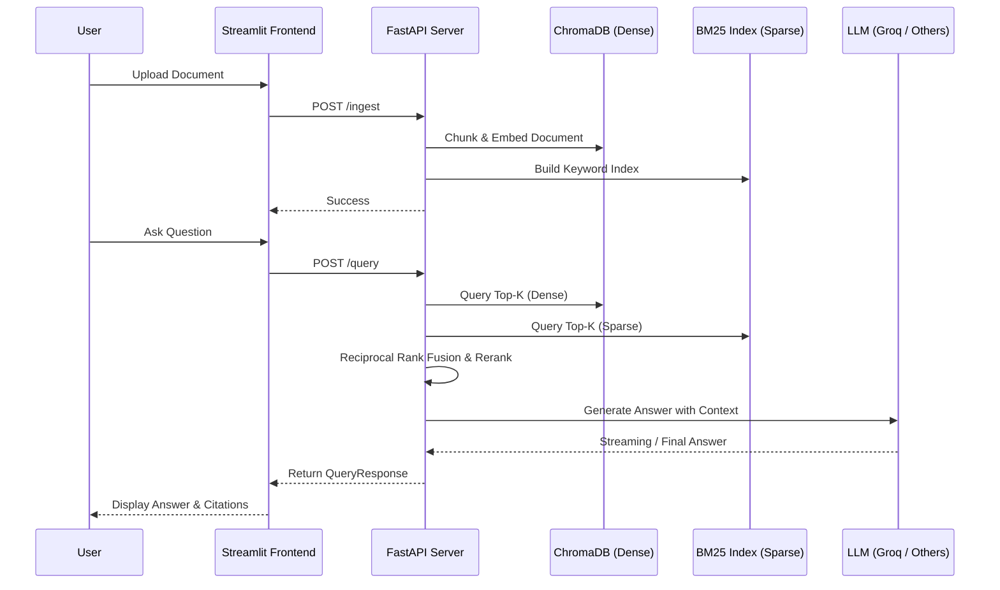

# RAGForge

RAGForge is an enterprise-grade Retrieval-Augmented Generation (RAG) backend and frontend. It leverages a modern stack with FastAPI, Streamlit, and ChromaDB for high-quality document intelligence.

## Architecture



## Setup

1. Configure `.env` based on `.env.example`.
2. Run via Docker Compose:
   ```bash
   docker-compose up --build
   ```
3. Access the application:
   - **Frontend**: http://localhost:8501
   - **API Docs**: http://localhost:8000/docs

## API Documentation

### `POST /query`
Execute a RAG query against the indexed documents.
- **Request Body**:
  ```json
  {
    "query": "What is the main topic?",
    "strategy": "hybrid_rerank",
    "top_k": 8,
    "use_cache": true
  }
  ```
- **Response**: Returns the generated answer, source citations, and retrieval latency metrics.

### `POST /ingest`
Upload documents for processing and indexing.
- **Request**: `multipart/form-data` containing files.
- **Response**: List of saved file names and ingestion status.

### `POST /compare`
Run a query across multiple retrieval strategies (e.g., `dense`, `bm25`, `hybrid`, `hybrid_rerank`) to benchmark latency and result counts.

### `GET /health`
Returns system health, index chunk count, and guardrail metrics.
