# Data Warehousing & Mining — PT Question Bank (Detailed Answers)

> Based on the course material provided (Chapter1_DWM_Notes, Introduction to DW, Dimensional Modelling, OLAP Operations, Retail Sales Case Study, ETL slides for Chapter 1; Module2_Part1, Module2_Part2, Data Exploration & Preprocessing, UHB_Preprocessing for Chapter 2).
> Diagrams are given as **Mermaid diagrams** (render automatically in most markdown viewers — VS Code, Typora, Obsidian, GitHub, Notion, Claude) or as **ASCII/text-based schema sketches** matching exactly what your slides describe, since the source material is text-and-table based rather than image-heavy.

---

# CHAPTER 1: DATA WAREHOUSING FUNDAMENTALS

---

## Q1. Write a short note on: Operational Support System (OLTP)

### What is an Operational Support System?
An **Operational Support System**, more commonly called **OLTP (Online Transaction Processing)**, is a system that **maintains a database which is an accurate, real-time model of some real-world enterprise**, supporting the **day-to-day operational transactions** of an organization — e.g., booking a railway ticket, withdrawing cash from an ATM, or billing a customer at a retail counter.

### Key Characteristics
- **Short, simple transactions** — each transaction typically touches only a **small fraction** of the database (e.g., one customer's record, one order).
- **Relatively frequent updates** — data is constantly being **inserted, updated, and deleted** as business happens in real time.
- **Highly normalized (E-R model)** — data is broken into many related tables to **minimize redundancy** and ensure transactional consistency.
- **Fast writes** — optimized for quick, reliable insert/update/delete operations, not for complex analytical reads.
- **Current, detailed data** — reflects the *present* state of the business, not historical trends.
- Users are typically **clerks, cashiers, and front-line operational staff**.

### Real-World Example
A bank's core banking system is an OLTP system: every deposit, withdrawal, or fund transfer is a short, simple transaction that must be processed instantly and reflected accurately — this system is optimized for handling millions of such small transactions per day, not for answering "what was our average customer balance trend over the last 5 years?" (that's what a Data Warehouse/OLAP system is for).

### Why It Matters for Data Warehousing
OLTP systems are the **primary data sources** that feed into a data warehouse via the ETL process — the data warehouse extracts, transforms, and consolidates data *from* multiple OLTP systems (billing, inventory, CRM, etc.) to support analytical decision-making, since OLTP systems themselves are deliberately **not designed** for complex analytical queries (doing so would slow down the very transactions they exist to process quickly).

### OLTP vs OLAP at a Glance (quick reference — see Q for full OLTP vs OLAP comparison later too)
| Feature | OLTP | OLAP |
|---|---|---|
| Purpose | Day-to-day operations | Analysis & decision support |
| Data | Current, detailed | Historical, summarized |
| Design | Normalized (E-R) | Denormalized (star/snowflake) |
| Queries | Simple, short | Complex, multi-dimensional |
| Performance goal | Fast writes | Fast reads |

---

## Q2. Explain Data Warehouse Architecture in detail.

### Definition
A **Data Warehouse (DW)** is a **subject-oriented, integrated, time-variant, and non-volatile** collection of data used to support managerial decision-making. Data Warehouse **Architecture** describes how data physically and logically moves from scattered operational sources all the way to the analytical end-user.

### The Four Core Characteristics (good to state before the architecture)
1. **Subject-Oriented:** Organized around major business subjects (customer, product, sales, inventory) rather than around individual applications.
2. **Integrated:** Data pulled from different, inconsistent sources is converted into consistent naming conventions, formats, units, and codes.
3. **Time-Variant:** Stores **historical** data across different time periods, unlike OLTP which mainly reflects the current state.
4. **Non-Volatile:** Once data is loaded, it is mainly **read**, not frequently modified or deleted — historical records remain stable for analysis.

### The Logical Flow (Layered Architecture)

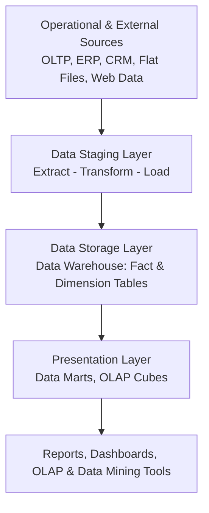

### A. Data Source Layer
Contains all the **data-producing systems**, e.g.:
- OLTP databases, ERP systems, CRM systems
- Legacy applications, flat files, web applications
- External/third-party data, POS (Point of Sale) systems

### B. Data Staging Layer
A **temporary processing area** where all ETL (Extract-Transform-Load) activities happen, before data is allowed into the actual warehouse. Major activities here:
- Data extraction from sources
- Data cleansing (fixing errors, nulls, inconsistencies)
- Format conversion & deduplication
- Validation, integration, transformation
- Surrogate-key generation

**Important:** The staging area is generally **not directly accessed by business users** — it's purely an internal working area.

### C. Data Storage Layer (the Warehouse itself)
Contains the actual **integrated warehouse database**, storing:
- Detailed data, historical data, summarized data
- Dimension tables and Fact tables
- Pre-computed aggregates
- Metadata (see Q5/Q6)

### D. Presentation Layer
Provides data in a form **suitable for direct end-user analysis**:
- Data Marts (department-specific subsets — see Q3)
- OLAP Cubes
- Reports, Dashboards, Ad-hoc query tools, Data-mining tools

### Supporting Components (span across all layers)
- **Metadata Repository** — stores "data about the data" (see Q5/Q6)
- **Load Manager** — controls how/when data is loaded into the warehouse
- **Warehouse Manager** — manages the overall warehouse data and its organization
- **Query Manager** — directs user queries to the appropriate data/tables
- **Security & Access Control**
- **Backup & Recovery**
- **Data-Quality Management**

### Real-World Example
A retail organization's warehouse pulls data from POS terminals, an online store's order database, a CRM system, and a supplier management system (**Data Source Layer**) → this raw data is cleaned, standardized, and deduplicated in a **Staging Area** → loaded into fact tables (like Sales_Fact) and dimension tables (like Product, Store, Date) in the **Storage Layer** → business users then access department-specific views through **Data Marts** or interactive **OLAP cubes** in the **Presentation Layer**, to answer questions like "which product category generated the highest yearly profit?"

---

## Q3. Differentiate Data Warehouse vs. Data Mart.

### Definitions
- **Data Warehouse:** A **centralized repository** for an **entire organization**, integrating data across multiple subjects/departments.
- **Data Mart:** A **subset of a data warehouse**, focused on the needs of a **single department or subject area** (e.g., sales, marketing, finance).

### Comparison Table

| Feature | Data Warehouse | Data Mart |
|---|---|---|
| **Scope** | Entire organization | One department or subject |
| **Subjects covered** | Multiple subjects | Usually one subject |
| **Size** | Large | Relatively small |
| **Users** | Enterprise-wide users | Departmental users |
| **Data Sources** | Multiple enterprise sources | The warehouse itself, or limited direct sources |
| **Implementation** | Longer and costlier | Faster and less costly |
| **Example** | Company-wide sales, finance, and inventory data | A marketing-only data mart |

### Two Types of Data Marts

**1. Dependent Data Mart**
- Created **from** the enterprise data warehouse (i.e., it draws its data from the already-integrated DW).
- **Advantages:** Better consistency, common business definitions, centralized governance.

**2. Independent Data Mart**
- Created **directly** from operational (source) systems, bypassing the central warehouse.
- **Advantages:** Faster initial development.
- **Disadvantages:** Risk of inconsistent definitions across different marts, difficult to later integrate into an enterprise-wide view.

### Real-World Example
A large retail company might have **one enterprise Data Warehouse** consolidating sales, inventory, HR, and finance data — and from it, derive a **Sales Data Mart** (used only by the sales team) and a separate **Finance Data Mart** (used only by the finance team), each a smaller, department-focused slice of the same underlying integrated data.

### One-Line Summary
> *"Think of the Data Warehouse as the entire company's reservoir of integrated historical data, and a Data Mart as a smaller tank drawn from that reservoir, sized and shaped for one department's specific needs."*

---

## Q4. Differentiate top-down and bottom-up approaches for building data warehouses. Discuss the merits and limitations of each approach.

### Overview
There are two classical philosophies for building a data warehouse, associated with two pioneers of the field: **Bill Inmon's Top-Down approach** and **Ralph Kimball's Bottom-Up approach**.

### Top-Down Approach (Inmon)
**Concept:** First build a **single, centralized, enterprise-wide data warehouse** that integrates data from all subject areas, following a normalized (often 3NF) design — **then** derive individual, smaller **Data Marts** from this central warehouse for specific departments.

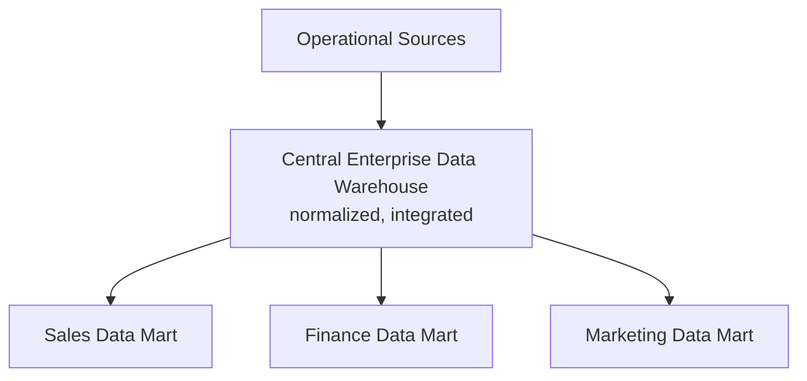

**Merits:**
- Produces a **highly consistent, single source of truth** — all data marts derive from the same integrated warehouse, so definitions/business rules never conflict between departments.
- Better **long-term data integrity and enterprise-wide standardization**.
- Easier to maintain **data quality** centrally.

**Limitations:**
- **Longer time to implement** and see initial results — the whole enterprise warehouse must be substantially built before departments get value.
- **Higher upfront cost and complexity** — requires significant enterprise-wide planning and buy-in before any single department benefits.
- Higher risk if the large, complex initial project stalls or is poorly scoped.

### Bottom-Up Approach (Kimball)
**Concept:** First build **individual, department-focused Data Marts** (each using dimensional star-schema modeling) for immediate, specific business needs — then **integrate/combine** these marts over time (using shared, "conformed" dimensions) to eventually form a de-facto enterprise data warehouse.

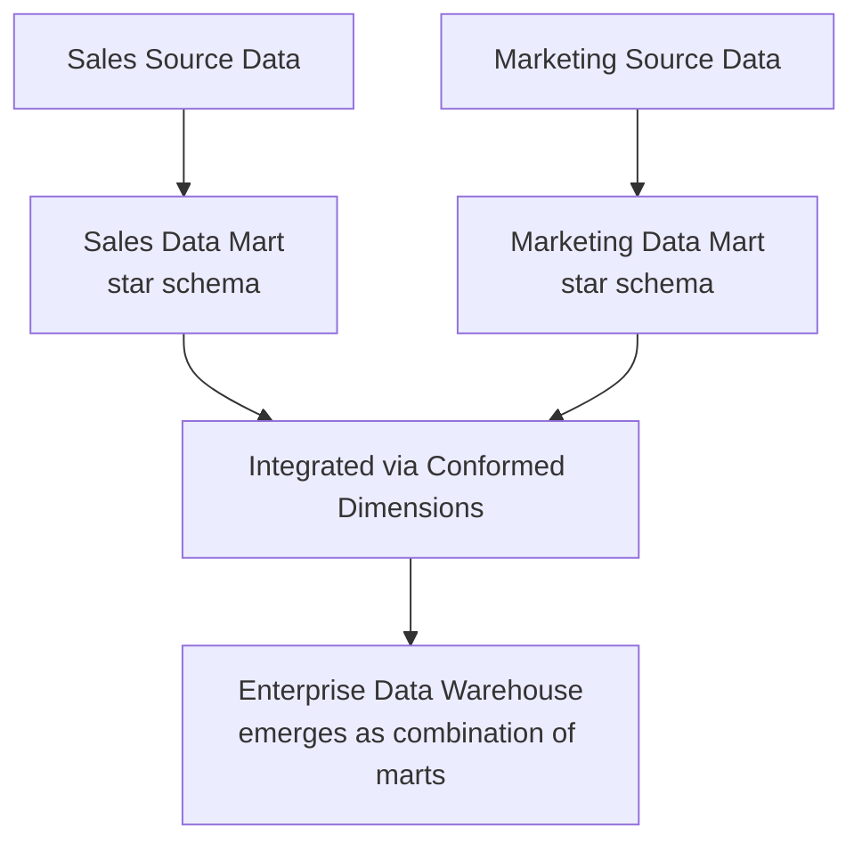

**Merits:**
- **Faster initial delivery** — a single department mart can be built and delivering business value in weeks/months, not years.
- **Lower initial cost and risk** — smaller, focused projects are easier to scope, manage, and get stakeholder buy-in for.
- Easier to demonstrate **quick wins** to management, building organizational support for further investment.

**Limitations:**
- Risk of **data inconsistency** across marts if "conformed dimensions" (shared, standardized dimension definitions) are not carefully planned from the start.
- Without careful governance, can result in **"stovepipe" or siloed marts** that are difficult to later integrate into a coherent enterprise view.
- May require **significant rework** later if early department-specific marts weren't designed with future enterprise integration in mind.

### Comparison Table

| Aspect | Top-Down (Inmon) | Bottom-Up (Kimball) |
|---|---|---|
| **Starting Point** | Enterprise-wide warehouse first | Department-specific data marts first |
| **Design Style** | Normalized (3NF) central warehouse | Dimensional (star schema) marts |
| **Time to First Result** | Longer | Faster |
| **Initial Cost/Risk** | Higher | Lower |
| **Consistency** | Very high (single source of truth) | Requires careful conformed-dimension planning |
| **Best Suited For** | Large enterprises with strong central IT governance | Organizations needing faster ROI, department-driven needs |

### Real-World Example
A large bank with strict regulatory reporting needs might prefer the **top-down (Inmon)** approach, since consistent, centrally-governed data is critical for compliance. A fast-growing e-commerce startup might prefer the **bottom-up (Kimball)** approach, first building a Sales Data Mart to get quick insights, then expanding to Marketing and Inventory marts as the business grows.

---

## Q5. What is meant by Metadata in the context of a Data warehouse? Explain the different types of metadata stored in a data warehouse. Illustrate with a suitable example.

### Definition
**Metadata** literally means **"data about data."** In a data warehouse, metadata describes the warehouse's own data — its meaning, source, structure, transformations, and usage — helping both technical staff and business users understand, trust, and correctly use the warehouse's contents.

### Why Metadata Matters
Metadata helps users understand:
- **What** the data means
- **Where** it originated
- **How** it was transformed
- **When** it was last refreshed
- **Who** owns it
- **Whether** it can be trusted

### The Three Types of Metadata

**1. Technical Metadata**
Describes the **structural/technical details** of the warehouse data — mainly used by IT/database administrators.
- Table and column names, data types
- Keys and indexes
- Schema definitions
- Source-to-target mappings
- Transformation rules (ETL logic)
- Data lineage (tracing where a piece of data originally came from)

**2. Business Metadata**
Describes the data in **business-friendly terms** — mainly used by business analysts and managers.
- Business terms and definitions (e.g., what exactly counts as "Net Revenue"?)
- KPI (Key Performance Indicator) definitions
- Measure definitions
- Data ownership (who is responsible for this data's accuracy?)
- Business rules

**3. Process (Operational) Metadata**
Describes the **operational history and health** of the ETL/data-loading processes — mainly used by warehouse administrators.
- ETL execution time
- Number of records loaded
- Number of records rejected
- Refresh status and load schedules
- Error logs

### Illustrative Example
Consider a `Sales_Amount` column in the Sales Fact table:
- **Technical Metadata** would say: *"Sales_Amount is a DECIMAL(10,2) column in the Sales_Fact table, sourced from the `total_price` field in the POS system's `transactions` table, loaded nightly via an SSIS ETL job."*
- **Business Metadata** would say: *"Sales_Amount represents the total revenue from a transaction, INCLUDING tax but EXCLUDING any returns — this is the officially approved definition used in all executive dashboards, owned by the Finance department."*
- **Process Metadata** would say: *"Last night's load of Sales_Amount processed 45,230 records in 12 minutes, with 3 records rejected due to negative values."*

Together, these three types of metadata let a business analyst **trust and correctly interpret** a number on a dashboard, rather than treating the warehouse as an opaque "black box."

---

## Q6. What is metadata? Why do we need metadata when search engines like Google seem so effective?

### What is Metadata (brief recap)
Metadata is **"data about data"** — it doesn't hold the actual content itself, but describes properties of that content: its meaning, structure, origin, and context. *(See Q5 for the full technical/business/process breakdown.)*

### Why We Still Need Metadata, Even Though Google "Just Works"

This is a conceptual/reasoning question — the key insight is that **Google's apparent simplicity is actually powered by massive amounts of metadata working invisibly behind the scenes.** A search engine looking clean and effortless to the *user* doesn't mean metadata isn't needed — it means metadata is being used so well that it becomes invisible.

**1. Google's search itself heavily relies on metadata.**
Search engines use webpage **metadata** (page titles, meta descriptions, header tags, structured data/schema.org markup, last-modified dates) to index, rank, and correctly display search results — without this metadata, Google could not distinguish a page's topic, freshness, or relevance nearly as effectively.

**2. Data warehouses solve a fundamentally different problem than free-text web search.**
Google is optimized for **unstructured, publicly available text content** where "good enough, most relevant" results are acceptable. A data warehouse, by contrast, must support **precise, trustworthy, auditable business decisions** (e.g., "exactly what does 'Net Revenue' mean in this report, and can I trust this number for a regulatory filing?") — a fuzzy, best-guess search-engine-style answer is **not acceptable** for financial reporting or compliance.

**3. Business context cannot be inferred by a generic search algorithm.**
A search engine cannot know that your organization defines "Active Customer" as someone who purchased in the last 90 days, specifically for your business — this is **business metadata** that only your organization's data governance process can define and maintain, and no external search algorithm can guess it correctly.

**4. Metadata provides lineage and trust that search snippets cannot.**
When a manager sees a number on a report, they need to know **exactly where it came from and how it was calculated** (data lineage) to trust it for a decision — a Google-style "best matching result" approach provides no such guarantee of correctness or traceability.

**5. Metadata enables governance, security, and compliance.**
Metadata tracks **data ownership, access permissions, and regulatory classifications** (e.g., "this column contains PII and must be masked for non-authorized users") — functions a general-purpose search engine has no concept of.

### One-Line Summary
> *"Google appears effective without visible metadata because metadata is working silently in the background to make search possible at all — but a data warehouse needs metadata to be explicit, structured, and business-owned, because it must support precise, auditable, trustworthy decision-making, not just 'find something roughly relevant.'"*

---

## Q7. Explain the steps in dimensional modeling and its advantages.

### What is Dimensional Modeling?
**Dimensional Modeling** is a data-design technique optimized for **data warehouse query performance and ease of understanding**, organizing data into **Fact tables** (measurable business events) and **Dimension tables** (descriptive context) — as opposed to E-R modeling, which is optimized for transactional consistency (see Q3-style comparison content in earlier notes).

### The 8 Major Steps in Dimensional Modeling

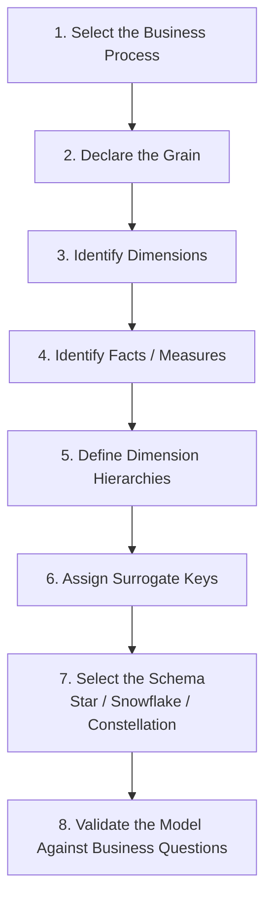

**1. Select the Business Process:** Identify which business activity/process is being modeled — e.g., "retail sales," "inventory management," "shipments."

**2. Declare the Grain:** Define exactly **what one row in the fact table represents**. Example: *"One row represents one product sold in one transaction at one store."* The grain **must** be declared before selecting facts, since it determines the level of detail everything else is built around.

**3. Identify Dimensions:** Determine the descriptive "who, what, where, when" context for facts — e.g., Product, Customer, Store, Date, Promotion.

**4. Identify Facts (Measures):** Determine the numeric, measurable values tied to the business process — e.g., Quantity, Sales Amount, Discount, Cost, Profit.

**5. Define Dimension Hierarchies:** Establish the natural levels within each dimension for drill-down/roll-up (see Q11) — e.g., Day → Month → Quarter → Year; Product → Subcategory → Category; Store → City → State → Region.

**6. Assign Surrogate Keys:** Generate warehouse-internal, meaningless integer keys for each dimension record (instead of using the natural/business key directly) — this supports tracking historical changes (SCD) and insulates the warehouse from changes in source-system keys.

**7. Select the Schema:** Choose Star, Snowflake, or Fact Constellation schema based on requirements (see earlier schema notes / Q8 below).

**8. Validate the Model Against Business Questions:** Confirm the resulting design can actually answer the real business questions it was intended for (e.g., "which product generated the highest yearly profit?").

### Advantages of Dimensional Modeling
1. **Simplicity and Understandability:** Business users can intuitively understand a star-shaped schema (facts surrounded by descriptive dimensions) far more easily than a complex, highly-normalized E-R diagram.
2. **Query Performance:** Fewer joins (especially in star schema) mean **faster analytical queries** — critical for interactive reporting and dashboards.
3. **Predictable, Standard Structure:** Every dimensional model follows the same fact/dimension pattern, making it easier for BI tools to auto-generate reports and for new analysts to onboard quickly.
4. **Flexibility for Analysis:** Naturally supports OLAP-style operations (slice, dice, roll-up, drill-down, pivot) since data is already organized around measures and hierarchical dimensions.
5. **Scalability for Adding New Data:** New facts or dimensions can often be added without redesigning the entire schema, as long as the grain is respected.
6. **Better Support for Aggregation:** Since measures are clearly identified as additive/semi-additive/non-additive, building summary/aggregate tables is straightforward.

---

## Q8. Explain with examples Factless Fact Table and Fact Constellation.

### Factless Fact Table

**Definition:** A **Factless Fact Table** is a fact table that contains **foreign keys to dimension tables but NO numeric measure/fact column at all.** It exists purely to record the **occurrence of an event or a condition** — the analysis comes from **counting rows**, not summing any measure.

**Two Common Use Cases:**

**1. Event-Tracking Factless Fact Table**
Records that an event **happened**.
- Example: **Student Attendance**
  - Columns: `Student_Key`, `Course_Key`, `Date_Key`, `Faculty_Key`
  - There's no "amount" or "quantity" to measure — you simply analyze it by **counting rows** (e.g., "how many times did Student X attend Course Y?" = count of matching rows).

**2. Coverage Factless Fact Table**
Records what was **possible** — even if no actual transaction occurred.
- Example: **Products Eligible for a Promotion**
  - Columns: `Product_Key`, `Store_Key`, `Promotion_Key`, `Date_Key`
  - This records **which products COULD have been discounted** at which stores on which dates — regardless of whether a sale actually happened. This lets analysts answer questions like *"what fraction of promoted products actually sold?"* by comparing this coverage table against the actual Sales Fact table.

**Diagram — Factless Fact Table Structure**
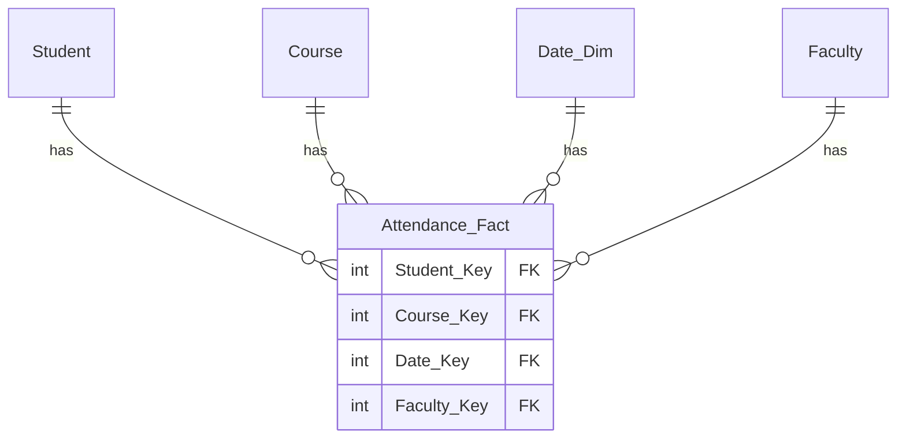
*(Notice: no measure column at all — just foreign keys.)*

---

### Fact Constellation Schema (Galaxy Schema)

**Definition:** A **Fact Constellation Schema** (also called a **Galaxy Schema**) contains **multiple fact tables that share common dimension tables**. It's used when an organization needs to model **several related business processes together** within the same warehouse.

**Example:**
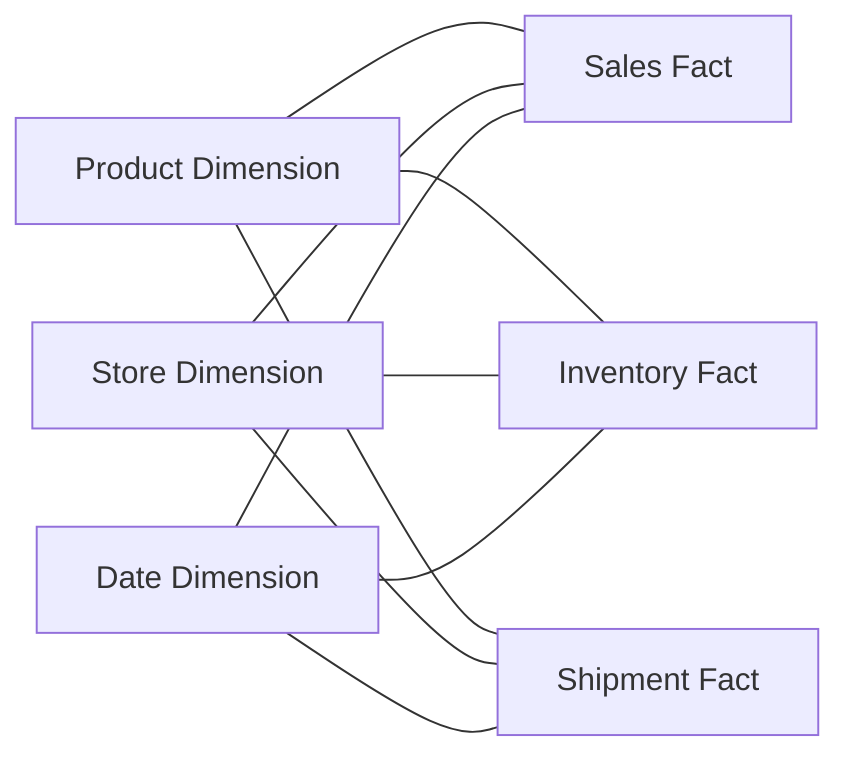

- **Fact Tables:** Sales_Fact, Inventory_Fact, Shipment_Fact
- **Shared Dimensions:** Product, Store, Date (all three fact tables connect to these same dimension tables)

**Why it's useful:** A retail manager can analyze **Sales, Inventory levels, and Shipments together**, because these three separate business processes all share the **Product, Store, and Date** dimensions — enabling cross-process analysis like *"were stockouts (low inventory) correlated with delayed shipments in stores with the highest sales?"* — a question that a single-fact-table star schema couldn't answer.

### Quick Comparison

| | Factless Fact Table | Fact Constellation |
|---|---|---|
| **Number of Fact Tables** | One (but with no measures) | Multiple (each with its own measures) |
| **Purpose** | Track event occurrence/coverage | Model multiple related business processes together |
| **Analysis Method** | Count of rows | Standard aggregation (SUM/AVG) per fact table, joined via shared dimensions |
| **Example** | Student attendance, promotion eligibility | Sales + Inventory + Shipment sharing Product/Store/Date |

---

## Q9. Describe the process of Extraction, Transformation and Loading (ETL) with a neat and labeled diagram.

### Definition
**ETL (Extract, Transform, Load)** is the core process by which data moves from scattered, heterogeneous operational source systems into a clean, integrated data warehouse.

### Diagram — ETL Process Flow

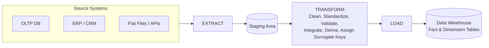

### Step 1 — Extraction
Data is pulled from various heterogeneous source systems — relational databases, ERP, CRM, POS systems, flat files, APIs, external data — into a **staging area** (never loaded directly into the warehouse, since raw extracted data may be inconsistent or corrupted and rolling back a bad direct-load would be very difficult).

**Extraction Methods:**
- **Logical:** Full Extraction (entire dataset every time) vs. Incremental Extraction / Change Data Capture (only new/changed records).
- **Physical:** Online Extraction (direct connection to source) vs. Offline Extraction (via exported files/dumps).

**Best practices while extracting:** use optimized queries to fetch only needed data; avoid excessive use of `DISTINCT` (slows performance); use comparison keywords (`LIKE`, `BETWEEN`) rather than functions in WHERE clauses where possible.

### Step 2 — Transformation
A set of rules/functions is applied to convert extracted data into a **single, standard format** suitable for the warehouse:
- **Filtering:** Loading only certain relevant attributes.
- **Cleaning:** Filling NULLs with defaults, standardizing values (e.g., mapping "U.S.A", "United States", "America" all to "USA").
- **Joining / Splitting:** Combining multiple source attributes into one, or splitting one attribute into several.
- **Sorting:** Ordering tuples by key attributes.
- **Summarization / Aggregation, Enrichment, Format Revision, Decoding of Fields, Calculated/Derived Values, Date-Time Conversion, De-duplication.**
- **Surrogate-key generation** and **conforming dimensions** across sources also happen here.

### Step 3 — Loading
The transformed, cleaned data is finally loaded into the data warehouse's fact and dimension tables.
- **Initial Load:** The first, full population of the warehouse.
- **Incremental Load:** Regularly adding only new/changed data.
- **Full Refresh** vs. **Periodic Refresh** vs. **Real-time/near-real-time Load** — the frequency depends entirely on business requirements (e.g., a retail sales warehouse might refresh nightly, while a fraud-detection system might need near-real-time loads).

### Overall ETL Sequence (summary flow)
```
Source Systems → Extract → Staging Area → Clean → Standardize → Integrate → Validate → Load → Data Warehouse
```

### Real-World Example
A retail data warehouse's nightly ETL job: **Extracts** the day's transactions from the POS system and online orders database → **Transforms** them by standardizing currency formats, filling missing customer IDs with "Guest," removing duplicate transaction records, and assigning surrogate keys to new products/customers → **Loads** the cleaned records into the `Sales_Fact` table and updates the `Product`/`Customer` dimension tables, ready for next-morning analytical reporting.

---

## Q10. Discuss various OLAP models and their architecture.

### Overview
OLAP (Online Analytical Processing) systems can be implemented using three different underlying storage/architecture models: **ROLAP, MOLAP, and HOLAP.**

### A. ROLAP (Relational OLAP)
**Architecture:** Stores warehouse data directly in **relational tables** (typically star or snowflake schema); OLAP queries are translated into standard **SQL** at query time.

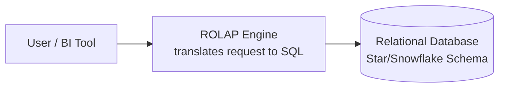

**Characteristics:**
- Aggregations may be calculated **dynamically** at query time.
- Suitable for **large, detailed datasets**.
- **Highly scalable** (leverages standard RDBMS scalability).

**Limitation:** Complex joins and on-the-fly aggregations can be **slower** than pre-computed cube access.

### B. MOLAP (Multidimensional OLAP)
**Architecture:** Stores data in **pre-built multidimensional cube structures**, with aggregates typically **pre-computed** during cube processing.

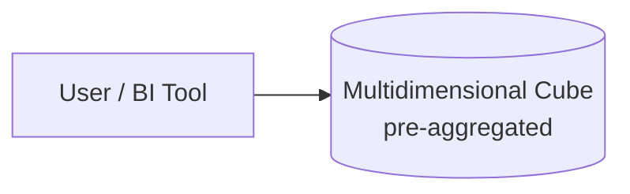

**Characteristics:**
- **Very fast query response**, since most aggregations are already computed.
- Natural, direct support for multidimensional analysis.
- Efficient for **repeated summary queries**.

**Limitations:** Cube processing/build time can be significant; additional storage required for pre-computed aggregates; less suitable for extremely large, sparse, highly-detailed data (cube can become very large or sparse).

### C. HOLAP (Hybrid OLAP)
**Architecture:** Combines ROLAP and MOLAP — **detailed data** is stored relationally, while **aggregated/summary data** is stored in cubes.

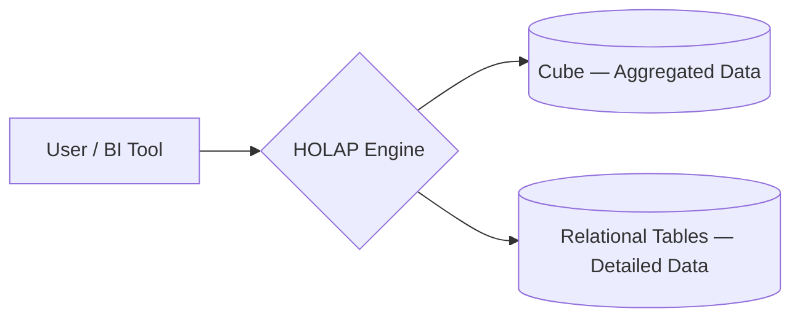

**Characteristics:** Provides a balance of **MOLAP's fast summary queries** and **ROLAP's scalability for detailed data**.

### Comparison Table

| Feature | ROLAP | MOLAP | HOLAP |
|---|---|---|---|
| **Storage** | Relational tables | Multidimensional cube | Both |
| **Query Speed** | Moderate | Very Fast | Fast |
| **Scalability** | High | Moderate | High |
| **Aggregation** | SQL / dynamic | Precomputed | Mixed |
| **Detailed Data Support** | Strong | Limited by cube size | Relational storage for detail |
| **Joins** | Common (explicit SQL joins) | Mostly hidden inside cube | Used for relational-detail access |

### Real-World Example
A large retailer with **billions of detailed transaction records** might use **ROLAP** (leveraging scalable relational storage) for granular data, but pre-build **MOLAP cubes** for frequently-run summary reports (e.g., monthly regional sales), or adopt a **HOLAP** approach to get the best of both — fast standard reports via cubes, with the ability to drill through to full relational detail when needed.

---

## Q11. Describe the following OLAP operations on a cube: (i) Roll-up (ii) Drill-down (iii) Slice (iv) Dice (v) Pivot

### The OLAP Cube (context)
An **OLAP Cube** represents measures (e.g., Sales Amount) across multiple dimensions (e.g., Product, Time, Location). Important terms: **Dimension, Measure, Hierarchy, Level, Member, Cell, Aggregation, Subcube.**

### i) Roll-Up (Aggregation)
**Definition:** Aggregates data to a **higher level** in a dimension hierarchy, reducing the level of detail.
**Example:** Store → City → State → Country (summing sales from individual stores up to country-level totals).
**Memory word: Summarize**

### ii) Drill-Down (Disaggregation)
**Definition:** The **opposite** of roll-up — moves from summarized data to **more detailed** data.
**Example:** Year → Quarter → Month → Day (breaking down an annual sales figure into daily figures).
**Memory word: Detail**

### iii) Slice
**Definition:** Selects **a single value** from **one** dimension, reducing an n-dimensional cube to an (n-1)-dimensional sub-cube.
**Example:** Viewing sales for the year **2026 only** (fixing the Time dimension to a single value, viewing the resulting Product × Store slice).
**Memory word: Filter (single dimension)**

### iv) Dice
**Definition:** Selects a **sub-cube** by filtering on **multiple values or ranges across several dimensions** simultaneously.
**Example:** "Laptop and Mobile sales, in Mumbai and Pune, during January to March" — filtering Product, Location, AND Time dimensions together.
**Memory word: Subset (multiple dimensions)**

### v) Pivot (Rotate)
**Definition:** **Reorients** the cube's view by interchanging dimensions — e.g., swapping which dimension appears on rows vs. columns of a report.
**Example:** A report initially showing **Product as rows and City as columns** is pivoted to show **City as rows and Product as columns** — same underlying data, different viewing angle.
**Memory word: Rotate**

### Diagram — OLAP Operations Overview

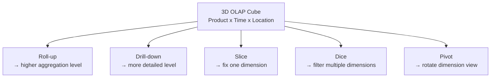

### Bonus Operations (mention if extra marks available)
- **Drill-across:** Analyzes measures from **multiple fact tables** that share common dimensions (e.g., comparing Sales_Fact and Inventory_Fact via shared Product/Store/Date dimensions).
- **Drill-through:** Moves from summarized cube data all the way down to the **detailed source/transaction records** (e.g., from a monthly sales total down to the individual transactions that made it up).

### Real-World Example (all 5 operations on one scenario)
A retail sales cube (Product × Store × Time, measure = Sales Amount):
- **Roll-up:** View total sales by **State** instead of by individual Store.
- **Drill-down:** From **State**-level sales, expand down to see **City**-level, then **Store**-level sales.
- **Slice:** View only **Q1 2026** sales across all products and stores.
- **Dice:** View **Electronics and Stationery** sales, in **Mumbai and Pune stores only**, for **Q1 2026**.
- **Pivot:** Switch the report from "Product (rows) × Store (columns)" to "Store (rows) × Product (columns)" for a different viewing perspective.

---

## Q12. Design Star Schema — Case Study Problems

### General Steps to Design a Star Schema (apply to ANY case study given in the exam)
1. **Identify the business objective** — what decisions does the business need to make?
2. **Select the business process** to model (e.g., retail sales, hospital admissions).
3. **Declare the grain** — what does one row in the fact table represent?
4. **Identify the dimensions** (the "who, what, where, when" context).
5. **Identify the measures/facts** (the numeric values to be analyzed).
6. **Create surrogate keys** for each dimension.
7. **Connect dimension keys to the fact table** as foreign keys.
8. **Define hierarchies** within dimensions (for roll-up/drill-down).
9. **Classify measures** as additive, semi-additive, or non-additive.
10. **Draw the schema** — fact table in the center, dimension tables surrounding it.

---

### Worked Case Study: Retail Sales Data Warehouse

**Business Problem:** A retail organization wants to analyze sales performance across customers, products, stores, and dates, to answer questions like: *Which product generates the highest sales? Which store performs best? Which customers purchase the most? How do sales change over time?*

**Grain:** One row represents **one sales transaction** (one product sold, in one transaction, at one store, on one date).

### The Star Schema Diagram

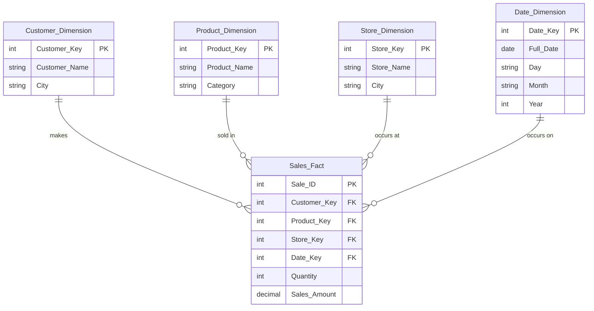

*(Notice the classic "star" shape: the Sales_Fact table sits at the center, with each dimension table connected directly to it — no dimension connects to another dimension, which is exactly what makes a Star Schema "flat" and fast to query, as opposed to a Snowflake Schema.)*

### Sample Dimension & Fact Data

**1. Customer Dimension** (5 tuples)
| Customer_Key | Customer_Name | City |
|---|---|---|
| 101 | Ravi | Mumbai |
| 102 | Meera | Pune |
| 103 | Amit | Nashik |
| 104 | Sneha | Mumbai |
| 105 | Karan | Thane |

**2. Product Dimension** (5 tuples)
| Product_Key | Product_Name | Category |
|---|---|---|
| 201 | Laptop | Electronics |
| 202 | Mobile | Electronics |
| 203 | Notebook | Stationery |
| 204 | Pen | Stationery |
| 205 | Headphones | Accessories |

**3. Store Dimension** (5 tuples)
| Store_Key | Store_Name | City |
|---|---|---|
| 301 | Store A | Mumbai |
| 302 | Store B | Pune |
| 303 | Store C | Nashik |
| 304 | Store D | Thane |
| 305 | Store E | Navi Mumbai |

**4. Date Dimension** (5 tuples)
| Date_Key | Full_Date | Day | Month | Year |
|---|---|---|---|---|
| 401 | 2026-07-01 | Wednesday | July | 2026 |
| 402 | 2026-07-02 | Thursday | July | 2026 |
| 403 | 2026-07-03 | Friday | July | 2026 |
| 404 | 2026-07-04 | Saturday | July | 2026 |
| 405 | 2026-07-05 | Sunday | July | 2026 |

**5. Sales Fact Table** (12 tuples — grain: one sales transaction)
| Sale_ID | Customer_Key | Product_Key | Store_Key | Date_Key | Quantity | Sales_Amount |
|---|---|---|---|---|---|---|
| 1 | 101 | 201 | 301 | 401 | 1 | 50000 |
| 2 | 102 | 202 | 302 | 401 | 2 | 40000 |
| 3 | 103 | 203 | 303 | 402 | 5 | 500 |
| 4 | 104 | 204 | 301 | 402 | 10 | 200 |
| 5 | 105 | 205 | 304 | 403 | 2 | 4000 |
| 6 | 101 | 202 | 301 | 403 | 1 | 20000 |
| 7 | 102 | 203 | 302 | 404 | 4 | 400 |
| 8 | 103 | 201 | 303 | 404 | 1 | 48000 |
| 9 | 104 | 205 | 305 | 405 | 3 | 6000 |
| 10 | 105 | 204 | 304 | 405 | 5 | 100 |
| 11 | 101 | 203 | 301 | 405 | 6 | 600 |
| 12 | 102 | 205 | 302 | 405 | 1 | 2000 |

*(Note: the maximum theoretically possible combinations would be 5×5×5×5 = 625, but only 12 combinations actually occurred as real transactions — this is normal and expected, since a fact table only stores events that actually happened, at the declared grain.)*

### Sample SQL Query on This Star Schema
```sql
SELECT P.Product_Name, SUM(F.Sales_Amount) AS Total_Sales
FROM Sales_Fact F
JOIN Product_Dimension P ON F.Product_Key = P.Product_Key
GROUP BY P.Product_Name
ORDER BY Total_Sales DESC;
```
*(This directly answers the business question: "Which product generates the highest sales?")*

### Why This Is a Star Schema (not Snowflake)
- The fact table (Sales_Fact) is connected **directly** to each dimension table.
- Dimension tables are **denormalized** — e.g., Product_Dimension directly stores `Category` as a column, rather than normalizing it into a separate `Category` table (which would make it a Snowflake Schema instead).
- This keeps the schema **simple, with fewer joins**, which is exactly why star schemas are preferred for fast, business-user-friendly analytical querying.

### Extending to a Fact Constellation (bonus — if the case study asks for multiple business processes)
If the retailer also wants to track **Inventory** and **Shipments**, additional fact tables (`Inventory_Fact`, `Shipment_Fact`) can be added, sharing the same **Product, Store, and Date** dimensions — turning this Star Schema into a **Fact Constellation Schema** (see Q8), enabling the manager to study sales, stock levels, and returns together.

### Exam Tip for "Design Star Schema" Case Studies
Whatever new scenario is given (hospital, university, e-commerce, etc.), follow the **same 10-step method** above: identify the grain first, then dimensions, then measures — and always draw the fact table in the **center**, with dimension tables **directly** surrounding it in a "star" shape.

---
---

# CHAPTER 2: DATA MINING

---

## Q1. Describe the steps involved in Knowledge Discovery in Databases (KDD).

### What is KDD?
**KDD (Knowledge Discovery in Databases)** is the **overall process** of discovering **useful, valid, novel, and understandable knowledge** from large volumes of data. **Data Mining is just one step** within the broader KDD process — a common point of confusion worth stating explicitly in an exam answer.

### Diagram — The KDD Process

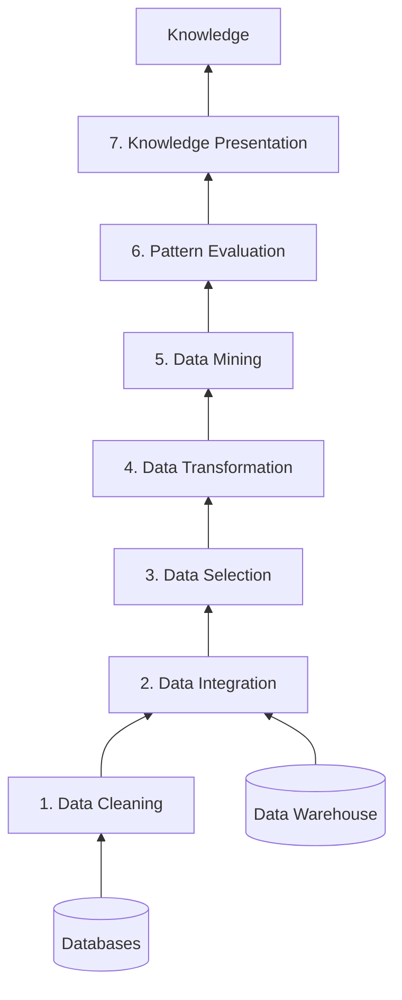

### The 7 Steps in Detail

**1. Data Cleaning:** Removing **noise and inconsistent data** — handling missing values, duplicate records, and errors.

**2. Data Integration:** **Combining data from different sources** (e.g., multiple databases, files, or a data warehouse) into a single, coherent data store.

**3. Data Selection:** **Choosing the data relevant** to the analysis task from the (much larger) integrated dataset.

**4. Data Transformation:** **Converting data into a suitable format/structure** for mining — e.g., through aggregation, normalization, or discretization.

**5. Data Mining:** The core step — **applying algorithms** (classification, clustering, association rule mining, etc.) to extract hidden patterns.

**6. Pattern Evaluation:** **Identifying the truly interesting patterns** based on some measure of "interestingness" — not all discovered patterns are actually useful.

**7. Knowledge Presentation:** **Visualizing and presenting** the discovered knowledge to the user, using techniques like reports, charts, or dashboards, so it can actually support decision-making.

### KDD in the Context of Business Intelligence (bigger picture)

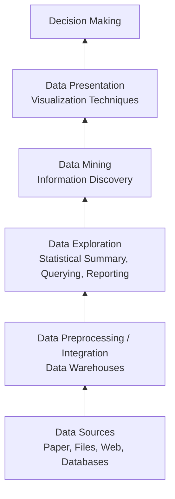
*(This shows increasing potential to support business decisions as you move up the stack — from raw data sources at the bottom, handled by a DBA, to decision-making at the top, handled by the end user/business analyst.)*

### Real-World Example
A telecom company wants to predict **customer churn**: it **cleans** its billing/usage data (removing errors) → **integrates** data from billing, customer service, and network usage systems → **selects** only relevant attributes (call frequency, complaints, tenure) → **transforms** them (normalizing usage values) → **mines** the data using a classification algorithm → **evaluates** which discovered patterns are genuinely predictive of churn → **presents** the findings as a dashboard the retention team can act on.

---

## Q2. Explain types of attributes with examples.

### What is an Attribute?
An **attribute** is a property or characteristic of a data object (e.g., customer_ID, name, address are attributes of a "Customer" object).

### Diagram — Classification of Attribute Types

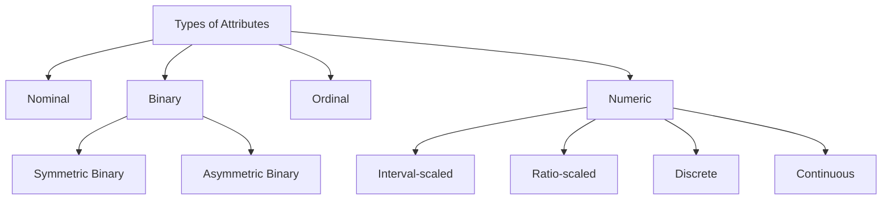

### 1. Nominal Attribute
Values are represented by **names, labels, or categories** with **no meaningful order**.
**Examples:** Gender (Male, Female); Blood Group (A, B, AB, O); Branch (Computer, IT, Mechanical); City (Mumbai, Pune, Delhi).

### 2. Binary Attribute
A **special case of nominal attribute** with only **two possible values** (0/1, Yes/No, True/False).
- **Symmetric Binary:** **Both** values are equally important, with no preference for either (e.g., Gender: Male/Female — both outcomes contribute equally to analysis).
- **Asymmetric Binary:** **One** value is more important than the other — usually "1" indicates the **presence** of a significant characteristic. Example: Fraud Transaction — Yes(1)/No(0), where the "Yes" (presence of fraud) is the actual focus of analysis.

### 3. Ordinal Attribute
Values have a **meaningful order/ranking**, but the **difference between consecutive values cannot be precisely measured**.
**Examples:** Customer Satisfaction (Poor, Fair, Good, Excellent); Education Level (Primary, Secondary, Undergraduate, Postgraduate); T-Shirt Size (S, M, L, XL); Movie Star Rating (1★–5★).

### 4. Numeric Attribute
Values are **quantitative measurements** on which mathematical operations (addition, subtraction, multiplication, division) can be meaningfully performed. Two sub-types:

**a) Interval-Scaled Attribute:** Difference between values is meaningful, but there is **NO true/absolute zero point**.
**Example:** Temperature in Celsius/Fahrenheit (0°C doesn't mean "no temperature" — it's an arbitrary reference point; you also can't say 20°C is "twice as hot" as 10°C).

**b) Ratio-Scaled Attribute:** Difference between values is meaningful, **AND there IS a true/absolute zero point**.
**Examples:** Age (years), Height (cm), Weight (kg), Salary (₹), Distance (km) — here, 0 truly means "none," and ratios are meaningful (someone who is 40 years old is genuinely twice the age of someone who is 20).

### Discrete vs. Continuous Attributes (an orthogonal classification, applies across the above)
- **Discrete Attribute:** Has a **finite or countably infinite** set of values (e.g., number of children, ZIP code, a set of category labels). Binary attributes are a special case of discrete attributes.
- **Continuous Attribute:** Has **real number values** within a range (e.g., height, weight, temperature) — theoretically infinite possible values within any interval.

### Summary Table

| Attribute Type | Order Meaningful? | True Zero? | Math Operations | Example |
|---|---|---|---|---|
| Nominal | No | No | None (only =, ≠) | City, Blood Group |
| Binary | No (2 values only) | N/A | None | Pass/Fail |
| Ordinal | Yes | No | Order comparison only (<, >) | Satisfaction rating |
| Interval | Yes | **No** | +, − meaningful; ×, ÷ not | Temperature (°C) |
| Ratio | Yes | **Yes** | +, −, ×, ÷ all meaningful | Age, Height, Salary |

---

## Q3. In real-world data, tuples with missing values for some attributes are a common occurrence. Describe various methods for handling this problem.

### Why Missing Values Occur
Data can be missing due to equipment malfunction, inconsistent data entry, deliberate non-response, or data not being applicable/collected at the time.

### Methods for Handling Missing Values

| Method | Description |
|---|---|
| **1. Ignore the tuple** | Simply **remove/discard** the record containing missing values. Suitable **only** when relatively few records are missing, or when the missing attribute is the class label (in classification tasks) — discarding too many tuples this way risks losing valuable data. |
| **2. Fill manually** | A human expert manually enters the correct missing value. **Accurate but very time-consuming** — impractical for large datasets. |
| **3. Use a global constant** | Replace all missing values with a fixed constant such as `"Unknown"` or `"N/A"`. Simple, but can mislead a mining algorithm into treating "Unknown" as a meaningful, common category. |
| **4. Use the attribute mean** | Replace the missing value with the **average value** of that attribute across all other records. |
| **5. Use class-wise attribute mean** | Replace with the mean of that attribute computed **within the same class** (e.g., for classification tasks) — more accurate than a single global mean, since it accounts for known relationships between the class and the attribute. |
| **6. Use the most probable value** | **Predict** the missing value using techniques such as **Decision Trees, Regression, or Bayesian inference** — generally the most sophisticated and often most accurate approach, since it uses relationships with other attributes to make an informed estimate. |

### Real-World Example
In a hospital patient dataset, if a patient's **"Blood Pressure"** reading is missing:
- **Ignore the tuple:** Risky if many patients have this missing — could lose too much valuable data.
- **Global constant:** Replacing with "Unknown" doesn't help any predictive model.
- **Attribute mean:** Replacing with the average BP of all patients is a reasonable, simple estimate.
- **Class-wise mean:** If we know the patient's diagnosis category, using the average BP for patients with the *same* diagnosis is more accurate.
- **Most probable value (regression/decision tree):** Predicting BP based on the patient's age, weight, and other vitals would likely give the most accurate estimate.

### Exam Tip
When asked this question, always mention **at least 4–5 methods** and briefly note the **trade-off** for each (accuracy vs. effort vs. risk of bias) — examiners specifically look for this comparative understanding, not just a list.

---

## Q4. Explain different normalization techniques such as min-max normalization, z-score, and decimal scaling with examples.

### Why Normalize?
Normalization **scales attribute values to fall within a smaller, specified range** (e.g., [0,1] or [-1,1]) — this is important because attributes with naturally larger numeric ranges (e.g., Salary in thousands) can **dominate/bias** distance-based mining algorithms (like clustering or k-NN) compared to attributes with smaller ranges (e.g., Age), even if both are equally important.

### 1. Min-Max Normalization
**Formula:**
$$v' = \frac{v - min_A}{max_A - min_A} \times (new\_max_A - new\_min_A) + new\_min_A$$
where **v** is the original value, **min_A/max_A** are the attribute's original min/max, and **new_min_A/new_max_A** define the target range (commonly 0 to 1).

**Worked Example:** Suppose `Income` ranges from **min = ₹12,000** to **max = ₹98,000**, and we want to normalize `v = ₹73,600` into the range **[0, 1]**:
$$v' = \frac{73600 - 12000}{98000 - 12000} \times (1-0) + 0 = \frac{61600}{86000} \approx 0.716$$

**Limitation:** If a future value falls outside the original [min, max] range, it can produce an "out-of-bounds" normalized value.

### 2. Z-Score Normalization (Zero-Mean Normalization)
**Formula:**
$$v' = \frac{v - \bar{A}}{\sigma_A}$$
where **Ā** is the attribute's mean, and **σ_A** is its standard deviation.

**Worked Example:** Suppose `Income` has mean **Ā = ₹54,000** and standard deviation **σ = ₹16,000**. Normalize `v = ₹73,600`:
$$v' = \frac{73600 - 54000}{16000} = \frac{19600}{16000} = 1.225$$
This tells us the value is **1.225 standard deviations above the mean**.

**Best used when:** the actual min/max of an attribute are **unknown** or when the data contains outliers (z-score handles outliers more gracefully than min-max).

### 3. Decimal Scaling Normalization
**Formula:**
$$v' = \frac{v}{10^j}$$
where **j** is the **smallest integer** such that **max(|v'|) < 1**.

**Worked Example:** Suppose the maximum absolute value of an attribute is **917**. Since 917 has 3 digits, we need **j = 3** (10³ = 1000), so:
$$v' = \frac{917}{1000} = 0.917$$
Every other value in the dataset is divided by the **same** 10³.

### Quick Comparison

| Technique | Formula Basis | Best Used When |
|---|---|---|
| **Min-Max** | Uses actual min/max | Range of data is known and stable; no significant outliers |
| **Z-Score** | Uses mean & std. deviation | Data has outliers, or true min/max is unknown; data roughly normal-ish |
| **Decimal Scaling** | Moves decimal point by powers of 10 | Simplicity is preferred; approximate scaling is acceptable |

---

## Q5. Discuss different steps involved in data preprocessing.

### Why Preprocessing is Needed
Real-world data is typically **dirty** — incomplete (missing values), noisy (errors/outliers), and inconsistent (conflicting representations). Preprocessing improves data quality, making it suitable for mining algorithms.

### Diagram — The 5 Major Steps of Data Preprocessing

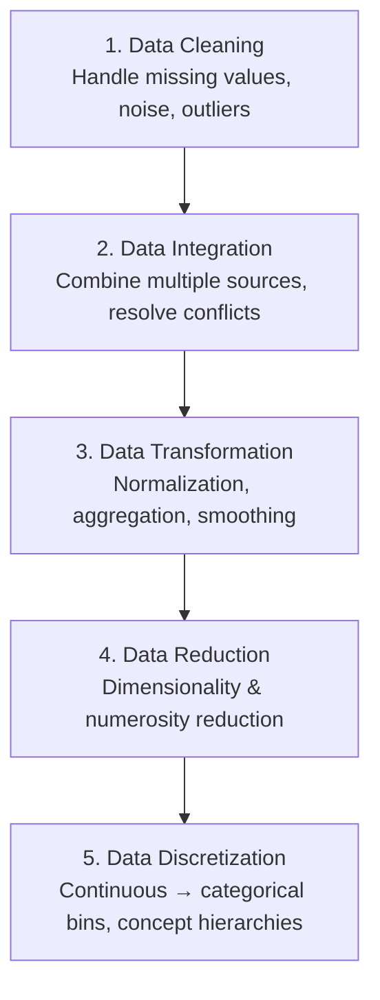

### 1. Data Cleaning
- **Handling missing values** (see Q3 methods).
- **Handling noisy data:** using Binning, Regression, Clustering, or combined computer-human inspection (see Q6/Q11 for binning detail).
- Removing **duplicate records** and fixing **inconsistent data**.

### 2. Data Integration
- **Combining data from multiple sources** into one coherent store.
- **Schema integration:** e.g., resolving that `A.cust-id` and `B.cust-#` refer to the same real-world concept.
- **Entity identification problem:** recognizing that "Bill Clinton" and "William Clinton" refer to the same real-world entity across different sources.
- **Detecting and resolving data value conflicts:** e.g., different units (metric vs. imperial) for the same attribute across sources.
- **Handling redundancy:** using correlation analysis (e.g., Chi-square test for nominal data) to detect and remove redundant attributes.

### 3. Data Transformation
- **Smoothing:** Removing noise from data.
- **Attribute/Feature construction:** Building new attributes from existing ones.
- **Aggregation:** Summarization, data cube construction.
- **Normalization:** Scaling values into a smaller range (min-max, z-score, decimal scaling — see Q4).
- **Discretization:** Converting continuous data into categorical bins (see Q8).

### 4. Data Reduction
Obtaining a **reduced representation** of the dataset that is much smaller in volume, but produces the same (or nearly the same) analytical results — important since a warehouse may store terabytes of data, and running complex analysis on the full dataset can be prohibitively slow.
- **Dimensionality Reduction:** Wavelet transforms, PCA, feature subset selection (see Q13).
- **Numerosity Reduction:** Regression/log-linear models, histograms, clustering, sampling, data cube aggregation.
- **Data Compression.**

### 5. Data Discretization & Concept Hierarchy Generation
- Converts **continuous** numerical attributes into a **finite number of intervals/categories** (see Q8), simplifying analysis and improving mining algorithm efficiency.

### Real-World Example (all 5 steps on one dataset)
A hospital dataset for predicting readmission risk: **Cleaning** fills missing "Blood Pressure" values using class-wise means → **Integration** merges the billing system's patient records with the pharmacy system's prescription records, resolving that "Patient_ID" in one system matches "PID" in the other → **Transformation** normalizes "Age" and "BMI" using min-max normalization → **Reduction** uses PCA to combine several correlated vital-sign attributes into fewer principal components → **Discretization** converts continuous "Age" into categorical bins like "Child," "Adult," "Senior" for easier rule-based analysis.

---

## Q6. Numerical on: (i) Binning Method (ii) Five-number summary (mean, mode, median, boxplot, histogram)

### How to Answer This Question (Method)

**For Binning:** (1) Sort the data. (2) Partition into equal-frequency bins (the exam will usually specify or imply bin size). (3) For **smoothing by bin means**, replace every value in a bin with that bin's average. For **smoothing by bin boundaries**, replace every value with whichever bin boundary (min or max of that bin) it is numerically **closer to**.

**For Five-Number Summary:** (1) Sort the data. (2) Find Min and Max. (3) Find the Median (Q2). (4) Split the data into lower half and upper half (excluding the overall median if n is odd) and find the median of each half — these are Q1 and Q3. (5) Report **[Min, Q1, Median, Q3, Max]**. (6) Use these 5 values to draw a boxplot.

### Worked Example — Binning
*(Using illustrative data, sorted: 4, 8, 9, 15, 21, 21, 24, 25, 26, 28, 29, 34)*

**Step 1 — Partition into equal-frequency bins of size 3:**
- Bin 1: 4, 8, 9
- Bin 2: 15, 21, 21
- Bin 3: 24, 25, 26
- Bin 4: 28, 29, 34

**Step 2a — Smoothing by Bin Means:**
- Bin 1 mean = (4+8+9)/3 = 7 → becomes: 7, 7, 7
- Bin 2 mean = (15+21+21)/3 = 19 → becomes: 19, 19, 19
- Bin 3 mean = (24+25+26)/3 = 25 → becomes: 25, 25, 25
- Bin 4 mean = (28+29+34)/3 = 30.33 → becomes: 30.33, 30.33, 30.33

**Step 2b — Smoothing by Bin Boundaries:** *(each value snaps to the nearer of the bin's min/max)*
- Bin 1 (min=4, max=9): 4→4, 8→9 (closer to 9), 9→9 → **4, 9, 9**
- Bin 2 (min=15, max=21): 15→15, 21→21, 21→21 → **15, 21, 21**
- Bin 3 (min=24, max=26): 24→24, 25→24 or 26 (equidistant, convention: round to nearest, often taken as lower), 26→26 → **24, 24/26, 26**
- Bin 4 (min=28, max=34): 28→28, 29→28 (closer to 28), 34→34 → **28, 28, 34**

*(This exact method — sort, partition, then either average or snap-to-boundary — applies to whatever specific numbers your exam gives, including the specific 12-value dataset in Q11 below, which is solved in full there.)*

### Worked Example — Five-Number Summary & Boxplot
*(Using the same sorted data: 4, 8, 9, 15, 21, 21, 24, 25, 26, 28, 29, 34 — n=12)*

- **Minimum** = 4
- **Maximum** = 34
- **Median (Q2)** = average of 6th and 7th values = (21+24)/2 = **22.5**
- **Q1** = median of lower half (4,8,9,15,21,21) = avg of 3rd & 4th = (9+15)/2 = **12**
- **Q3** = median of upper half (24,25,26,28,29,34) = avg of 3rd & 4th = (26+28)/2 = **27**
- **Five-Number Summary = [4, 12, 22.5, 27, 34]**
- **IQR** = Q3 − Q1 = 27 − 12 = **15**

**Boxplot construction:** Draw a box from Q1 (12) to Q3 (27), with a line inside at the Median (22.5). Whiskers extend to Min (4) and Max (34), unless they fall outside the "fences" [Q1 − 1.5×IQR, Q3 + 1.5×IQR] = [12−22.5, 27+22.5] = [-10.5, 49.5] — since both 4 and 34 fall within these fences, they are **not** outliers, and whiskers extend directly to them.

### Histogram (brief note)
A **histogram** for this data would group values into equal-width intervals (e.g., 0–10, 10–20, 20–30, 30–40) on the x-axis, with **bar height = frequency** (count of values falling in that interval) on the y-axis — for the data above: [0–10]: 2 values, [10–20]: 1 value, [20–30]: 6 values, [30–40]: 2 values.

*(For the exact numbers given in Q11 and Q12 of your paper, apply this identical method — full worked solutions for those specific datasets are provided under Q11 and Q12 below.)*

---

## Q7. Explain different Data Visualization techniques.

### Why Data Visualization?
**Data Visualization** is the graphical representation of data, helping to identify patterns, trends, correlations, and outliers that might not be obvious from raw numbers alone — crucial during the **Data Exploration** phase.

### Key Techniques

**1. Histogram**
Displays the **frequency distribution** of a single numeric attribute — data is divided into bins/intervals, and bar height shows the count of values in each bin. Useful for understanding the shape (skew, spread) of a distribution.

**2. Boxplot (Box-and-Whisker Plot)**
Summarizes data using the **five-number summary** (Min, Q1, Median, Q3, Max), clearly showing spread, central tendency, and **outliers** (points beyond 1.5×IQR from the quartiles).

**3. Scatter Plot**
Shows the **relationship between two numeric variables** — each point represents one data record, plotted by its values on the X and Y axes. Useful for spotting correlation, clusters, or outliers between two attributes.

**4. Scatter Plot Matrix**
An **extension of the scatter plot** for more than 2 dimensions — for k attributes (X1...Xk), it creates a grid of pairwise scatter plots, letting you visually inspect relationships between **every pair** of attributes simultaneously.

**5. Bar Chart / Pie Chart**
Used mainly for **categorical (nominal/ordinal)** data — bar charts compare category frequencies/values, pie charts show proportion of a whole.

**6. Line Chart**
Best for **time-series data**, showing how a measure changes over time (e.g., monthly sales trend).

**7. Data Cube Visualization / Heat Maps**
Represents multi-dimensional OLAP-style data using color intensity to indicate value magnitude across two categorical dimensions.

### Summary Table

| Technique | Best For | Reveals |
|---|---|---|
| Histogram | Single numeric attribute | Distribution shape, skew |
| Boxplot | Single numeric attribute | Spread, median, outliers |
| Scatter Plot | Two numeric attributes | Correlation, clusters |
| Scatter Plot Matrix | Many numeric attributes | Pairwise relationships |
| Bar/Pie Chart | Categorical data | Category comparison/proportion |
| Line Chart | Time-series data | Trends over time |

### Real-World Example
A retail analyst exploring sales data might use a **histogram** to see the distribution of transaction amounts, a **boxplot** to detect unusually large/small transactions (outliers, possibly fraud), a **scatter plot** to check if there's a relationship between "discount given" and "quantity sold," and a **line chart** to visualize the monthly sales trend over the past year.

---

## Q8. Explain data discretization and concept hierarchy generation.

### Data Discretization

**Definition:** Discretization is the process of **transforming continuous numerical data into a finite number of intervals (bins) or categories**.

**Why is it needed?**
- Reduces data complexity.
- Simplifies data analysis and interpretation.
- Improves the efficiency of many data mining algorithms (some algorithms, like certain decision tree implementations, work better with or require categorical input).
- Makes continuous data easier for humans to interpret (e.g., "Senior Citizen" is more intuitive than "Age = 67.3").

### Data Discretization Methods
*(All methods below can generally be applied recursively for multi-level discretization)*

| Method | Type |
|---|---|
| **Binning** | Top-down split, unsupervised |
| **Histogram analysis** | Top-down split, unsupervised |
| **Clustering analysis** | Unsupervised; top-down split OR bottom-up merge |
| **Decision-tree analysis** | Supervised, top-down split (uses class labels to choose optimal split points) |
| **Correlation analysis (e.g., χ² / Chi-Square)** | Unsupervised, bottom-up merge (merges adjacent intervals that are not significantly different) |

### Concept Hierarchy Generation

**Definition:** The process of **organizing data into multiple levels of abstraction**, where lower-level (more detailed/specific) concepts are progressively replaced by higher-level (more general) concepts.

**Purpose:**
- Simplifies data analysis.
- Reduces data complexity.
- Supports **data generalization** (viewing data at different levels of detail).
- Improves mining efficiency.

**Example — Location Concept Hierarchy:**
```
Street/Address  →  City  →  State  →  Country
```
**Example — Time Concept Hierarchy:**
```
Day  →  Month  →  Quarter  →  Year
```
**Example — Age (via discretization) → Concept Hierarchy:**
```
Exact Age (e.g., 7, 23, 45, 68)
      ↓ discretize into ranges
Age Range (0-12, 13-19, 20-59, 60+)
      ↓ generalize further
Age Category (Child, Teenager, Adult, Senior Citizen)
```

### How Discretization Feeds Into Concept Hierarchies
Discretization is often the **first step** in building a concept hierarchy for a **numeric** attribute — converting exact continuous values into ranges/bins (the lowest level of the hierarchy), which can then be further grouped into progressively more general categories (higher levels of the hierarchy). For **categorical** attributes, concept hierarchies can instead be generated based on the **number of distinct values** (schema-based, e.g., fewer distinct values = higher level in the hierarchy) or defined explicitly by domain experts (e.g., "Street < City < State < Country" is defined by geographic knowledge, not derived from the data itself).

### Real-World Example
An e-commerce company discretizes the continuous `Customer_Age` attribute into bins (0–17, 18–35, 36–55, 56+), then builds a concept hierarchy generalizing these further into "Minor," "Young Adult," "Adult," "Senior" — allowing marketing analysis at multiple levels: exact age → age bracket → life-stage category, depending on how granular or general the required report is (this directly supports the **Roll-up/Drill-down OLAP operations** from Chapter 1, Q11).

---

## Q9. Describe any five issues in data mining.

### The 5 Major Categories of Issues

**1. Mining Methodology Issues**
- Mining **different kinds of knowledge** from diverse data types (e.g., text files in PDF/DOC format, not just structured tables).
- Mining knowledge in **multi-dimensional space**.
- Data mining is inherently **interdisciplinary** — e.g., mining data combined with natural language text requires NLP expertise alongside mining techniques.
- **Pattern evaluation (the "interestingness" problem)** — distinguishing genuinely useful patterns from trivial or already-known ones.
- **Handling noise, uncertainty, and incompleteness** of data during mining itself.

**2. User Interaction Issues**
- **Interactive mining** — allowing users to dynamically change the focus/direction of a search based on intermediate results.
- **Incorporation of background knowledge** (business constraints, domain rules) into the mining process.
- **Presentation and visualization** of data mining results in a way that's genuinely useful/interpretable to end users.

**3. Efficiency and Scalability Issues**
- Ensuring mining algorithms have **predictable, acceptable run times**, even on very large datasets.
- Developing **parallel, distributed, stream-based, and incremental** mining methods to handle ever-growing data volumes.

**4. Diversity of Data Types**
- Handling **complex data types** — from simple structured records to temporal, spatial, graph, or multimedia data objects.
- Mining from **dynamic, networked, and global** data repositories (e.g., data constantly streaming in from IoT devices worldwide).

**5. Data Mining and Society**
- **Social impact** of data mining — ensuring the benefits to society are genuinely positive.
- **Privacy-preserving data mining** — extracting useful patterns without exposing sensitive personal information.
- **Invisible data mining** — many everyday systems have mining built directly into their functionality (e.g., a single click triggering a recommendation engine) without the user necessarily realizing mining is happening at all.

### Real-World Example (tying an issue to a concrete scenario)
A hospital wants to mine patient records to predict disease risk: **efficiency/scalability** becomes an issue with millions of records; **diversity of data types** is a challenge since records include structured lab values AND unstructured doctor's notes; and **data mining and society** issues arise sharply here, since patient privacy must be carefully protected (e.g., via anonymization) even while extracting genuinely useful medical insights.

---

## Q10. Describe any five applications of data mining.

| Domain | Application | Example |
|---|---|---|
| **Banking** | Fraud Detection | Detecting suspicious/anomalous credit card transactions in real time |
| **Retail** | Market Basket Analysis | Discovering that "customers buying bread also tend to buy butter," used for product placement and cross-selling |
| **Healthcare** | Disease Prediction | Predicting diabetes risk using patient history and vitals data |
| **Education** | Performance Analysis | Identifying students who are likely to need extra academic support, based on early performance patterns |
| **Telecommunications** | Churn Prediction | Predicting which customers are likely to switch providers, enabling proactive retention offers |
| **E-Commerce** | Recommendation Systems | Amazon/Netflix recommending products or movies based on a user's past behavior |
| **Manufacturing** | Quality Control | Detecting defective products on a production line using sensor data patterns |
| **Cyber Security** | Intrusion Detection | Identifying network attacks by spotting abnormal traffic patterns |

### Five Detailed Examples (pick any 5 for the exam)

**1. Market Analysis and Management:** Target marketing, Customer Relationship Management (CRM), market basket analysis, and cross-selling — e.g., a supermarket uses association rule mining to determine which products are frequently bought together, then optimizes shelf placement accordingly.

**2. Fraud Detection (Banking/Finance):** Classification and anomaly-detection algorithms flag transactions that deviate from a customer's normal spending pattern, triggering real-time fraud alerts.

**3. Healthcare/Disease Diagnosis:** Data mining models trained on patient history, symptoms, and test results assist doctors in predicting disease risk (e.g., diabetes, heart disease) and recommending preventive interventions.

**4. Recommendation Systems (E-Commerce/Streaming):** Netflix and Amazon use collaborative filtering (a data mining technique) to recommend movies/products based on the behavior of similar users, directly driving engagement and revenue.

**5. Intrusion/Cyber-Attack Detection:** Network traffic is continuously mined for unusual patterns that may indicate a hacking attempt or malware activity, enabling automated security responses.

---

## Q11. For the given data, apply smoothing by (a) bin means (b) bin boundaries.
**Given data:** `8, 9, 15, 30, 16, 24, 26, 27, 21, 21, 30, 34`

### Step 1 — Sort the Data
`8, 9, 15, 16, 21, 21, 24, 26, 27, 30, 30, 34` *(12 values total)*

### Step 2 — Partition into Equal-Frequency Bins
With 12 values, using **bins of size 3** (a standard, commonly-used choice for this size of dataset, giving 4 bins):

| Bin | Values |
|---|---|
| **Bin 1** | 8, 9, 15 |
| **Bin 2** | 16, 21, 21 |
| **Bin 3** | 24, 26, 27 |
| **Bin 4** | 30, 30, 34 |

### (a) Smoothing by Bin Means
Replace every value in a bin with that bin's **average**.

- Bin 1 mean = (8 + 9 + 15) / 3 = 32/3 = **10.67**
- Bin 2 mean = (16 + 21 + 21) / 3 = 58/3 = **19.33**
- Bin 3 mean = (24 + 26 + 27) / 3 = 77/3 = **25.67**
- Bin 4 mean = (30 + 30 + 34) / 3 = 94/3 = **31.33**

**Result (smoothed by bin means):**
`10.67, 10.67, 10.67, 19.33, 19.33, 19.33, 25.67, 25.67, 25.67, 31.33, 31.33, 31.33`

### (b) Smoothing by Bin Boundaries
Replace every value with whichever **boundary (min or max of its bin)** it is numerically **closer to**. (The boundary values themselves stay unchanged.)

- **Bin 1** [min=8, max=15]: 8 → **8**; 9 is closer to 8 (distance 1) than to 15 (distance 6) → **8**; 15 → **15**
- **Bin 2** [min=16, max=21]: 16 → **16**; 21 → **21**; 21 → **21** *(both non-boundary-adjacent values already equal a boundary here)*
- **Bin 3** [min=24, max=27]: 24 → **24**; 26 is closer to 27 (distance 1) than to 24 (distance 2) → **27**; 27 → **27**
- **Bin 4** [min=30, max=34]: 30 → **30**; 30 → **30**; 34 → **34**

**Result (smoothed by bin boundaries):**
`8, 8, 15, 16, 21, 21, 24, 27, 27, 30, 30, 34`

---

## Q12. For the given data values `5, 10, 11, 12, 12, 12, 13, 14, 15, 16, 18, 22`, find Mean, Median, Mode, Midrange, Q1, Q2, Q3, five-number summary, and draw a boxplot.

### Given Data (already sorted, n = 12)
`5, 10, 11, 12, 12, 12, 13, 14, 15, 16, 18, 22`

### Mean
$$\text{Mean} = \frac{5+10+11+12+12+12+13+14+15+16+18+22}{12} = \frac{160}{12} = 13.33$$

### Median (Q2)
n = 12 (even) → average of the 6th and 7th values: 6th = 12, 7th = 13
$$\text{Median} = \frac{12+13}{2} = 12.5$$

### Mode
The value that occurs **most frequently**: **12** appears 3 times (more than any other value) → **Mode = 12**

### Midrange
$$\text{Midrange} = \frac{\text{Min} + \text{Max}}{2} = \frac{5+22}{2} = 13.5$$

### Q1 (First Quartile)
Median of the **lower half** (first 6 values, since n is even, the whole lower half is used): `5, 10, 11, 12, 12, 12`
$$Q1 = \frac{11+12}{2} = 11.5$$

### Q3 (Third Quartile)
Median of the **upper half** (last 6 values): `13, 14, 15, 16, 18, 22`
$$Q3 = \frac{15+16}{2} = 15.5$$

### Five-Number Summary
$$[\text{Min}, Q1, \text{Median}, Q3, \text{Max}] = [5, 11.5, 12.5, 15.5, 22]$$

### IQR and Outlier Check (needed to correctly draw the boxplot whiskers)
$$IQR = Q3 - Q1 = 15.5 - 11.5 = 4$$
$$\text{Lower Fence} = Q1 - 1.5 \times IQR = 11.5 - 6 = 5.5 \qquad \text{Upper Fence} = Q3 + 1.5 \times IQR = 15.5 + 6 = 21.5$$
- **Min = 5** is **below** the lower fence (5.5) → **5 is an outlier**.
- **Max = 22** is **above** the upper fence (21.5) → **22 is an outlier**.
- So the whiskers extend only to the **most extreme non-outlier values**: lower whisker → **10** (smallest value ≥ 5.5), upper whisker → **18** (largest value ≤ 21.5).

### Boxplot Diagram

```
Value:    5      10    11.5      12.5      15.5    18      22
          •------|=======|=========|=========|------|-------•
        outlier  whisker  Q1      Median      Q3   whisker  outlier
                  (lower)  |________box_________|    (upper)
```

**How to draw it by hand:**
1. Draw a number line from 0 to 25.
2. Draw a **box** from **Q1 (11.5)** to **Q3 (15.5)**.
3. Draw a **line inside the box** at the **Median (12.5)**.
4. Draw **whiskers** (lines) from the box edges out to **10** (lower) and **18** (upper) — the most extreme values that are NOT outliers.
5. Mark **5** and **22** as **individual points/dots** beyond the whiskers, since both are outliers by the 1.5×IQR rule.

---

## Q13. Explain the following data preprocessing methods: (i) Data Dimensionality Reduction (ii) Data Transformation and Discretization

### (i) Data Dimensionality Reduction

**Definition:** Techniques that reduce the **number of attributes/features** under consideration, while preserving as much of the original information (variance) as possible.

**The "Curse of Dimensionality" (why we need this):**
- As dimensionality increases, data becomes **increasingly sparse**.
- **Density and distance** between points (critical for clustering/outlier analysis) become **less meaningful** in very high dimensions.
- The number of possible attribute-combinations **grows exponentially**, making analysis computationally infeasible.

**Benefits of Dimensionality Reduction:**
- Avoids the curse of dimensionality.
- Eliminates **irrelevant features** and reduces noise.
- Reduces **time and space** required for data mining.
- Allows **easier visualization** (e.g., reducing to 2-3 dimensions for plotting).

**Key Techniques:**

**a) Wavelet Transform**
- Decomposes a signal into different **frequency subbands**; applicable to n-dimensional signals.
- **Working:** Divide input data into pairs → apply **Smoothing (Average)** to capture overall trend and **Difference (Detail)** to capture fine details → repeat recursively on the smoothed values → store only the significant coefficients.
- **Advantages:** Reduces storage, preserves important information, supports efficient image compression, improves mining algorithm performance.

**b) Principal Component Analysis (PCA)**
- A statistical technique that transforms the original **correlated** attributes into a smaller set of **uncorrelated** variables called **Principal Components**.
- **Working Steps:** (1) Standardize the data. (2) Compute the covariance matrix. (3) Calculate eigenvalues and eigenvectors. (4) Select the principal components with the **highest variance**. (5) Transform the original data into this new, reduced feature space.
- **Example:** A student dataset with `Height, Weight, BMI, Waist Size` (many correlated attributes) can be reduced by PCA into just **2-3 principal components** that retain most of the original information.

**c) Attribute Subset Selection**
- Removes **redundant attributes** (duplicate the information already contained in another attribute — e.g., purchase price and sales tax paid are highly correlated) and **irrelevant attributes** (contain no useful information for the mining task — e.g., Student ID is irrelevant for predicting GPA).

---

### (ii) Data Transformation and Discretization

**Data Transformation** converts data into forms appropriate for mining. Key methods:
- **Smoothing:** Removing noise from the data.
- **Attribute/Feature Construction:** Building new, more useful attributes from existing ones.
- **Aggregation:** Summarization / data cube construction (e.g., daily sales aggregated into monthly totals).
- **Normalization:** Scaling attribute values into a smaller, specified range — **min-max, z-score, and decimal scaling** (see Q4 for full formulas and worked examples).
- **Discretization:** Converting continuous data into discrete intervals/categories (**"concept hierarchy climbing"** — see Q8 for full detail on methods and concept hierarchies).

**Why Transformation is Needed:**
- Improves overall data quality.
- Makes data suitable for the specific requirements of different mining algorithms.
- Reduces inconsistencies across data from different sources.
- Improves the accuracy and efficiency of subsequent mining steps.

### Quick Summary Table

| Method | Goal | Key Techniques |
|---|---|---|
| **Dimensionality Reduction** | Fewer attributes, less complexity | Wavelet Transform, PCA, Attribute Subset Selection |
| **Data Transformation** | Suitable format/scale for mining | Smoothing, Aggregation, Normalization |
| **Data Discretization** | Continuous → categorical | Binning, Histogram, Clustering, Decision-tree, Correlation analysis |

### Real-World Example
An e-commerce recommendation system collects dozens of raw attributes per customer (age, income, browsing time, click count, cart abandons, etc.) — many of which are highly correlated. **PCA (dimensionality reduction)** combines these into a handful of meaningful components (e.g., an "engagement score"); **normalization (transformation)** scales all remaining numeric attributes to [0,1] so no single attribute dominates the recommendation algorithm; and **discretization** converts a continuous "engagement score" into categories like "Low," "Medium," "High" engagement for simpler rule-based targeting.

---

*End of document. All Mermaid diagrams (flowcharts, ER-diagrams) render automatically in most modern Markdown viewers (VS Code with Mermaid extension, Typora, Obsidian, GitHub, Notion, or the Claude interface itself). The Chapter 1 Q12 case study data and Chapter 2 numerical solutions (Q11, Q12) are fully worked — practice re-deriving them by hand, and apply the identical step-by-step methods shown throughout to whatever specific numbers your actual exam paper provides.*