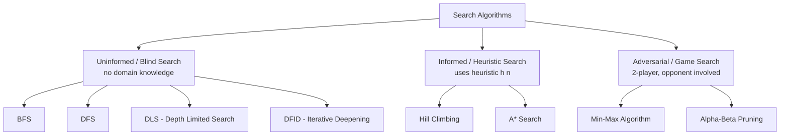

# Artificial Intelligence & Soft Computing — PT-I Question Bank (Detailed Answers)

> Based on the course slides provided (Agent Structure and Types, PEAS Properties, Search Algorithms, Soft Computing vs Hard Computing, Chapter 1 & Chapter 2 modules).
> Diagrams marked **[From Course Slides]** are the actual images extracted from your PPTs — stored in the `assets_ai/` folder next to this `.md` file (keep the folder alongside the file so images render). Diagrams marked **[Mermaid Diagram]** are redrawn using Mermaid since no exact image existed for that specific sub-topic.

---

## How to Use This Document — Quick Orientation

| Question | Type | What examiners want | How to allocate your time (out of the given marks) |
|---|---|---|---|
| Q1 (PEAS) | Definition + applied listing | 4 PEAS components × environment properties, for each of 5-6 agents | ~1.5–2 min per agent; write in table form, don't over-explain |
| Q2 (Agent structures) | Theory + diagram | Block diagram + working explanation for each of the 4-5 agent types | Diagram first (30 sec to draw), then 3-4 bullet points of working |
| Q3 (Soft vs Hard Computing) | Comparison | A clean point-by-point difference table + 1-2 lines of definition each | Table is the answer; don't write paragraphs |
| Q4 (Algorithms) | Theory + working + example | Definition → Algorithm/steps → a solved example → complexity | This is the **most important, highest-weightage** question type — practice the worked examples until you can redraw them without the slide |
| Q5 (Numericals) | Pure problem-solving | Apply the exact steps from Q4 to a **given** tree/graph | Practice the model solved examples in this doc — the method never changes, only the numbers |
| Q6 (Evaluation parameters) | Theory + comparison table | Define Completeness, Optimality, Time & Space Complexity, then fill a comparison table for all Q4 algorithms | Use the ready-made table at the end of this document |

---

# Q1. Write PEAS and Environment Properties for the following agents: (i) Robot Soccer Playing Agent (ii) Internet Shopping Agent (iii) Medical Diagnosis Agent (iv) Driverless Car Agent (v) Search Engine Agent (vi) Reflex Agent

## How to Answer This Question (Method)

### Step 1 — Recall what PEAS stands for
| Letter | Stands for | Question to ask yourself |
|---|---|---|
| **P** | **Performance Measure** | *"How do I judge if the agent is doing a GOOD job?"* — this is the objective/success criterion |
| **E** | **Environment** | *"What is the 'world' the agent operates in?"* — everything external that the agent senses/acts upon |
| **A** | **Actuators** | *"What OUTPUT/ACTION tools does the agent use to affect the environment?"* |
| **S** | **Sensors** | *"What INPUT tools does the agent use to perceive the environment?"* |

### Step 2 — Recall the 6 Environment Properties (always answer as a PAIR, state which side the given agent falls on, and justify in one line)
1. **Fully Observable vs. Partially Observable** — Can sensors access the COMPLETE state of the environment at any time?
2. **Deterministic vs. Stochastic (Strategic)** — Is the next state fully determined by the current state + agent's action, or can it change independently (or due to another intelligent agent, i.e., "strategic")?
3. **Episodic vs. Sequential** — Is each decision independent of past decisions (episodic), or do past actions affect future ones (sequential)?
4. **Static vs. Dynamic** (also mention **Semi-dynamic** if a timer affects performance) — Does the environment change while the agent is "thinking"?
5. **Discrete vs. Continuous** — Are the percepts/actions countable/finite, or infinite/continuous-valued?
6. **Single-agent vs. Multi-agent** (if multi, mention **competitive** or **cooperative**) — Is the agent alone, or interacting with other agents?

### Step 3 — The Shortcut Table (fill this from memory in the exam — reproduced from your slides for reference)

| Environment | Observable | Deterministic | Episodic | Static | Discrete | Agents |
|---|---|---|---|---|---|---|
| Chess (with clock) | Fully | Strategic | Sequential | Semi | Discrete | Multi |
| Chess (without clock) | Fully | Strategic | Sequential | Static | Discrete | Multi |
| Poker | Partial | Strategic | Sequential | Static | Discrete | Multi |
| Backgammon | Fully | Stochastic | Sequential | Static | Discrete | Multi |
| Taxi driving | Partial | Stochastic | Sequential | Dynamic | Continuous | Multi |
| Medical diagnosis | Partial | Stochastic | Episodic | Static | Continuous | Single |
| Image analysis | Fully | Deterministic | Episodic | Semi | Discrete | Single |
| Robot part-picking | Fully | Deterministic | Episodic | Semi | Discrete | Single |
| Interactive English tutor | Partial | Stochastic | Sequential | Dynamic | Discrete | Multi |

### Exam-Time Shortcut Sentence Template
> *"Performance Measure: [maximize/minimize + criteria]. Environment: [physical or digital setting the agent works in]. Actuators: [output devices/UI elements]. Sensors: [input devices/UI elements]. This environment is [observable-type], [deterministic-type], [episodic-type], [static-type], [discrete-type], and [single/multi-agent-type]."*

---

## Worked Answers

### (i) Robot Soccer Playing Agent

**PEAS:**
| Component | Description |
|---|---|
| **Performance Measure** | Goals scored, ball possession time, successful passes, winning the match, avoiding fouls |
| **Environment** | The soccer field, the ball, teammates, opponent robots/players, goalposts, referees |
| **Actuators** | Motors/wheels or legs for movement, kicking mechanism, robotic arm/kicker actuator, communication signals to teammates |
| **Sensors** | Cameras (for ball/player/field detection), infrared/proximity sensors, GPS/positioning sensors, gyroscope (balance), wireless communication receiver |

**Environment Properties:**
- **Partially Observable** — the robot's camera has a limited field of view; it cannot see the entire field and all players at once.
- **Stochastic/Strategic** — opponent robots act as intelligent adversaries, so outcomes depend on more than just this agent's own actions.
- **Sequential** — a pass made now affects the possibility of scoring a goal in future moves.
- **Dynamic** — the ball and players keep moving even while the robot is "thinking" about its next move.
- **Continuous** — positions, speeds, and angles are continuous-valued, not discrete steps.
- **Multi-agent, Competitive (with opponents) and Cooperative (with own teammates)**.

---

### (ii) Internet Shopping Agent

**PEAS:**
| Component | Description |
|---|---|
| **Performance Measure** | Best price found, product relevance to query, minimizing time/clicks to purchase, user satisfaction, successful checkout |
| **Environment** | E-commerce websites, product catalogues/databases, payment gateways, sellers, shipping/delivery network |
| **Actuators** | Display results on screen, add-to-cart button clicks, fill payment/shipping forms, send purchase confirmation |
| **Sensors** | Keyboard/mouse (user's search query, filters), web page/HTML content (product listings, price data, reviews) |

**Environment Properties:**
- **Partially Observable** — the agent cannot see all sellers/prices across the entire web simultaneously; it only sees what it has crawled/queried.
- **Stochastic** — prices, stock availability, and offers can change independently of the agent's actions.
- **Sequential** — earlier decisions (e.g., choice of category filter) affect what options are seen later.
- **Dynamic** — prices/stock can change while the agent is still browsing/deciding.
- **Discrete** — product listings, categories, and prices are typically discrete, countable values.
- **Single-agent** (from the perspective of one shopper's assistant; though the marketplace itself has many sellers, the agent's own decision-making is usually single-agent).

---

### (iii) Medical Diagnosis Agent

**PEAS:**
| Component | Description |
|---|---|
| **Performance Measure** | Correct diagnosis of patient's health condition, minimizing cost, maintaining reputation/trust, patient safety |
| **Environment** | Patients, medical staff, hospital/insurer records, courts (legal/compliance context) |
| **Actuators** | Screen display (questions, tests, diagnoses, treatments, referrals), email, printed prescription, diagnosis report, scan report |
| **Sensors** | Keyboard/mouse for data entry (symptoms, findings, patient's answers), sensor/medical device readings (BP, temperature, scan machines) |

**Environment Properties:**
- **Partially Observable** — the agent cannot directly perceive the patient's actual internal condition, only reported symptoms and test results.
- **Stochastic** — the same symptoms can arise from different underlying conditions; outcomes aren't fully determined.
- **Episodic** — as per the slides, each diagnostic case can largely be treated as an independent episode (though follow-ups exist).
- **Static** — the patient's basic case data doesn't change while the agent is actively reasoning/deciding (within a single consultation).
- **Continuous** — vital signs, lab values, and many medical measurements are continuous-valued.
- **Single-agent** — the diagnosis agent operates independently for a given case (though it consults data from many sources).

---

### (iv) Driverless (Autonomous) Car Agent

**PEAS:**
| Component | Description |
|---|---|
| **Performance Measure** | Safe driving, optimal speed, comfortable journey, obeying traffic rules, minimizing travel time and fuel/energy, maximizing passenger safety |
| **Environment** | Roads (city/highway/village), traffic conditions (vehicles, pedestrians, animals), weather, traffic signals, other drivers, left-hand/right-hand drive rules |
| **Actuators** | Steering wheel, accelerator, brake, gear, indicator/signal lights, horn |
| **Sensors** | Cameras, sonar/LIDAR/RADAR system, speedometer, GPS, odometer, accelerometer, engine sensors |

**Environment Properties:**
- **Partially Observable** — sensors have range/weather limitations and cannot perceive the entire road network at once.
- **Stochastic** — other drivers, pedestrians, and traffic conditions change unpredictably and are outside the agent's control.
- **Sequential** — braking now affects the vehicle's state and available actions in the next moments (e.g., must also downshift/declutch).
- **Dynamic** — the road/traffic situation keeps changing even while the car's system is processing a decision.
- **Continuous** — speed, steering angle, and distances are continuous values.
- **Multi-agent** — shares the road with other independent agents (other cars, pedestrians), making it both cooperative (following shared traffic rules) and competitive (e.g., competing for lane space).

---

### (v) Search Engine Agent

**PEAS:**
| Component | Description |
|---|---|
| **Performance Measure** | Relevance/accuracy of search results, speed of returning results, minimizing irrelevant/spam results, user click-through satisfaction |
| **Environment** | The World Wide Web (web pages, indexed documents, hyperlinks, user query context) |
| **Actuators** | Displaying ranked list of search results/links on-screen, highlighting snippets, suggesting related searches |
| **Sensors** | Keyboard (user's typed query), web crawler data feed (crawled/indexed page content), click-stream/user-behavior data |

**Environment Properties:**
- **Partially Observable** — no search engine has indexed/observed the entire web at any single instant; new pages appear constantly.
- **Stochastic** — the web changes (new pages added/removed, content updated) independent of the agent's own actions.
- **Episodic** (each individual search query can largely be treated as an independent episode, though personalization introduces some sequential elements).
- **Dynamic** — web content keeps changing/updating even as the search engine's index is being used to answer queries.
- **Discrete** — queries, keywords, and indexed documents are discrete, countable units.
- **Single-agent** — from the perspective of a single query-answering session (although it operates over data contributed by many independent web publishers).

---

### (vi) Reflex Agent (Example: Vacuum-Cleaner Reflex Agent)

**PEAS:**
| Component | Description |
|---|---|
| **Performance Measure** | Number of clean squares per unit time, minimizing unnecessary moves/energy used |
| **Environment** | A grid of rooms/squares (e.g., Room A and Room B), which may be clean or dirty |
| **Actuators** | Motor to move Left/Right, Suck mechanism |
| **Sensors** | Location sensor (which room it is in), dirt sensor (whether the current square is dirty) |

**Simple Reflex Rule (condition-action rule) — the defining feature of this agent type:**
```
If status = Dirty  → return Suck
else if location = A → return Right
else if location = B → return Left
```
*(This is the "IF-THEN" logic that makes it purely reflexive — the action depends only on the CURRENT percept, with no memory of past states.)*

**Environment Properties:**
- **Fully Observable** — the agent's sensors can directly perceive both its current location and whether that square is dirty at any instant.
- **Deterministic** — the outcome of "Suck" or "Move" is completely predictable given the current state.
- **Episodic** — under the basic formulation, cleaning one square is largely independent of the next decision (a purely reflexive rule doesn't consider history).
- **Static** — the environment does not change on its own while the agent decides (only the agent's own actions change it).
- **Discrete** — locations (A, B) and status (Clean/Dirty) are discrete, finite values.
- **Single-agent** — operates alone in its environment.

> **Key Insight for exams:** A **Reflex Agent** is characterized less by *what task* it does and more by *how* it decides — it maps the **current percept directly to an action** using condition-action ("if-then") rules, with **no memory of past states, no goals, and no planning**. This makes it fast and simple, but "short-sighted" — it can fail in **partially observable** environments where the current percept alone isn't enough to make a good decision.

---

# Q2. Explain the structure of the following Agents with a neat block diagram: (i) Model-Based Agent (ii) Goal-Based Agent (iii) Utility-Based Agent (iv) Learning Agent

## How to Answer This Question (Method)
1. **Draw the diagram FIRST** — every agent-type diagram builds on the *same* base template (Sensors → Processing box(es) → Actuators, with an Environment box connected via feedback loop). Learn the **one base template**, then just add the extra internal box each agent type introduces.
2. State the **one-line defining idea** of that agent type.
3. Give the **working steps** (how percept flows to action).
4. Give **one real-world example** (the same "vacuum cleaner" or "self-driving car" runs through all types — showing the SAME example evolve across agent types is a great way to demonstrate you understand the *progression* of complexity, which is exactly what examiners look for).
5. Mention **1-2 limitations** to show deeper understanding.

### The General Agent-Environment Loop (base template) **[From Course Slides]**


*(Every agent — regardless of type — follows this same fundamental loop: it PERCEIVES the environment through sensors, REASONS/processes internally, and ACTS on the environment through actuators, and this cycle repeats continuously.)*

---

## (i) Model-Based Agent (Reflex Agent with State / Model-Based Reflex Agent)

### Block Diagram **[From Course Slides]**


### Explanation
A **Model-Based Agent** differs from a simple reflex agent in that it **maintains an internal state** based on the percept history — it keeps a **"model" of how the world works** (how the world evolves independently, and how the agent's own actions affect the world).

**Working (step-by-step, matching the diagram):**
1. **Sensors** perceive the current percept from the **Environment**.
2. The agent **updates its internal State**, combining the new percept with (a) **"how the world evolves"** and (b) **"what my actions do"** — this produces an updated belief about **"what the world is like now."**
3. **Condition-action rules** are matched against this updated internal state (not just the raw current percept).
4. The matched rule determines **"what action I should do now,"** which is sent to the **Actuators**.

**Pseudocode (from your slides):**
```
ReflexAgentWithState(percept):
   state  = UpdateState(state, action, percept)
   rule   = RuleMatch(state, rules)
   action = RuleAction(rule)
   Return action
```

### Real-World Example
**Waymo self-driving car:** it uses GPS and sensor history to understand its location and **predict** what other drivers will do next. For instance, it learns to associate a car's brake lights turning on with that car decelerating — a red light alone doesn't cause braking, but the agent's internal *model* connects the two based on accumulated perceptual history, letting it hit the brakes proactively rather than just reactively.

### Limitation
It can only **react based on the current state derived from history** — it does **not** look ahead into the future or plan a sequence of actions to achieve a specific outcome; that capability belongs to the Goal-Based Agent.

---

## (ii) Goal-Based Agent

### Block Diagram **[From Course Slides]**


### Explanation
A **Goal-Based Agent** extends the model-based agent by adding **explicit goal information**. It doesn't just track "what the world is like now" — it also considers **"what it will be like if I do action A"** and compares this against its **Goals**, choosing actions that will actually lead toward the goal.

**Working (step-by-step, matching the diagram):**
1. **Sensors** perceive the environment; the internal state ("what the world is like now") is updated exactly as in the model-based agent.
2. The agent uses its knowledge of **"how the world evolves"** and **"what my actions do"** to predict **"what it will be like if I do action A"** — i.e., it simulates/projects the outcome of candidate actions.
3. This projected outcome is compared against the agent's stored **Goals**.
4. The action that best moves the agent toward the goal is selected and sent to the **Actuators**.

### Key Characteristics
- It can only differentiate between a **goal state and a non-goal state** — hence its "success" is essentially binary (100% or 0%) unlike a utility-based agent's graded scoring.
- Since it needs to **look ahead** into the future to check if a sequence of actions satisfies the goal, it requires a **planning/search engine** internally (e.g., A* search, BFS/DFS) — this is the key technical addition over a model-based agent.
- It is **proactive rather than reactive** — it has an "agenda" and works backward/forward from it, rather than merely responding to the current percept.

### Real-World Example
A **goal-based vacuum cleaning robot** doesn't just react to "dirt detected → suck." Instead, given the goal **"whole house clean,"** it internally asks: *"If I clean the kitchen first, then the hallway, will I finish before my battery runs out, or should I reverse the order?"* — this requires simulating hypothetical action-sequences in memory before physically moving, exactly the kind of look-ahead a simple reflex/model-based agent cannot do.

### Limitation
Once a goal is fixed, the agent has **no flexibility** to weigh trade-offs between multiple competing goals or partial successes — it either reaches the goal or it doesn't. This limitation motivates the **Utility-Based Agent**.

---

## (iii) Utility-Based Agent

### Block Diagram **[From Course Slides]**


### Explanation
A **Utility-Based Agent** goes one step further than a goal-based agent: instead of just a binary goal-test, it uses a **utility function** that maps each possible resulting state to a **real-valued "happiness"/desirability score**, letting the agent choose not just *a* path to the goal, but the **BEST** path among several competing options.

**Working (step-by-step, matching the diagram):**
1. Same as goal-based: **Sensors** update **"what the world is like now,"** and the agent predicts **"what it will be like if I do action A."**
2. Instead of a simple Goal comparison, the predicted outcome is passed through a **Utility function**, producing **"how happy I will be in such a state."**
3. The action leading to the **highest utility value** is selected and sent to the **Actuators**.

### Key Characteristics
- Utility function: **f(state) → real value**, useful for evaluating and comparing **competing/conflicting goals**.
- Provides a **more general agent framework** than pure goal-based agents — it can accommodate different **preferences** among multiple goals (not just "reached" vs "not reached").
- The agent acts so as to **maximize expected utility**.

### Real-World Example
A **utility-based car-driving agent**, given the goals of *reaching the destination safely, in the least time, and saving fuel*, will check **multiple possible routes** and current traffic conditions, and select the route that gives the **best overall combination** of these (sometimes competing) objectives — e.g., a slightly longer route that saves significantly more fuel might be chosen over the shortest route, based on how the utility function weighs "time" vs "fuel."

### Limitation
Requires an accurate and well-designed **utility function**, which can be difficult to define precisely for complex real-world trade-offs; also computationally more expensive since it must evaluate/compare multiple candidate states.

---

## (iv) Learning Agent

### Block Diagram **[From Course Slides]**


### Explanation
A **Learning Agent** is designed to **adapt and improve its own performance over time**, even in **initially unknown environments** — unlike the previous three agent types (which act based on fixed, pre-programmed knowledge), a learning agent **analyzes the results of its own actions** and modifies its future behavior accordingly. Learning is considered essential for **true autonomy**.

### Four Core Components (as shown in the diagram)
1. **Performance Element** — the "worker": this is the part that actually **selects and executes external actions**, based on what it currently knows (this corresponds to the entire agent structure from types i-iii above — it could be a simple reflex, model-based, goal-based, or utility-based "core").
2. **Critic** — the "evaluator": compares the agent's actual behavior against a **fixed external Performance Standard** (e.g., "Is the room clean?") and gives **feedback** to the Learning Element.
3. **Learning Element** — the "brain" that makes improvements: it takes the Critic's feedback and makes **changes** to update the Performance Element's internal rules/knowledge.
4. **Problem Generator** — the "explorer": suggests new, **experimental actions** (exploration) that might lead to better long-term strategies, even if they aren't the most immediately efficient choice — this drives continued learning rather than settling for the current best-known behavior.

**Working (matching the diagram flow):**
- **Sensors** feed percepts to both the **Performance Element** (for immediate action) and the **Critic** (for evaluation against the performance standard).
- The **Critic** sends **feedback** to the **Learning Element**.
- The **Learning Element** uses this feedback (plus suggestions from the **Problem Generator**, guided by "learning goals") to make **changes** to the **Performance Element**, updating its knowledge.
- The **Performance Element** sends commands to the **Actuators**, completing the loop with the **Environment**.

### Real-World Example — Non-Learning vs Learning Vacuum

| Component | Non-Learning Vacuum | Learning Vacuum |
|---|---|---|
| **Performance Element** | Moves randomly, sucks dirt only when directly underneath, turns on bumper hit | Drives using its current internal map and battery-saving path algorithms |
| **Critic** | None — has no idea if it did a good job | Evaluates: *"You cleaned 80% of the floor but used 95% of the battery because you got stuck under the dining table"* |
| **Learning Element** | None — code never changes from factory settings | Updates the map: *"The area under the dining table is high-friction during dinner hours — avoid it until 8 PM"* |
| **Problem Generator** | None — repeats the same hardcoded pattern every day | Suggests: *"Next Tuesday, try cleaning the kitchen clockwise instead of counter-clockwise to see if it finishes 10 minutes faster"* |

### Why This Matters
Learning allows the agent to **operate in environments its designer did not fully anticipate**, gradually improving performance using experience rather than requiring every situation to be hand-coded in advance — this is what separates "intelligent, adaptive" systems from static, rule-based automation.

---

# Q3. Differentiate between Soft Computing and Hard Computing.

## How to Answer This Question (Method)
This is a **pure comparison question** — the fastest way to full marks is a **clean table** with 1-line definitions before it. Don't write long paragraphs; examiners scan comparison-question answers for **row-by-row contrast**, so a well-organized table outperforms prose.

### One-Line Definitions (write these first)
- **Hard Computing** demands **exact, precise inputs** and follows **deterministic, formal algorithms** to guarantee a **100% correct, verifiable** answer.
- **Soft Computing** mimics the human mind's ability to make decisions based on **incomplete, noisy, or imprecise information** — it deals with problems where hard computing fails or becomes computationally infeasible.

### Comparison Table

| Attribute | Hard Computing | Soft Computing |
|---|---|---|
| **Core Philosophy** | Precise, deterministic, and binary — everything is black or white (1 or 0) | Approximate, non-deterministic, and multi-valued — operates in "shades of gray" |
| **Handling of Data** | Requires exact, clean, and complete input data | Thrives on noisy, incomplete, vague, or uncertain data |
| **Underlying Math** | Traditional analytical mathematics and formal (Boolean) logic | Fuzzy logic, neural networks, and evolutionary algorithms |
| **Solving Process** | Follows a strict, step-by-step sequential algorithm | Learns from data, adapts dynamically, and generalizes from experience |
| **Computational Cost** | High for complex problems; can lead to NP-hard scenarios (unsolvable in reasonable time) | Much lower for complex problems, since it seeks **optimization**, not perfection |
| **Output** | 100% precise, repeatable, and verifiable | Approximate, probabilistic, or an "optimal guess" |

### The 5 Core Concepts Soft Computing is Built On (bonus points — mention these to elevate your answer)

| Concept | What it Handles | Core Soft Computing Tool |
|---|---|---|
| **Approximation** | Finding an "acceptable" solution instead of a "perfect" one (exact solutions are often computationally impossible/expensive) | Artificial Neural Networks (ANN) |
| **Vagueness (Fuzziness)** | Concepts without sharp boundaries (e.g., "tall," "warm," "hot") — an intrinsic property of human language/perception, not a lack of information | Fuzzy Logic Systems (FLS) |
| **Randomness** | Non-deterministic, unpredictable events (e.g., a coin flip) — used as a tool for exploration | Genetic Algorithms (stochastic search via mutation/crossover) |
| **Probability** | Measuring the likelihood of a specific, well-defined ("crisp") random event happening | Bayesian Networks / Probabilistic Reasoning |
| **Uncertainty** | The overarching state of having incomplete/imperfect/unreliable information — caused by *both* randomness and vagueness together | The entire Soft Computing hybrid framework |

> **Important Distinction (often asked as a follow-up):** **Probability** deals with the likelihood of a **crisp, well-defined event** happening (e.g., *"There is a 30% chance it will rain tomorrow"* — it either will or won't rain). **Vagueness/Fuzziness** deals with the **degree of truth** of a statement about something that has *already* happened (e.g., *"It rained a little bit today, so 'It rained' is 0.4 true"*).

### Real-World Example
- **Hard Computing example:** Calculating the exact roots of a quadratic equation, or sorting a list of numbers — there is one guaranteed, exact, correct answer.
- **Soft Computing example:** A **self-driving car navigating in heavy fog** — sensor data is noisy and incomplete (uncertainty), "the road is a bit slippery" is inherently vague (fuzziness), and the car must still make a **"good enough"** driving decision in real time using fuzzy logic, probabilistic reasoning, and neural-network-based approximation — a purely hard-computing, exact-algorithm approach would fail or freeze under such imprecise conditions.

### Conclusion Line (good to write at the end of this answer)
> *"Soft Computing does not replace Hard Computing — it complements it. Hard Computing is preferred when problems are well-defined and require exact/guaranteed answers (e.g., billing systems, calculators), while Soft Computing is preferred for complex, real-world problems involving uncertainty, noise, or human-like reasoning (e.g., image recognition, natural language understanding, autonomous vehicles)."*

---

# Q4. Explain and demonstrate with a suitable example the working of the following algorithms in detail: (i) DLS (ii) DFID (iii) Hill Climbing (iv) A* Search (v) Min-Max Algorithm (vi) Alpha-Beta Pruning

## How to Answer This Question (General Method for ANY Search-Algorithm Question)
For **every** algorithm in this question, structure your answer in this exact order — it matches how these algorithms are taught and gets you marks for each sub-part even if you run out of time:
1. **One-line definition** — what problem does it solve, and what "family" does it belong to (uninformed/blind search vs informed/heuristic search vs adversarial/game search)?
2. **Key idea / how it decides what to expand next** — this is the single most important differentiator between search algorithms.
3. **Algorithm steps / pseudocode** — write this as a short numbered list, not paragraphs.
4. **Worked example** — trace through a small tree/graph step-by-step, showing the OPEN/CLOSED list or the f/g/h values at each step (**this is what gets you the most marks in "demonstrate with example" questions**).
5. **Completeness/Optimality one-liner + 1 advantage + 1 limitation.**

### Where These 6 Algorithms Fit (Big Picture)



---

## (i) DLS — Depth-Limited Search

### Definition
DLS is an **uninformed/blind search** algorithm — it is simply **DFS (Depth-First Search) with a pre-determined depth limit, L**. Search is **not permitted** beyond this depth bound, which solves DFS's biggest problem (running forever down an infinite branch).

### Key Idea
Behaves exactly like DFS (always expands the deepest unexpanded node, using a **LIFO stack** as the frontier), **except** that any node at depth greater than the limit **L** is treated as if it has **no successors** (i.e., the search is artificially cut off there).

### Recall: How Plain DFS Traverses (DLS = this + a cutoff) **[From Course Slides]**


*(This shows classic DFS: it dives all the way down the leftmost branch first — A→B→D→H, I — before backtracking up to explore the next unvisited sibling. DLS follows this exact same traversal order, but simply refuses to go past the given depth limit L.)*

### Algorithm / Pseudocode
```
function DEPTH-LIMITED-SEARCH(problem, ℓ) returns a node or failure or cutoff
   frontier ← a LIFO queue (stack) with NODE(problem.INITIAL) as an element
   result ← failure
   while not IS-EMPTY(frontier) do
      node ← POP(frontier)
      if problem.IS-GOAL(node.STATE) then return node
      if DEPTH(node) > ℓ then
         result ← cutoff
      else if not IS-CYCLE(node) do
         for each child in EXPAND(problem, node) do
            add child to frontier
   return result
```
**[From Course Slides]** *(pseudocode above reproduced exactly as taught)*

### Worked Example (Trace)
Given a tree with root A, and a **depth limit L = 2**:
- The search proceeds exactly like DFS — expanding the deepest node first, leftmost tie-breaking — **but** any node discovered at depth 3 or beyond is **not expanded further**; the algorithm simply reports `cutoff` at that branch and backtracks, exactly like hitting a dead-end.
- If the goal happens to lie at depth 1 or 2, DLS finds it (behaving identically to DFS up to that depth).
- If the goal lies at depth 3+ (beyond L), DLS **fails to find it**, even though it exists — it terminates having "run out" of allowed depth.

*(Use the same style of A→B,C→D,E,F,G tree from the DFS/BFS diagrams below — just stop expanding any branch once you cross the given depth limit, and mark it "cutoff.")*

### Completeness, Optimality & Trade-offs
- **Completeness:** **No** — if the closest goal is at depth *d* > *L*, DLS finishes without ever finding it. It is complete **only if L ≥ d**.
- **Optimality:** **No** — even if a goal is found within the limit, it may not be the shallowest/best one if multiple goals exist within L.
- **Time Complexity:** O(b^L)
- **Space Complexity:** O(b·L) — like DFS, it only holds the current path, capped at the limit.
- **Advantage:** Guarantees **termination** (unlike plain DFS on infinite/cyclic spaces).
- **Limitation:** Choosing the "right" L requires knowing (or guessing) the solution depth in advance — too small a limit misses the goal entirely, too large wastes time/memory.

---

## (ii) DFID — Depth-First Iterative Deepening Search (also called IDS/IDDFS)

### Definition
DFID is an **uninformed search** strategy that **combines the low memory usage of DFS with the completeness and optimality guarantees of BFS**. It works by **repeatedly running Depth-Limited Search**, with the depth limit increasing one level at a time: first with limit 0, then limit 1, then limit 2, and so on — **until the goal is found**.

### Key Idea
Rather than trying to guess the "right" depth limit once (like DLS), DFID simply **tries every limit in increasing order**, guaranteeing it will eventually use a limit equal to the depth of the shallowest goal — while still only ever using DFS's cheap, linear memory at any single iteration.

### Algorithm Steps
1. Set depth limit **ℓ = 0**.
2. Run **DLS(problem, ℓ)**.
3. If a goal is found, **return it**.
4. Otherwise, **increment ℓ by 1** and repeat from Step 2.

### Worked Example (Trace) **[From Course Slides]**


*(As shown: at **limit 0**, only the root A is checked. At **limit 1**, the search re-starts from A and now also explores B and C. At **limit 2**, it restarts again from A and goes as deep as D, E, F, G. At **limit 3**, it goes as deep as H, I, J, K — notice how each iteration completely REDOES the work of all previous iterations, re-visiting upper-level nodes each time before finally reaching new, deeper nodes.)*

### Why the "Wasteful" Re-generation Isn't Actually Wasteful
It might seem inefficient to regenerate upper-level nodes repeatedly on every iteration, but the overhead is **minimal** — in an exponential search tree, the **vast majority of nodes sit at the bottom-most layer**, so the cost of re-visiting the (relatively few) upper-level nodes multiple times is small compared to the cost of the final, deepest layer.

### Completeness, Optimality & Complexity
- **Completeness:** **Yes** — since it expands all nodes level-by-level (implicitly), it is guaranteed to find the goal if one exists, even in infinite trees.
- **Optimality:** **Yes** — it expands nodes in strictly increasing order of depth, so the **first** goal found is guaranteed to be the **shallowest** (and therefore optimal, if all step-costs are equal).
- **Time Complexity:** O(b^d)
- **Space Complexity:** O(b·d) — retains DFS's efficient linear space property, since it only ever goes as deep as the *current* iteration's limit.

### Comparative Summary Table (DFS vs DLS vs DFID) **[From Course Slides]**

| Metric | DFS | DLS | IDDFS (DFID) |
|---|---|---|---|
| Time Complexity | O(b^m) | O(b^L) | O(b^d) |
| Space Complexity | O(b·m) | O(b·L) | O(b·d) |
| Complete? | No | No (Yes only if L ≥ d) | **Yes** |
| Optimal? | No | No | **Yes** (if path cost is a non-decreasing function of depth) |

*(b = branching factor, m = maximum depth of the state space, d = depth of the shallowest solution, L = the chosen depth limit)*

### Real-World Analogy
DFID is like searching for a lost item in a large house **one room-depth at a time**: first check just the entryway (limit 0); if not found, start over and check the entryway + adjoining rooms (limit 1); if still not found, start over again and check one room deeper (limit 2) — repeating until found. It seems repetitive, but it guarantees you find the item **at the shallowest possible search depth**, without ever needing to hold the entire house's search-space in memory at once.

---

## (iii) Hill Climbing Search

### Definition
Hill Climbing is an **informed, local search** technique that iteratively moves toward the direction of **increasing (better) heuristic value**, using an **evaluation function**. It is memory-efficient because it does **not** maintain the entire search tree — it only looks at the **current state** and its **immediate neighbors**.

### Key Idea — "Climbing a Hill"
> *"Consider all the possible states laid out on the surface of a landscape. The height of any point on the landscape corresponds to the evaluation function (heuristic value) of the state at that point."*

Hill climbing **only ever moves to a neighboring state that is BETTER** than the current one — it can be visualized as **always walking uphill**, never downhill, and it stops as soon as no neighboring state is better (i.e., it has reached a "peak").

### Two Variants

**(A) Simple Hill Climbing**
```
1. Evaluate the initial state. If it is a goal state, return and quit;
   otherwise make it the current state and go to Step 2.
2. Loop until a solution is found or no new operators are left:
   a. Select and apply a new operator (generate a new child node).
   b. Evaluate the new state:
      (i)   If it is a goal state, return and quit.
      (ii)  If it is BETTER than the current state, make it the new current state.
      (iii) If not better, continue the loop (try the next operator).
```
- Takes the **FIRST** neighbor found that is better than the current state — saves time, but may not find the optimal solution.

**(B) Steepest-Ascent Hill Climbing**
```
1. Evaluate the initial state; if goal, return and quit; else set as current state.
2. Loop until a solution is found or a complete iteration produces no change:
   a. Let SUCC = a state such that any possible successor will be better than SUCC (i.e., initialize SUCC as "worse than everything").
   b. For each applicable operator, evaluate the new state:
      (i)  If it is the goal, return and quit.
      (ii) If it is better than SUCC, set SUCC to this state.
   c. If SUCC is better than the current state, set current state = SUCC.
```
- Evaluates **ALL** neighbors and picks the **BEST** one among them — always finds the optimal move at each step (locally), but takes more time since every successor must be evaluated.

### Worked Example (Trace) **[From Course Slides]**
*Apply Hill Climbing to the tree below, with G as the Goal State and A as the initial state. (Numbers next to each node are heuristic values — higher is better.)*


**Step-by-step trace:**
| Step | Action | OPEN list | CLOSED list |
|---|---|---|---|
| 1 | Start at initial state A (h=3) | [A] | [] |
| 2 | Generate all children of A: B(3), C(5), D(3). Since C has the **highest heuristic** among A's children, select C for expansion next. | [C5, B3, D3] | [A] |
| 3 | Generate children of C: E(8), F(7). E has the higher heuristic among C's children, so expand E next. | [E8, F7, B3, D3] | [A, C] |
| 4 | Generate the child of E: G(9). G has the highest heuristic AND is the **Goal** — STOP. | [G9, F7, B3, D3] | [A, C, E] |

**Path found: A → C → E → G** *(the algorithm never even looks at B or D, since it always greedily follows the single best-looking neighbor at each level — this is the defining "greedy, no-backtracking" nature of hill climbing).*

### Limitations of Hill Climbing (very commonly asked separately — know these 3)
1. **Local Maximum:** A state that is better than all its immediate neighbors, but is **not** the actual best (global) solution — the algorithm gets "stuck" here since no neighboring move looks better, even though a better solution exists elsewhere in the search space, reachable only by temporarily going "downhill."
2. **Plateau:** A **flat region** where all neighboring states have the **same** heuristic value — the algorithm cannot determine which direction to move using only local comparisons, and may wander indefinitely.
3. **Ridge:** A sequence of local maxima that is very difficult for the algorithm to navigate, because the direct path along the ridge-top requires moves that look like they go "sideways/downhill" from the algorithm's simple local view, even though the ridge overall leads to a higher point.

### Simple vs Steepest-Ascent — Trade-off
| | Simple Hill Climbing | Steepest-Ascent Hill Climbing |
|---|---|---|
| Which successor is chosen | The **first** one found that's better | The **best** among ALL successors |
| Time taken | Less (saves time) | More (must evaluate every successor) |
| Solution quality | May not be optimal; more nodes/branches may get explored | Always the locally optimal choice at each step |

### Real-World Example
A **delivery-route optimization agent** using hill climbing starts with some initial route and repeatedly swaps the order of two delivery stops; if the swap **reduces** total distance (a "better" state), it keeps the change, otherwise it discards it — continuing until no single swap improves the route further (a "hilltop" / locally optimal route).

---

## (iv) A* Search

### Definition
A* Search is the **most widely known form of Best-First Search** — an **informed search** algorithm that finds the lowest-cost path from a start node to a goal node. It is also referred to as an **OR graph/tree search algorithm**.

### Key Idea — The Evaluation Function
A* evaluates each node **n** using:
$$f(n) = g(n) + h(n)$$
- **g(n)** = the actual cost of the path from the **start node to node n** (cost already incurred).
- **h(n)** = the **heuristic estimate** of the cheapest cost from node n to the **goal** (estimated cost remaining).
- **f(n)** = the estimated **total** cost of the cheapest solution path that passes through n.

**Key difference from plain Best-First Search:** Best-First Search considers **only h(n)** (how promising the remaining path looks), while **A* considers BOTH g(n) and h(n)** — i.e., it balances "how far I've already come" against "how far I think I still have to go" — which is exactly why A* always finds the **cheapest** overall solution, not just the one that "looks" closest to the goal.

### Admissible Heuristic (important sub-concept, often asked)
A heuristic h(n) is **admissible** if, for every node n: **h(n) ≤ h\*(n)**, where h\*(n) is the TRUE cost to reach the goal from n. In other words, an admissible heuristic **never overestimates** the true remaining cost — it is always "optimistic." **This property is what guarantees A* finds the optimal (cheapest) solution.**

### Algorithm Steps
1. Initialize the OPEN list with the start node; set g(start) = 0.
2. Loop:
   a. If OPEN is empty, return **failure**.
   b. Pick the node **n** from OPEN with the **lowest f(n) = g(n) + h(n)**.
   c. If **n** is the goal, return the solution path (success).
   d. Move **n** to CLOSED; generate its successors.
   e. For each successor, compute g and f; add to OPEN (updating if a cheaper path to an already-seen node is found).
3. Repeat until goal is found or OPEN is exhausted.

### Properties of A*
1. **Completeness:** It is complete — it will always find a solution if one exists.
2. **Optimality:** Yes, it is optimal (**provided the heuristic is admissible**).
3. **Time Complexity:** O(b^m) — grows exponentially with solution depth in the worst case.
4. **Space Complexity:** O(b^m) — it keeps **all** generated nodes in memory (this is A*'s biggest practical drawback).

### Worked Example 1 — Simple Graph Trace **[From Course Slides]**


*(Red figures = h(n), Black figures = g(n) in the diagram. Starting at S, the algorithm computes f(n) = g(n)+h(n) for each candidate path (via A, B, or C) and always expands the node with the lowest f-value next — notice the QUEUE ordering SC, SA, SB reflects increasing f-value, not simply the order the nodes were generated.)*

### Worked Example 2 — Full Numerical Problem (exact style asked in exams)

> **Problem:** *Consider the graph below. The initial state is S and the goal state is node 7. Find a path from the initial state to the goal state using A* Search, and report the solution cost. Heuristic (straight-line distance) estimates: h(1)=14, h(2)=10, h(3)=8, h(4)=12, h(5)=10, h(6)=10, h(S)=15, h(7)=0 (goal).*

**Graph Structure [From Course Slides]:**


**How to Solve This Type of Numerical (General Steps):**
1. Start at S; list all of S's neighbors along with the **edge cost** to reach them.
2. For each candidate node n, compute **g(n)** = cumulative edge-cost from S to n, and look up **h(n)** from the given heuristic table.
3. Compute **f(n) = g(n) + h(n)** for every node currently in the OPEN list (frontier).
4. **Expand the node with the lowest f(n)** — move it to CLOSED, and generate its children, adding them to OPEN with their own newly-computed f-values.
5. Repeat steps 3-4 — always picking the globally lowest f(n) among ALL nodes currently in OPEN (not just the children of the last-expanded node) — until the **goal node itself is selected for expansion** (not merely generated).
6. Once the goal is expanded, backtrack through the parent pointers to report the **final path** and sum the **actual edge costs** (g-values) along that path — this sum is the **solution cost**.

*(Apply this exact 6-step method to whatever specific graph/heuristic values are given in your actual exam question — the method never changes, only the numbers do.)*

### Worked Example 3 — A* on the 8-Puzzle (classic AI textbook example) **[From Course Slides]**


**Evaluation function used:** f(X) = g(X) + h(X), where:
- **h(X)** = number of tiles **not in their goal position** in state X (a simple, admissible heuristic for the 8-puzzle).
- **g(X)** = depth of node X in the search tree (number of moves made so far).

*(As shown: from the given start state, two possible moves — "left" and "right" — lead to two child states, each labeled with its own f = g + h value in the diagram. A* always continues expanding down the branch with the LOWEST total f-value at each step, which is why it correctly finds the shorter overall path down to the Goal State rather than wastefully exploring the more expensive alternative branch.)*

### Real-World Example
**GPS navigation apps** (Google Maps, etc.) use A*-like algorithms: **g(n)** = actual driving distance/time so far, **h(n)** = straight-line (or estimated) distance/time remaining to the destination — the app always expands the most promising route-segment first, guaranteeing it finds the shortest/fastest overall route rather than just one that "looks" locally promising.

---

## (v) Min-Max Algorithm

### Definition
Minimax is a **recursive, adversarial search** algorithm used to choose the **optimal move** for a player in a two-player, zero-sum game (like Chess or Tic-Tac-Toe), under the assumption that **the opponent is also playing optimally**.

### Key Idea — MAX vs MIN
- The two players are called **MAX** (trying to **maximize** their own score/outcome) and **MIN** (the opponent, trying to **minimize** MAX's score).
- If the game space is small enough, the entire game tree can be generated down to terminal (leaf) states, each assigned a **utility value** (e.g., +1 for a MAX win, -1 for a MIN win, 0 for a draw).
- These leaf values are then **propagated back up the tree**: at a **MAX node**, the value is the **maximum** of its children's values; at a **MIN node**, the value is the **minimum** of its children's values.

### Key Terminology
- **Terminal state:** The position of the board when the game is over.
- **Goal test:** Checks whether the game has ended (i.e., whether the current state is a terminal state).
- **Utility function:** Assigns a numeric value to the outcome of the game for a terminal state.
- **Game tree:** Built from the Initial state + all Legal moves at each level.

### Algorithm / Pseudocode **[From Course Slides]**


**In plain steps:**
1. If the search has reached its depth limit (a terminal/leaf node), calculate and return its static utility value.
2. If the current level is a **MIN level**, recursively call minimax on all children, and return the **MINIMUM** of their resulting values.
3. If the current level is a **MAX level**, recursively call minimax on all children, and return the **MAXIMUM** of their resulting values.
4. Utility values are calculated bottom-up, one layer of the tree at a time, until reaching the root.
5. At the root (topmost point), **MAX** chooses the action corresponding to the **highest** backed-up value.

### Worked Example (Trace) **[From Course Slides]**


**Reading this tree bottom-up (general method, apply to the exact values shown in your diagram/exam):**
- The **bottom (leaf) row** shows the raw utility values, evaluated using the game's utility function.
- At each **MIN** level directly above the leaves (shown in red in the diagram), every node takes the **minimum** value among its own children.
- At the next level up, each **MAX** node (shown in gray) takes the **maximum** value among its (already MIN-processed) children.
- This alternates layer-by-layer, all the way up to the **root** — the final backed-up value at the root is the score MAX can **guarantee** by playing optimally, assuming MIN also always plays optimally in response.
- The move actually chosen at the root is whichever child branch **produced** that backed-up maximum value.

*(For your own given tree in an exam, simply apply "min of children" and "max of children" alternately, one level at a time, from the leaves up to the root — always check whether the ROOT is a MAX or MIN level first, as this is usually implied by whose turn it is to move.)*

### Completeness, Optimality & Complexity
- **Completeness:** Yes, for finite game trees.
- **Optimality:** Yes, against an optimally-playing opponent.
- **Time Complexity:** O(b^m), where b = branching factor (number of legal moves), m = maximum depth of the game tree.
- **Space Complexity:** O(b·m) (like DFS, since it explores depth-first).

### Limitation
For real games like Chess, the game tree is **far too large** to search all the way down to terminal states (b ≈ 35, m can be 80+ moves) — this motivates using **Alpha-Beta Pruning** to eliminate branches that cannot possibly affect the final decision, and/or cutting off search at a limited depth with a heuristic evaluation function.

### Real-World Example
Classic **Tic-Tac-Toe AI** — since Tic-Tac-Toe's entire game tree is small enough to fully enumerate, a minimax-based AI opponent can **guarantee at least a draw** by always choosing the move that maximizes its own worst-case outcome, assuming the human opponent also plays their best possible move at every turn.

---

## (vi) Alpha-Beta Pruning

### Definition
Alpha-Beta Pruning is an **optimization/extension of the Minimax algorithm** — it computes the **exact same result** as plain minimax, but **without needing to examine every single node** of the game tree. It "prunes" (cuts off) branches that **cannot possibly influence** the final decision, making the search dramatically more efficient.

### Key Idea
- **Pruning** means "cutting off" — like clipping an unfruitful branch off a tree before it wastes further examination.
- Only the branches that are actually important for computing the correct final decision are explored; the rest are safely skipped **without changing the final answer**.
- Two values are tracked as the search proceeds:
  - **Alpha (α):** The **best (highest)** value found so far **for MAX**, along the current path.
  - **Beta (β):** The **best (lowest)** value found so far **for MIN**, along the current path.

### Algorithm Rules
1. Initialize **α = −∞** and **β = +∞** at the root.
2. If the node is a **leaf node**, simply return its value.
3. **At a MIN node:** recursively apply minimax-with-alpha-beta to each child.
   - If a child returns a value **less than the current β**, update **β** to this new (smaller) value.
   - **Pruning condition:** If at any point **β ≤ α**, **STOP examining further children** of this node (prune the rest) — since MAX (the parent) would never let the game reach this branch anyway.
4. **At a MAX node:** recursively apply minimax-with-alpha-beta to each child.
   - If a child returns a value **greater than the current α**, update **α** to this new (larger) value.
   - **Pruning condition:** If at any point **α ≥ β**, **STOP examining further children** of this node (prune the rest) — since MIN (the parent) would never let the game reach this branch anyway.

### Worked Example (Trace) **[From Course Slides]**

**Starting game tree (before any pruning):**


**Final result after Alpha-Beta Pruning is applied:**


**How to read the final diagram:**
- The **circled/shaded leaf nodes** are explicitly marked "**nodes that were never explored**" — this is the entire point of alpha-beta pruning: the algorithm reaches the **same final root value (=5)** as plain minimax would, **without** needing to evaluate every single leaf.
- Working left to right: the leftmost MIN subtree resolves to **4**; once the algorithm starts exploring the middle subtree and quickly determines its value must be **≤ 2** (worse for MAX than the 4 already found on the left), it **prunes** the remaining children of that middle subtree without evaluating them fully — because MAX (the root) will never choose a path that leads to something worse than 4.
- The rightmost subtree resolves to **5**, which becomes the new best value for MAX at the root, and some of its children are similarly pruned once their outcome is already determined to not matter.
- **Final root value = 5** — exactly matching what plain Minimax would have computed, but achieved by examining noticeably fewer nodes.

### How to Solve an Alpha-Beta Numerical (General Steps for exams)
1. Draw/label the game tree with MAX and MIN levels alternating from the root.
2. Perform a **depth-first, left-to-right** traversal, carrying along the current **α** and **β** values (initially −∞ and +∞) as parameters passed down to each recursive call.
3. At each **leaf**, simply return its given value.
4. At each **MIN node**, update β as you examine each child in order; **the moment β ≤ α, stop and don't examine the rest of that node's children** — mark them as "pruned."
5. At each **MAX node**, update α as you examine each child in order; **the moment α ≥ β, stop and don't examine the rest of that node's children** — mark them as "pruned."
6. The value finally backed up to the root is your answer — it will always be **identical** to what plain Minimax would produce.

### Completeness, Optimality & Complexity
- **Result:** Alpha-Beta always produces the **exact same decision** as plain Minimax — it is an optimization, not an approximation.
- **Best-case Time Complexity:** O(b^(m/2)) — if nodes happen to be explored in the best possible order, alpha-beta can effectively search **twice as deep** as plain minimax in the same amount of time (since it only needs to examine the square root of the number of nodes minimax would).
- **Worst-case Time Complexity:** O(b^m) — same as plain minimax, if node ordering is unfavorable (no pruning opportunities arise).

### Real-World Example
Modern **Chess engines** (like early versions of Deep Blue, or Stockfish's classical search mode) rely heavily on alpha-beta pruning (combined with smart move-ordering heuristics to maximize pruning opportunities) to search many more moves ahead within the same time budget than plain minimax ever could — this is what makes real-time competitive game-playing AI computationally feasible.

---

# Q5. Problems based on Q4 Algorithms (Numericals)

## How to Answer This Question (Method)
Numerical problems in this course are **never** about inventing a new method — they always test whether you can **correctly apply the exact algorithm steps from Q4** to a specific given tree/graph. Follow this general exam strategy:

1. **Identify which algorithm is being asked** (look for keywords: "heuristic value" + "goal test only" → Hill Climbing; "g(n), h(n) both given" → A*; "MAX/MIN players" → Minimax; "prune"/"cut off branches" → Alpha-Beta; "depth limit ℓ given" → DLS; "increasing depth limits" → DFID).
2. **Redraw the given tree/graph neatly** on rough paper first — label every node with its given value(s) exactly as stated.
3. **Maintain an OPEN and CLOSED list explicitly** (as a running table) for BFS/DFS/DLS/DFID/Hill-Climbing/A* type questions — examiners give **partial credit for a correctly maintained OPEN/CLOSED trace**, even if your final path has a small error.
4. **Show EVERY intermediate calculation** (e.g., every f(n)=g(n)+h(n) computation, every min/max backup value) — most of the marks in numericals come from **showing the working**, not just the final answer.
5. **State the final answer explicitly** — the path found, and (for A*/UCS-style problems) the total solution cost.

### Below are fully worked model numericals for each algorithm type (practice these; apply the identical method to whatever specific numbers your exam gives)

---

### Numerical 1 — DLS / DFID Trace (using the same base tree used for BFS/DFS in your slides)

**Given:** Tree with root A; children of A = B, C; children of B = D, E; children of C = F, G; children of D = H, I. **Find the traversal order using DLS with depth limit ℓ = 2**, and separately using **DFID**.

**BFS traversal reference (for comparison) [From Course Slides]:**


**Solution — DLS with ℓ = 2:**
- Depth 0: A (expand)
- Depth 1: B, C (both within limit — expand)
- Depth 2: D, E (children of B), F, G (children of C) — all within limit, but **their children (H, I, at depth 3) are NOT expanded** since depth 3 > ℓ = 2.
- **Traversal order:** A, B, D, E, C, F, G *(exact left-to-right order depends on tie-breaking convention, typically leftmost-first)* — search terminates having explored only up to depth 2, reporting `cutoff` for D, E, F, G's children.

**Solution — DFID:**
- **Iteration ℓ=0:** Visit A only.
- **Iteration ℓ=1:** Visit A, B, C.
- **Iteration ℓ=2:** Visit A, B, D, E, C, F, G.
- **Iteration ℓ=3:** Visit A, B, D, H, I, E, C, F, G *(now reaching depth 3, including H, I)*.
- If the goal is, say, node **I** (at depth 3), DFID finds it on the **ℓ=3 iteration**, having "wasted" some repeated work on iterations 0-2 — but this repeated work is the guaranteed trade-off for DFID's completeness + optimality + low memory use.

---

### Numerical 2 — Hill Climbing (a second practice tree, different from the Q4 demonstration)

**Given:** Root A(h=3) has children B(h=6), C(h=4). B has children D(h=9), E(h=5). Goal = D.

**Solution (Steepest-Ascent Hill Climbing):**
| Step | Current Node | Children Generated & Evaluated | Best Child (SUCC) | Action |
|---|---|---|---|---|
| 1 | A (h=3) | B(6), C(4) | B (h=6, highest) | Move to B (6 > 4 > 3) |
| 2 | B (h=6) | D(9), E(5) | D (h=9, highest) | Move to D (9 > 5) |
| 3 | D (h=9) | D **is the Goal** | — | **STOP — Goal Found** |

**Path found: A → B → D**, total 2 moves. *(Notice how the algorithm never even looks at C or E — exactly like the Q4 example, it greedily commits to the best-looking neighbor at each step.)*

---

### Numerical 3 — A* Search (a second practice example, referencing the numbered-node style graph)

Use the exact **6-step general method** given under Q4(iv) above. As practiced there with the S→1..7 numbered graph (h(1)=14, h(2)=10, h(3)=8, h(4)=12, h(5)=10, h(6)=10, h(S)=15):

**Solution approach:**
1. From S, compute f(n) = g(n) + h(n) for each direct neighbor of S (using the edge costs shown in the graph image `astar_numerical_graph.png`).
2. Expand the neighbor with the **lowest f-value** first.
3. Continue expanding the lowest-f node in the **entire** OPEN list (not just children of the last expansion) at every step.
4. Stop when node **7** (the goal) is **selected for expansion** — at that point, backtrack via parent-pointers to report the path and sum the actual edge costs (g-values) for the **solution cost**.

*(This exact procedure is what you must replicate step-by-step for full marks — always draw out an explicit OPEN-list table showing the f, g, h values at each iteration.)*

---

### Numerical 4 — Minimax + Alpha-Beta on the Same Tree (a very common combined-question format)

**Given:** The tree from Q4's Alpha-Beta example (`alphabeta_tree_start.png`), with leaf values: 4, 3, 6, 2, 2, 1, 9, 5, 3, 1, 5, 4, 7, 5 (left to right).

**Part A — Solve using plain Minimax:**
- Apply "min of children" / "max of children" alternately bottom-up, exactly as shown in Q4(v) — **every single leaf must be evaluated**.
- Final root value obtained = **5**.

**Part B — Solve the SAME tree using Alpha-Beta Pruning:**
- Apply the α/β update-and-prune rules from Q4(vi), left to right.
- Final root value obtained = **5** (**identical to Part A**, confirming alpha-beta never changes the final decision).
- **Key numerical to report:** count and list **which leaf nodes were pruned/never explored** (shown as the shaded circles in `alphabeta_tree_pruned_result.png`) — examiners specifically check whether you correctly identified the pruned branches, not just the final value.

> **Exam Tip:** Questions very often ask you to solve the **same** tree with both Minimax and Alpha-Beta, specifically to test whether you understand that **Alpha-Beta is a pure efficiency optimization** — same answer, fewer nodes explored. Always explicitly state "the final value matches plain Minimax; the only difference is X nodes were pruned" to show this understanding.

---

# Q6. Elaborate on the evaluation parameters used to measure the performance of the algorithms in Q4.

## How to Answer This Question (Method)
This question wants you to **define each parameter clearly** (1-2 lines each, with the exact meaning of the notation b, d, m, L), and then present a **comparison table** applying these parameters to all 6 algorithms from Q4. Always define **b, d, m** at the very start, since every complexity expression is written in terms of these.

### Notation (define this first — used throughout)
- **b** = **branching factor** — the maximum number of children/successors any node in the search tree can have.
- **d** = **depth of the shallowest/best solution** in the search tree.
- **m** = **maximum depth of the search space** (may be infinite for some problems).
- **L (or ℓ)** = the **depth limit** chosen for Depth-Limited Search.

## The 4 Evaluation Parameters

### 1. Time Complexity
**Definition:** The number of operations (or equivalently, the number of nodes generated/expanded) required for the algorithm to find a solution. This directly indicates **how long** the algorithm will take to run.

### 2. Space Complexity
**Definition:** The **maximum amount of memory** required by the algorithm at any point during its execution — typically measured as the maximum number of nodes that must be stored in memory simultaneously (e.g., in the OPEN/frontier list).

### 3. Completeness
**Definition:** An algorithm is **complete** if it is **guaranteed to find a solution whenever one exists** in the search space (and correctly report failure when none exists). An incomplete algorithm might search forever (or terminate early) without finding an existing solution.

### 4. Optimality
**Definition:** An algorithm is **optimal** if, whenever there are multiple possible solutions, it is guaranteed to find the **best one** (i.e., the one with the minimum path cost) — not merely *a* solution, but the *cheapest/shortest* one.

*(A 5th parameter, sometimes added specifically for adversarial/game search: **Correctness against optimal opponent** — does the algorithm guarantee the best achievable outcome assuming the opponent also plays optimally? Minimax and Alpha-Beta both satisfy this.)*

## Comprehensive Comparison Table — All Q4 Algorithms

| Algorithm | Type | Time Complexity | Space Complexity | Complete? | Optimal? |
|---|---|---|---|---|---|
| **DLS** (Depth-Limited Search) | Uninformed | O(b^L) | O(b·L) | No *(Yes only if L ≥ d)* | No |
| **DFID** (Iterative Deepening) | Uninformed | O(b^d) | O(b·d) | **Yes** | **Yes** *(if path cost is non-decreasing with depth)* |
| **Hill Climbing** | Informed / Local Search | Varies (no fixed tree kept; can be very fast per step) | O(1) *(only stores current state — extremely memory-efficient)* | **No** *(can get stuck at local maxima/plateaus/ridges)* | **No** |
| **A\* Search** | Informed | O(b^m) *(exponential in worst case; much better with a good heuristic)* | O(b^m) *(keeps all generated nodes in memory)* | **Yes** | **Yes** *(if heuristic h(n) is admissible)* |
| **Minimax** | Adversarial / Game Search | O(b^m) | O(b·m) | Yes *(for finite game trees)* | Yes *(against an optimal opponent)* |
| **Alpha-Beta Pruning** | Adversarial / Game Search (optimized Minimax) | Best case: O(b^(m/2)); Worst case: O(b^m) | O(b·m) | Yes | Yes *(identical decision quality to plain Minimax)* |

### Quick Takeaways to Write as a Concluding Paragraph
- **Memory vs Guarantee trade-off:** DLS and Hill Climbing are the most **memory-efficient** (only storing the current path or current state), but they **sacrifice completeness/optimality** as a result.
- **DFID** is specifically designed to get **BFS's completeness/optimality** while keeping **DFS's low memory usage** — this is its whole reason for existing.
- **A\*** guarantees the best possible solution **only when the heuristic is admissible** (never overestimates) — an inadmissible heuristic can make A* fast but **not** optimal.
- **Alpha-Beta Pruning does not change WHAT is found (same as Minimax) — it only changes HOW MUCH work is needed to find it.** This is the single most important exam takeaway for this pair of algorithms.
- In general, **informed search algorithms (Hill Climbing, A\*) use a heuristic function h(n)** to guide the search more efficiently than **uninformed algorithms (DLS, DFID)**, which must blindly explore based only on the tree structure.

---

*End of document. Diagram assets (agent_environment_loop.png, simple_reflex_agent.png, model_based_reflex_agent.png, goal_based_agent.png, utility_based_agent.png, learning_agent.png, bfs_traversal_example.png, dfs_traversal_example.png, dls_pseudocode.png, dfid_stepwise_example.png, hillclimbing_tree_example.png, astar_graph_example.png, astar_numerical_graph.png, astar_8puzzle_example.png, minimax_pseudocode.png, minimax_tree_example.png, alphabeta_tree_start.png, alphabeta_tree_pruned_result.png) are stored in the accompanying `assets_ai/` folder — keep it alongside this `.md` file so the images render. Mermaid diagrams render automatically in most modern Markdown viewers (VS Code with Mermaid extension, Typora, Obsidian, GitHub, Notion, or the Claude interface itself).*
