# Software Engineering — Detailed Answers
### Process Models, Requirements Engineering & Agile Practices

Running example used throughout (for the SRS and DFD questions): **Online Library Management System (OLMS)** — a web-based system for searching, issuing, returning and reserving library books.

---

## 1. Software Requirements Specification (SRS)

An SRS is a formal document that completely describes what the proposed software system will do and the constraints under which it must operate, serving as a contract between the customer and the developer.

### a. Product Perspective

- **System type:** OLMS is a **new, self-contained, web-based product**. It replaces the library's manual register-based issue/return process; it is not a sub-component of a pre-existing larger system.
- **System interfaces:** It connects to a central **Book/Member database** (relational DB), an **email/SMS gateway** for due-date and fine notifications, and, optionally, a **payment gateway** for online fine payment.
- **User interfaces:** A responsive web interface for members (search, reserve, view account) and a librarian/admin dashboard (issue, return, catalogue and member management, reports).
- **Hardware interfaces:** Barcode/RFID scanners at the circulation desk for quick book/member identification (optional enhancement).
- **User classes:**
  | User Class | Description |
  |---|---|
  | Member | Searches catalogue, reserves/renews books, views fines |
  | Librarian | Issues/returns books, manages catalogue & memberships |
  | System Administrator | Manages user accounts, roles, backups, system configuration |
- **Constraints:** Must run on standard browsers, must comply with the institution's data-privacy policy, and must integrate with the existing student/staff ID database.
- **Assumptions & dependencies:** Assumes reliable internet connectivity at the library and that member ID data is supplied by the institution's ERP/HR system.

### b. Scope and Objective

**Scope:** The system covers book cataloguing, member registration, book search, issue/return/renewal, fine calculation, and generation of circulation/inventory reports. **Out of scope** (Release 1): e-book/digital content delivery, inter-library loan, and mobile native apps (web-responsive only).

**Objectives:**
1. Automate day-to-day library operations and eliminate manual record-keeping errors.
2. Allow members to search the catalogue and check book availability remotely, 24×7.
3. Reduce the time taken to issue/return a book and automatically compute overdue fines.
4. Provide librarians with accurate, real-time reports on circulation and inventory.
5. Improve data security and reduce loss/misplacement of book records compared to manual registers.

### c. Functional Requirements (minimum 3, five given)

| ID | Requirement | Description |
|---|---|---|
| FR-1 | Search Catalogue | The system shall allow a member to search books by title, author, ISBN or subject and display real-time availability status. |
| FR-2 | Issue Book | The system shall allow a librarian to issue an available book to a registered member and record the issue date and due date. |
| FR-3 | Return Book & Fine Calculation | The system shall allow a librarian to record a return and automatically compute a fine if the return date exceeds the due date. |
| FR-4 | Member Registration | The system shall allow the admin to register new members and update or deactivate existing member records. |
| FR-5 | Reports | The system shall generate reports of overdue books, most-issued titles and current inventory on demand. |

### d. Non-Functional Requirements (minimum 3, five given, categorized)

| Category | ID | Requirement |
|---|---|---|
| Performance (Product) | NFR-1 | The system shall respond to a catalogue search within **2 seconds** for a database of up to 100,000 records. |
| Reliability/Availability (Product) | NFR-2 | The system shall be available **99.5%** of the time, excluding scheduled maintenance, and shall not lose transaction data on failure. |
| Usability (Product) | NFR-3 | A first-time member shall be able to use the search/reserve feature within **10 minutes** without training. |
| Security (Product) | NFR-4 | The system shall authenticate all users before granting access and shall store passwords in encrypted (hashed) form. |
| Portability (External) | NFR-5 | The system shall run correctly on the latest two versions of Chrome, Firefox and Edge without modification. |

---

## 2. Spiral Process Model

Proposed by **Barry Boehm (1988)**, the Spiral Model is an **evolutionary, risk-driven** process model that combines the iterative nature of prototyping with the controlled, systematic aspects of the waterfall model. The software is developed in a series of incremental releases, with each pass ("loop") around the spiral producing a more complete version of the system.

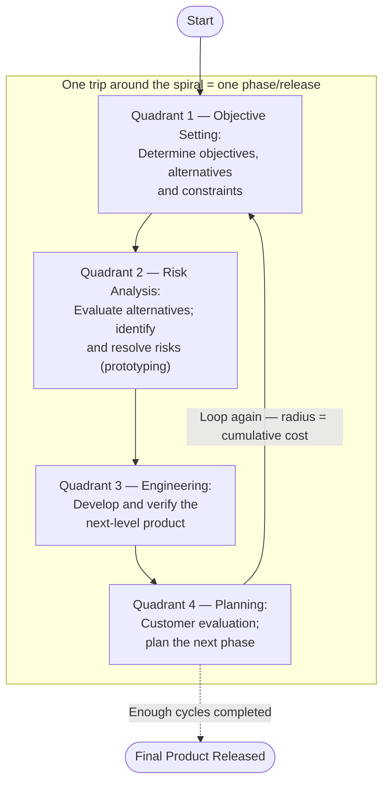

### How it works
- Each loop of the spiral is divided into **four quadrants/activities**: (1) objective setting, (2) risk assessment & reduction, (3) development & validation, and (4) review & planning for the next loop.
- The **radial dimension** represents cumulative project cost, and the **angular dimension** represents progress made in each cycle.
- **Risk analysis is central** — at every cycle, risks (technical, cost, schedule) are explicitly identified and mitigated, often via prototyping, simulation or benchmarking, before committing further resources.
- The model uses a different process model in the "development" quadrant of each cycle (e.g. waterfall for a well-understood cycle, prototyping for a risky one) — it is a **meta-model**.
- The loop repeats until the customer is satisfied and the product is delivered, and can continue afterward for maintenance cycles.

### Applications — most suitable for
- **Large, complex, high-risk projects** where a wrong decision can be disastrous (e.g. defence, aerospace, safety-critical or mission-critical systems).
- Projects where **requirements are unclear or expected to change**, requiring several rounds of prototyping/clarification with the customer.
- Long-duration projects where **continuous risk assessment adds real value** and budget allows for iterative risk-driven planning.
- New, technologically ambitious products released in **phased versions**, refined using user feedback after each release.

### Advantages / Disadvantages
| Advantages | Disadvantages |
|---|---|
| Strong emphasis on risk analysis reduces chance of project failure | Requires considerable risk-assessment expertise |
| Accommodates changes in requirements at any stage | Can be expensive; not suited to small/low-risk projects |
| Delivers early prototypes for user feedback | Difficult to define measurable milestones early on |

---

## 3. Incremental Process Model

The Incremental Model applies the linear (waterfall) sequence **repeatedly**, combined with the iterative philosophy of prototyping. The overall product is broken down into small, functional **increments**; each increment is fully designed, coded, tested and delivered as a working, usable piece before the next increment begins.

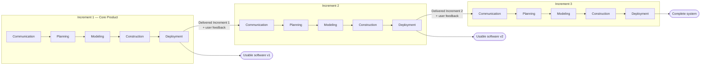

### Working
1. The **core product** (addressing the most basic requirements) is built first and delivered.
2. The customer uses/reviews it, and feedback drives the **plan for the next increment**.
3. Steps repeat — each increment passes through communication, planning, modeling, construction and deployment — until the complete system is delivered.

### Merits
- A **working, usable product** is delivered after every increment — early value to the customer.
- Lower initial delivery cost; **faster time-to-market** for core functionality.
- Easier to **test and debug** small increments than an entire system at once.
- Early customer feedback reduces the risk of building the wrong product.
- Staffing can ramp up gradually — the whole team is not needed from day one.
- Risk of complete project failure is reduced, since partial functionality is already delivered even if later increments are delayed.

### Demerits
- Requires **good upfront architecture/design** so the system can be cleanly split into increments; poor initial design makes later increments hard to integrate.
- Total cost of the fully-built system can end up **higher** than a single well-planned waterfall project.
- Not well suited to systems with **tightly-coupled, non-separable requirements**.
- Each increment can introduce **regression risk** in previously delivered increments if not managed carefully.

---

## 4. Applications of AI/ML in Software Engineering

| Application Area | How AI/ML Helps |
|---|---|
| Automated code generation & completion | AI coding assistants generate boilerplate code, functions and unit tests from natural-language prompts, speeding up development. |
| Defect / bug prediction | ML models trained on historical code-churn and defect data predict which modules are most likely to contain bugs, prioritizing testing effort. |
| Automated & intelligent testing | AI generates test cases, performs visual/UI regression testing, and prioritizes/selects the subset of tests to re-run for a given change. |
| Requirements analysis (NLP) | Natural Language Processing detects ambiguity, incompleteness or inconsistency in requirement documents, and clusters/classifies requirements. |
| Effort & cost estimation | ML-based estimation models learn from past project data to predict effort, cost and schedule more accurately than static formulas alone. |
| Code review & quality analysis | AI-powered static analysis tools detect code smells, vulnerabilities and style violations, and suggest refactorings automatically. |
| Intelligent project management | ML supports sprint/release planning, risk prediction and resource allocation based on historical velocity and defect trends. |
| DevOps chatbots / virtual assistants | Automate routine queries, incident triage and deployment support within CI/CD pipelines. |
| Self-healing systems | AI-driven monitoring detects production anomalies and triggers automated remediation (auto-scaling, rollback, alerting). |
| Recommendation systems for reuse | ML recommends existing code snippets, libraries or components similar to what a developer is currently building. |

**Overall impact:** AI/ML shifts software engineering from a largely manual, rule-based discipline toward a **data-driven, predictive and partly self-optimizing** discipline — reducing manual effort, catching defects earlier, and enabling faster, more informed decision-making across the SDLC.

---

## 5. RAD (Rapid Application Development) Model

RAD is an **incremental** process model that emphasizes an **extremely short development cycle** (typically **60–90 days**), achieved through component-based construction, heavy reuse of existing components, and automated code-generation/CASE tools. RAD is appropriate only when the system can be **modularized** so that each major function can be built by a separate team in parallel.

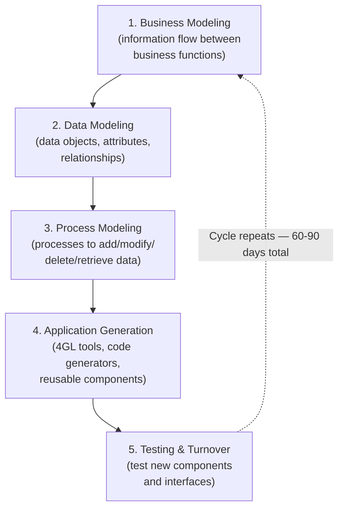

### Phases in detail
1. **Business Modeling** — Models the information flow among business functions: what information drives the process, who generates and processes it, and what governs it.
2. **Data Modeling** — The information flow is refined into data objects needed to support the business, along with their attributes and relationships (typically an ER model).
3. **Process Modeling** — Data objects are transformed to implement a business function; processing descriptions are created for adding, modifying, deleting or retrieving each data object.
4. **Application Generation** — RAD relies on **4th-generation techniques** and automated tools/code generators, reusing existing program components wherever possible, instead of writing conventional 3rd-generation code from scratch.
5. **Testing and Turnover** — Since many components are reused and pre-tested, overall testing time is reduced; however, new components and all interfaces must still be tested thoroughly.

### Suitability / Limitations
- Best suited to systems that can be **modularized** and built by multiple teams working in parallel within a fixed, short timeframe.
- Requires sufficient staff to form several RAD teams, and requires both developers and customers **committed** to the rapid schedule.
- **Not suitable** for systems with high technical/performance risk, systems that cannot be modularized, or where reusable components are not available.

---

## 6. Short Notes

### a. SCRUM
Scrum is a lightweight **Agile framework** for managing iterative and incremental development, organized around fixed-length iterations called **Sprints** (typically 2–4 weeks).

- **Roles:** *Product Owner* (owns and prioritizes the Product Backlog), *Scrum Master* (facilitates the process, removes impediments), *Development Team* (self-organizing, cross-functional).
- **Artifacts:** *Product Backlog* (prioritized feature list), *Sprint Backlog* (tasks selected for the current sprint), *Increment* (working product at sprint end).
- **Ceremonies/Events:** *Sprint Planning*, *Daily Scrum* (stand-up), *Sprint Review*, *Sprint Retrospective*.
- **Benefits:** rapid, visible progress; regular customer feedback; ability to adapt quickly to changing requirements between sprints.

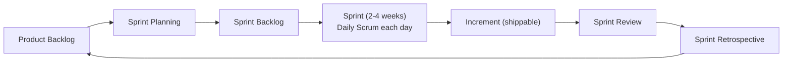

### b. CMM (Capability Maturity Model)
Developed by the **Software Engineering Institute (SEI)**, CMM is a framework describing the key elements of an effective software process, used to assess and improve an organization's process maturity through **five levels**:

| Level | Name | Characteristics |
|---|---|---|
| 1 | Initial | Process is ad hoc, even chaotic; success depends on individual effort/heroics. |
| 2 | Repeatable | Basic project management processes track cost, schedule and functionality. |
| 3 | Defined | The process is documented, standardized and integrated into an organization-wide standard process. |
| 4 | Managed | Detailed process/product quality metrics are collected; process and products are quantitatively understood and controlled. |
| 5 | Optimizing | Continuous process improvement via quantitative feedback and piloting innovative ideas/technologies. |

CMM gives organizations a **roadmap for systematic, staged process improvement** and a way to benchmark process maturity against industry norms (and is the basis for the later, more comprehensive **CMMI**).

---

## 7. Agile Process Model

Agile software development is a group of **iterative, incremental** methods in which requirements and solutions evolve through collaboration between **self-organizing, cross-functional teams**. It was formalized in the **Agile Manifesto (2001)**, which values:

> Individuals and interactions **over** processes and tools · Working software **over** comprehensive documentation · Customer collaboration **over** contract negotiation · Responding to change **over** following a plan

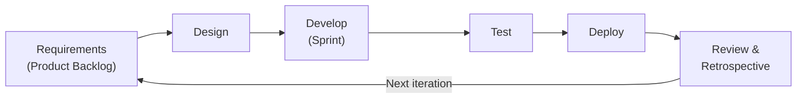

### Key characteristics
- Software is developed in **short iterations/sprints** (1–4 weeks), each producing a potentially shippable increment.
- Requirements are kept as a **prioritized backlog** and can change between iterations based on feedback.
- **Continuous customer involvement** and frequent delivery of working software are valued over heavy upfront documentation.
- **Self-organizing, cross-functional teams**, with frequent (often daily) communication.
- Testing is **integrated throughout** development, not reserved for a separate final phase.

### Common Agile methods
- **Scrum** — sprint-based framework with defined roles and ceremonies (see Q6a).
- **Extreme Programming (XP)** — engineering-practice-focused; pair programming, TDD, continuous integration (see Q10).
- **Kanban** — visualizes workflow on a board, limits work-in-progress to optimize flow.

### Suitability
Well suited to projects with **rapidly changing or poorly understood requirements**, and to small-to-medium, ideally co-located, teams. It delivers customer value early and adapts to change far more readily than plan-driven models like Waterfall.

---

## 8. Data Flow Diagrams (DFD) — Level 0 and Level 1

A DFD models a system as a network of **processes** connected by **data flows**, showing how data moves through the system, is transformed, and where it is stored — without depicting control logic, timing or decisions. Below, both levels are drawn for the **OLMS**.

### DFD Level 0 (Context Diagram)
Represents the **entire system as a single process** ("0.0") and shows only its interaction with external entities — no internal detail.

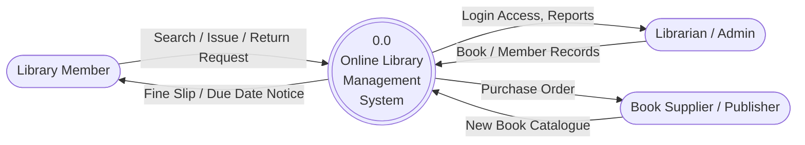

### DFD Level 1
Decomposes process "0.0" into its major sub-processes (1.0–5.0) and introduces the **data stores** these sub-processes read from / write to.

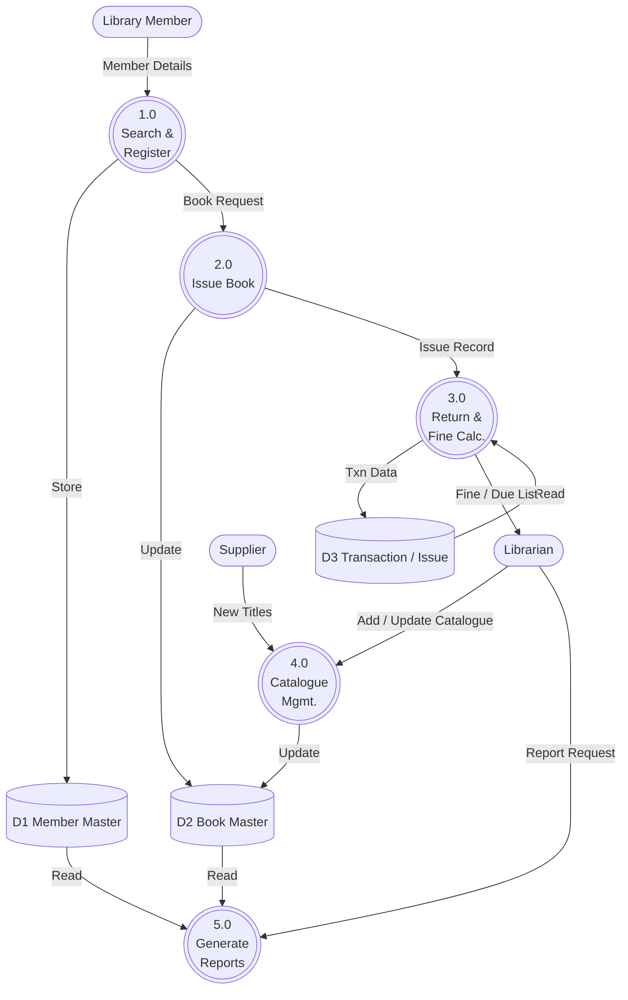

*Numbering convention:* process 2.0 in Level 1 could be further exploded into Level 2 (e.g. 2.1 Verify Membership, 2.2 Check Availability, 2.3 Record Issue) if more detail were required.

---

## 9. Requirement Engineering Tasks

Requirements Engineering (RE) is the process of **discovering, analysing, documenting and validating** the requirements of a system. It comprises five major tasks:

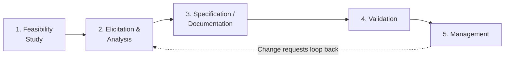

1. **Feasibility Study** — Conducted first to decide whether the project is worthwhile, examined from technical, financial, market, schedule, resource and legal perspectives. It should surface project risks and is typically kept short (2–3 weeks), based on consulting managers, engineers and end-users via interviews/surveys.
2. **Requirements Elicitation and Analysis** — Requirements are discovered through stakeholder interaction (interviews, questionnaires, scenarios, use cases, ethnography/observation), then classified, organized and **negotiated** to resolve conflicts between stakeholders. This is inherently iterative, since stakeholders often don't fully know what they want at first, and requirements evolve as understanding grows.
3. **Requirements Specification / Documentation** — Elicited requirements are written into a structured **SRS**, distinguishing **user requirements** (natural language, for customers, abstract) from detailed **system requirements** (precise, for designers/developers).
4. **Requirements Validation** — The documented requirements are checked for:
   - **Validity** — do they match the customer's real needs?
   - **Consistency** — are there conflicting requirements?
   - **Completeness** — are all needed functions included?
   - **Realism** — can they be implemented given budget/technology?
   - **Verifiability** — can they be objectively tested?
   Checking methods include requirements reviews, prototyping and test-case generation.
5. **Requirements Management** — Since requirements inevitably change (studies show ~25% of requirements change on average, causing 70–80% of project rework), this task establishes: unique **identification** of each requirement, a **change-management process** (problem analysis → change costing → change implementation), and **traceability** between requirements and system design/code.

> Note: These tasks are **not strictly sequential** — RE is an iterative "spiral" of elicitation, specification and validation activities that are revisited repeatedly as understanding of the system deepens.

---

## 10. Extreme Programming (XP)

Extreme Programming, introduced by **Kent Beck**, is an Agile methodology that improves software quality and responsiveness to changing requirements through frequent, small releases, intense collaboration, and strong engineering discipline.

### Core Values
**Communication · Simplicity · Feedback · Courage · Respect**

### Key Practices
| Practice | Description |
|---|---|
| Pair Programming | Two programmers share one workstation — one writes code, the other reviews in real time — improving quality and spreading knowledge. |
| Test-Driven Development (TDD) | Unit tests are written **before** the code; code is written just enough to pass the tests. |
| Continuous Integration | Code is integrated and built/tested multiple times a day to catch integration issues early. |
| Small, Frequent Releases | Working software is released to the customer in small increments frequently for fast feedback. |
| Refactoring | Code is continuously restructured to improve internal design without changing external behaviour. |
| Collective Code Ownership | Any team member may modify any part of the code, under shared coding standards. |
| On-site Customer | A customer representative works with the team full-time to clarify requirements and priorities. |
| Simple Design & Coding Standards | The team always implements the simplest design that works, following agreed conventions. |

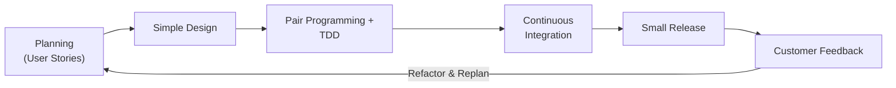

### Suitability
XP works best for **small-to-medium, co-located teams** on projects with **volatile, rapidly changing requirements**, where close, continuous customer collaboration is feasible.

---

## 11. Requirement Modelling

Requirement modelling combines **text and diagrams** to describe requirements in a form that is easy to understand and, importantly, can be **reviewed for correctness, completeness and consistency**. The resulting *analysis model* is the first technical representation of the system, bridging the gap between the SRS and design.

### Major approaches

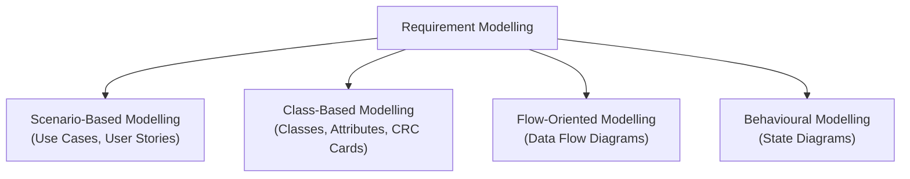

1. **Scenario-based modelling** — Views the system from the **user's** point of view using use cases and user stories/scenarios (details in Q12).
2. **Class-based (data) modelling** — Identifies classes of objects, their attributes and operations, and the associations/relationships among them (class diagrams, CRC cards).
3. **Flow-oriented modelling** — Represents how data objects are transformed as they move through the system, shown using Data Flow Diagrams (Q8).
4. **Behavioural modelling** — Represents how the software behaves in response to external events, typically shown using state/state-transition diagrams. Example (OLMS book state):

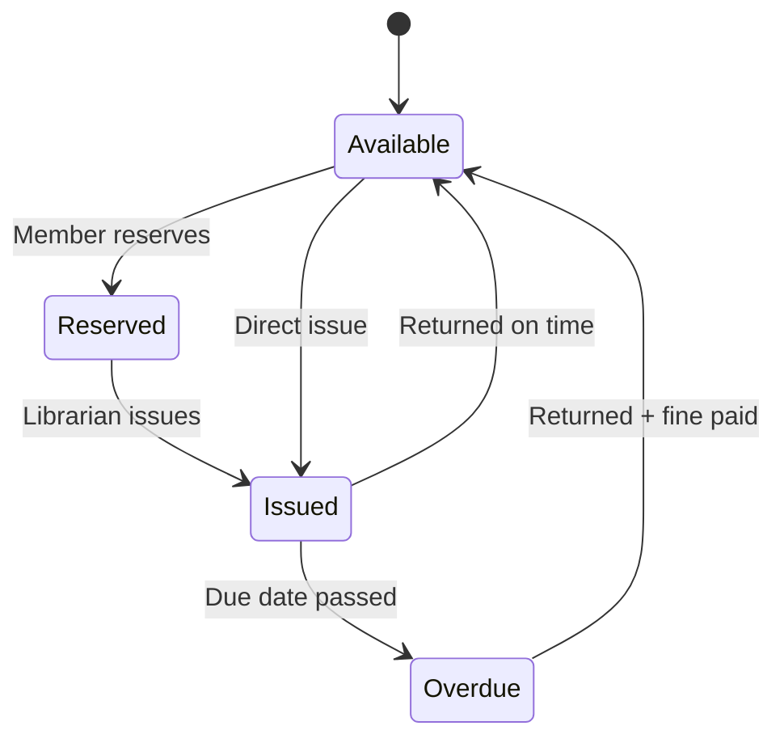

Together, these models describe **what** the software must do (not how it will do it) and form the foundation for later design activities.

---

## 12. Scenario-Based Model

Scenario-based modelling describes the system from the point of view of an end-user ("**actor**"), typically expressed through **Use Cases** and **Use Case Diagrams** as defined in the UML.

### Key elements
- **Actor** — a role played by a user or external system that interacts with the system (e.g. *Member*, *Librarian* in OLMS).
- **Use Case** — a narrative description of a sequence of actions performed by an actor to accomplish a goal (e.g. "Issue Book", "Search Catalogue").
- **Use Case Diagram** — a UML diagram graphically depicting actors, use cases, and relationships (association, `<<include>>`, `<<extend>>`, generalization) between them, giving an overview of the system's functional scope.
- **User Story** — a short feature description from the user's perspective, commonly written as *"As a `<role>`, I want `<goal>` so that `<benefit>`"* — used heavily in Agile/Scrum backlogs.

### Example — OLMS Use Case Diagram

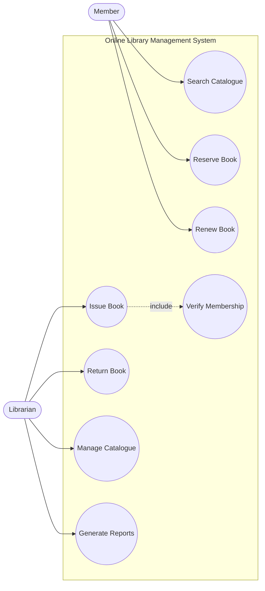

### Sample Use Case Specification — "Issue Book"
| Field | Description |
|---|---|
| Actor | Librarian |
| Precondition | Member is registered; book is available |
| Main flow | 1. Librarian scans/enters member ID → 2. System verifies membership → 3. Librarian scans/selects book → 4. System checks availability → 5. System records issue date & due date → 6. System updates book status to "Issued" |
| Postcondition | Book status = Issued; due date recorded |
| Exceptions | Member has unpaid fines → issue blocked; book not available → issue rejected |

### Purpose / Benefit
Scenario-based models are **easy for non-technical stakeholders to understand and validate**, and they help clearly define the **system boundary** and the functional requirements it must satisfy — making them one of the most widely used starting points in requirements modelling.

---
