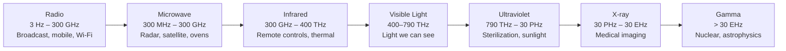
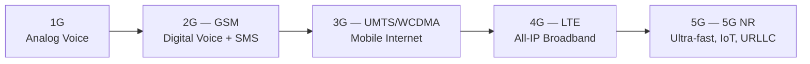
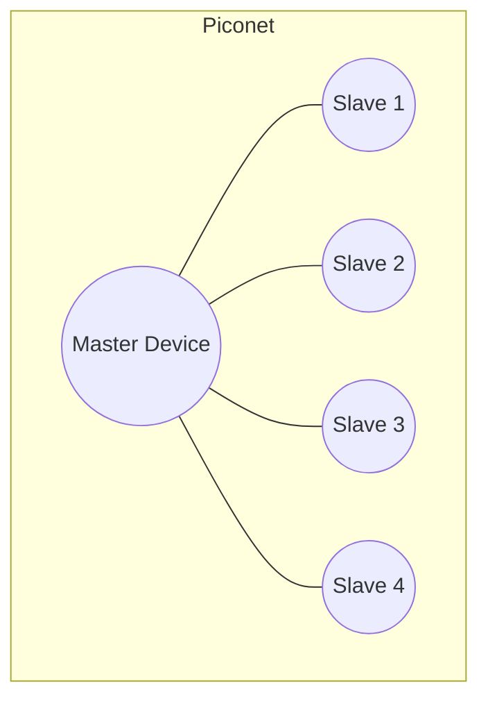

# Wireless & Mobile Communication (WMC) — PT-I Question Bank (Detailed Answers)

> Based on the course slides provided (Module 1: Introduction, Frequency Spectrum & Signal Propagation, Frequency Spectrum Allocation, Frequency Reuse; Module 2: Mobile Communication Generations, GSM Architecture, Spread Spectrum, LTE/4G Basics, 5G Intro).
> Diagrams marked **[From Course Slides — PPT name, Slide #]** are the actual images extracted from your PPTs, stored in the `assets_wmc/` folder next to this `.md` file (keep the folder alongside the file so images render).
> **Note on Module 3:** The uploaded ZIP contains only **Module 1 and Module 2** PPTs. The Wi-Fi/Bluetooth/Zigbee-specific slide deck (Module 3) was **not included** in this upload, so Q9 and Q10 are written from standard reference material rather than extracted slide content — diagrams for those two are left as **[Placeholder — draw by hand]**. If you have the Module 3 PPT, look for the equivalent diagrams there and slot them in.

---

# Q1. What is the need of Wireless Communication?

## How to Answer This Question (per your own note)
This is an **open-ended question** — there's no single "correct" list, so **do not skip it in the exam** even if you can't recall the exact slide wording. The safe strategy: **state a need → give a concrete real-world example → state the resulting benefit**, repeated for 4–6 points. Examiners reward breadth (covering multiple angles: personal, business, emergency, geographic) over depth on any single point.

## Answer

Wireless communication is the transfer of information between two or more points **without using physical wires or cables**, using electromagnetic waves (radio, microwave, infrared, satellite signals). It has become essential in modern life because it provides **mobility, flexibility, faster communication, and long-distance connectivity**. *(Source: Module 1 - Introduction, Slide 13)*

### The 6 Core Needs (Reason → Example → Benefit format)

**1. Mobility and Portability**
- **Need:** Users want to stay connected while physically moving around, which is impossible with a fixed wire.
- **Examples:** Mobile phones, wireless laptops, smartwatches, Bluetooth earphones.
- **Benefit:** People can make calls, access the internet, and send messages while traveling — this single need is really the *foundational* reason wireless communication exists at all. *(Slide 14)*

**2. Communication in Remote/Inaccessible Areas**
- **Need:** In mountains, rural villages, forests, or deserts, laying physical cable is either **technically difficult or economically unviable**.
- **Examples:** Mountain regions, rural villages, forest areas, desert locations.
- **Benefit:** Satellite phones and wireless internet extend connectivity into regions a wired network could never reach cost-effectively. *(Slide 15)*

**3. Fast and Easy Installation**
- **Need:** Wired networks require extensive trenching/wiring that takes weeks; some situations need connectivity **immediately**.
- **Examples:** Wi-Fi networks in homes/offices, temporary event networks, disaster-recovery communication systems.
- **Benefit:** Hospitals and offices can set up a fully working network in hours instead of weeks. *(Slide 16)*

**4. Cost Effectiveness**
- **Need:** Cabling, trenching, and long-term maintenance of wired infrastructure is expensive, especially at scale.
- **Examples:** Wireless LAN, mobile banking, online education platforms.
- **Benefit:** Businesses save significantly by avoiding the capital cost of physical infrastructure. *(Slide 17)*

**5. Emergency and Disaster Communication**
- **Need:** During natural disasters, physical cable infrastructure is often the **first thing destroyed**, precisely when communication matters most.
- **Examples:** Police communication, ambulance communication, fire-brigade wireless systems.
- **Benefit:** Rescue teams can coordinate via wireless radios/satellite links even when every wired line in the area is down (e.g., during floods or earthquakes). *(Slide 18)*

**6. Internet and Global Connectivity**
- **Need:** Modern life depends on always-on internet access wherever a person happens to be, not just at a fixed wired desk.
- **Examples:** 4G/5G mobile networks, Wi-Fi hotspots, satellite internet.
- **Benefit:** Students attend online classes and employees work remotely from virtually anywhere. *(Slide 19)*

### One-Line Summary (good exam closer)
> *"Wireless communication removes the physical constraint of wires, enabling mobility, rapid deployment, cost savings, and connectivity even in remote or emergency situations — making it foundational to nearly every modern digital service, from smartphones to IoT to disaster response."* — *(Module 1 - Introduction, Slide 26 Summary)*

---

# Q2. Comparison between Wired and Wireless Communication. Application.

## How to Answer This Question
Your note says **"give table"** — this is correct, comparison questions are answered fastest and most clearly with a table. Precede it with a 1-line definition of each, and follow it with a short "Applications" list (since the question explicitly asks for applications too).

## Definitions
- **Wired Communication:** Data is transmitted through a **physical medium** — copper wire, coaxial cable, or fiber optic cable — connecting the sender and receiver directly.
- **Wireless Communication:** Data is transmitted through **free space** using electromagnetic waves (radio, microwave, infrared), with no physical medium connecting sender and receiver. *(Module 1 - Introduction, Slide 13)*

## Comparison Table

| Parameter | Wired Communication | Wireless Communication |
|---|---|---|
| **Medium** | Physical cables (copper, coaxial, fiber) | Electromagnetic waves through air/free space |
| **Mobility** | None — device is tied to the cable's fixed location | Full mobility — user can move freely while connected *(Slide 36 — Characteristics)* |
| **Installation** | Slow — requires trenching/laying cables | Fast — network can be set up in hours *(Slide 16)* |
| **Installation Cost** | High initial infrastructure cost (cabling, right-of-way) | Lower infrastructure cost, though devices/spectrum licenses can add cost *(Slide 17)* |
| **Coverage in Remote Areas** | Difficult/uneconomical in mountains, forests, rural regions | Easily extends coverage via satellite/cellular towers *(Slide 15)* |
| **Bandwidth/Data Rate** | Generally higher and more stable (esp. fiber) | Generally lower and more variable *(Slide 25 — Disadvantages)* |
| **Reliability** | Very stable, largely immune to weather/interference | Susceptible to interference, fading, weather, obstacles *(Slide 25)* |
| **Security** | Harder to intercept (physical access needed to tap the line) | Signals travel through open air — easier to intercept if not encrypted *(Slide 25)* |
| **Scalability** | Adding a user needs a new physical line | Adding a user just needs spectrum/capacity planning, no new cabling *(2.1 Limitations of Wired Communication, Slide 2)* |
| **Disaster Resilience** | Cables can be physically cut/damaged | Can be quickly restored via mobile towers/satellite even after disasters *(Slide 2)* |
| **Example Technologies** | Ethernet LAN, PSTN telephone lines, fiber-optic broadband | Mobile networks (GSM/4G/5G), Wi-Fi, Bluetooth, satellite links |

## Applications

**Wired Communication Applications:**
- Broadband internet in homes/offices (fiber, DSL)
- Landline (PSTN) telephony
- Local Area Networks (LAN) in enterprises/data centers
- Cable television distribution

**Wireless Communication Applications:** *(Module 1 - Introduction, Slides 20–23)*
- **Mobile Communication:** Voice calls, messaging, internet access (GSM, 4G, 5G)
- **Wi-Fi Networks:** Internet connectivity in homes, colleges, airports, offices
- **Bluetooth:** Wireless headphones, file transfer, smart devices
- **Satellite Communication:** GPS navigation, weather forecasting, TV broadcasting
- **IoT:** Smart homes, smart cities, smart agriculture, health monitoring
- **Healthcare:** Remote patient monitoring, telemedicine, wireless medical sensors
- **Transportation:** GPS tracking, traffic control systems, railway communication
- **Defense & Security:** Radar systems, secure military communication, surveillance

### Why This Comparison Matters (good closing line)
> *"Neither technology has fully replaced the other — wired links (especially fiber) remain the backbone for high-capacity, stable, long-haul data transport (e.g., between cell towers and the core network), while wireless technology dominates the 'last mile' to the end-user device, precisely where mobility matters most."*

---

# Q3. Explain Frequency Spectrum.

## How to Answer This Question (per your note)
Your note says: **"2 diagrams. Draw and explain them. Explain benefits and applications."** So the structure should be: **Diagram 1 (EM Spectrum overview)** → explain → **Diagram 2 (Radio/RF band breakdown, or Licensed vs Unlicensed)** → explain → then benefits/applications of understanding spectrum allocation.

## Definition
The **electromagnetic (EM) spectrum** is the entire continuous range of electromagnetic radiation, organized by **frequency and wavelength** — from very low-frequency radio waves to very high-frequency gamma rays. **Frequency Spectrum Allocation** is the process by which regulators divide this spectrum into bands and assign them for specific uses (broadcasting, mobile communication, satellite, etc.). *(Module 1 - Frequency Spectrum Allocation, Slide 1)*

The wavelength (λ) and frequency (f) are related by:
$$\lambda = \frac{c}{f}$$
where **c ≈ 3×10⁸ m/s** (speed of light in vacuum). *(Module 1 - Frequency Spectrum and Signal Propagation, Slide 4)*

---

## Diagram 1 — The Electromagnetic Spectrum Overview **[Placeholder — draw by hand; described from Module 1 - Frequency Spectrum Allocation, Slide 2]**

Draw a **horizontal bar**, left to right, labeled with **increasing frequency / decreasing wavelength**, divided into these bands:

**Explanation:** The EM spectrum is **one continuous range of energy**; wireless communication systems live **entirely within the Radio band** (3 Hz – 300 GHz), since these frequencies can travel long distances, penetrate obstacles reasonably well, and are safe (non-ionizing) for continuous human exposure — unlike X-ray/Gamma frequencies.

---

## Diagram 2 — Zooming into the Radio Spectrum (the band actually used for wireless communication) **[Placeholder — draw by hand; described from Module 1 - Frequency Spectrum Allocation, Slide 3, and Module 1 - Frequency Spectrum and Signal Propagation, Slides 6–11]**

Draw a **table/ladder diagram** with each radio sub-band and its typical use:

| Band | Frequency Range | Typical Use |
|---|---|---|
| **VLF/LF** | up to 300 kHz | Submarine communication (penetrates water, follows Earth's curvature) |
| **MF (Medium Frequency)** | 300 kHz – 3 MHz | AM Radio (520 kHz – 1605.5 kHz) |
| **HF (High Frequency)** | 3 – 30 MHz | Shortwave radio (5.9 – 26.1 MHz) |
| **VHF (Very High Frequency)** | 30 – 300 MHz | FM Radio (87.5–108 MHz), analog TV (174–230 MHz) |
| **UHF (Ultra High Frequency)** | 300 MHz – 3 GHz | Mobile phones, Wi-Fi, TV (470–790 MHz), GSM (890–960, 1710–1880 MHz) |
| **SHF (Super High Frequency)** | 3 – 30 GHz | Satellite links (C-band 4–6 GHz, Ku-band 11–14 GHz), 5G mmWave |
| **EHF (Extremely High Frequency)** | 30 – 300 GHz | Radar, imaging |

**Explanation:** As frequency increases, **antenna size shrinks** (making devices practical to carry) but **range/obstacle-penetration decreases** — this is exactly why mobile telephony settled on the **UHF band**: it's the sweet spot allowing small antennas *and* reasonably reliable connections. *(Slide 9)*

### Alternative "Diagram 2": Licensed vs Unlicensed Spectrum Chart *(equally valid — use whichever your syllabus emphasized more)*

| | Licensed Spectrum | Unlicensed (ISM) Spectrum |
|---|---|---|
| **Access** | Exclusive rights to one operator (via govt. auction) | Open to anyone following power/technical rules |
| **Cost** | Very expensive (can cost billions) | Free |
| **Interference** | Protected — regulator enforces exclusivity | Not protected — devices coexist and tolerate interference |
| **Examples** | 4G/5G cellular, broadcast TV/radio, satellite | Wi-Fi, Bluetooth, Zigbee, garage door openers |

*(Module 1 - Frequency Spectrum Allocation, Slides 4–7)*

---

## Benefits of Understanding/Managing the Frequency Spectrum
1. **Efficient use of a scarce, finite resource** — spectrum cannot be manufactured or expanded, only re-planned, so allocation prevents waste.
2. **Interference avoidance** — licensing and band-planning prevents different services (e.g., aviation radar and Wi-Fi) from stepping on each other.
3. **Global interoperability** — ITU-level coordination lets a phone bought in one country roam/work in another.
4. **Enables both high-reliability services (licensed) and low-cost innovation (unlicensed)** — e.g., critical air-traffic radar gets protected licensed spectrum, while cheap consumer IoT devices thrive in free ISM bands.

## Applications
- **Broadcast:** AM/FM radio, analog & digital TV.
- **Mobile Communication:** 2G/3G/4G/5G cellular networks operate in specifically allocated UHF/SHF bands.
- **Satellite Communication:** GPS, weather satellites, TV broadcast via C/Ku/Ka bands.
- **Short-Range Wireless:** Wi-Fi, Bluetooth, Zigbee in the unlicensed 2.4/5/6 GHz ISM bands.
- **Radar & Aviation Safety:** Reserved SHF/EHF bands for safety-critical systems.
- **Defense:** Secure military communication uses specifically reserved, tightly controlled bands.

---

# Q4. Explain Frequency Reuse with proper diagram.

## How to Answer This Question (per your note)
Your note lists exactly what to cover: **what it is, why we use it, the formulas, the hexagonal diagram, what is a cluster, why the cluster size is what it is.** Follow that exact order below — this question is very numerically-flavored, so **memorize the 3 formulas** (S=kN, N=i²+ij+j², D=R√(3N)) cold.

## What is Frequency Reuse?
**Frequency Reuse** is the technique used in cellular mobile systems where the **same set of radio frequencies is reused in different cells** that are geographically separated far enough apart to avoid interference. Each base station is allocated a group of radio channels to be used within a small geographic area called a **cell**. *(Module 1 - Frequency Reuse, Slides 1–2)*

## Why We Use It (the core problem it solves)
The radio frequency spectrum is a **finite, limited resource** — a service provider cannot be given a unique, never-repeated frequency for every single user across an entire country; there simply isn't enough spectrum. Frequency reuse solves this by **reusing the same frequencies repeatedly** across the service area (in cells spaced far enough apart that their signals don't meaningfully interfere), which:
- Allows **efficient utilization** of the limited available spectrum.
- **Increases the number of users** that can be served with a fixed amount of spectrum.
- **Improves overall network capacity** without needing to buy additional spectrum. *(Slide 3 — Advantages)*

## Why the Cell Shape is Hexagonal
The **idealized shape of a cell is hexagonal** — not because real coverage is hexagonal (actual coverage is a roughly circular/irregular blob depending on terrain), but because hexagons are the **best shape to tile/tessellate a 2D area with no gaps and no overlaps**, while also most closely approximating a circle (the true shape of omnidirectional radio coverage) among all shapes that can tile a plane. Hexagons also require the **fewest number of cells to cover a given area** compared to squares or triangles, for a given cell radius. *(GSM Architecture, Slide 30: "hexagonal shape of cells is idealized — cells overlap, shapes depend on geography")*

## Diagram — Hexagonal Cluster with Frequency Reuse (Cluster Size N = 7) **[From Course Slides — Module 1: Frequency Reuse, Slide 6]**

**Explanation:** Cells with the **same letter** (A, B, C, D, E, F, G) use the **same set of frequency channels**. Notice that no two **adjacent** cells share a letter — this is deliberate, since neighboring cells using the same frequency would cause severe **co-channel interference**. The letter "A" only reappears once you move far enough away — this repeating unit (one occurrence of A through G) is what's called a **cluster**.

## What is a Cluster?
A **Cluster** is a group of **N cells** which, together, use the **complete set of available frequency channels exactly once** — no cell within a cluster repeats a frequency group used by another cell in the *same* cluster. The entire service area is then built by **repeating this cluster shape** over and over across the region. *(Slide 6)*

## The Core Formulas

**1. Total Channels in the System:**
$$S = kN$$
where **S** = total number of duplex channels available, **k** = channels allocated to each cell, **N** = cluster size (number of cells per cluster). *(Slide 5)*

**2. Frequency Reuse Factor:**
$$\text{Frequency Reuse Factor} = \frac{1}{N}$$
*(In the N=7 diagram above, the reuse factor = 1/7, meaning each cell uses only 1/7th of the total available channels.)* *(Slide 6)*

**3. Cluster Size Formula (why N takes specific "magic" values like 1, 3, 4, 7, 9, 12...):**
$$N = i^2 + ij + j^2$$
where **i** and **j** are non-negative integers representing the "shift" pattern used to tile the hexagonal cells (how many cells you move over and how many you move diagonally to find the next cell using the same frequency group). This formula is a geometric consequence of how hexagons tile a plane — it means **N can only take specific values** (1, 3, 4, 7, 9, 12, 13, 16, 19, 21...), **not just any arbitrary integer**. *(Slide 6)*

**4. Capacity if a Cluster is Replicated M times:**
$$C = MkN = MS$$
*(Slide 6)*

**5. Co-Channel Reuse Distance:**
$$D = R\sqrt{3N}$$
where **R** = radius of a cell, **N** = cluster size. This is the **minimum distance** that must separate two cells using the *same* frequency group, to keep co-channel interference at an acceptable level. *(Slide 7)*

## Diagram — Reuse Distance Between Co-Channel Cells **[From Course Slides — Module 1: Frequency Reuse, Slide 8]**

**Explanation:** This diagram shows a **7-cell cluster (f1–f7)** repeated across the coverage area, and highlights the **Frequency Reuse Distance** (D) — the physical straight-line distance between two cells that are both using the **same** frequency (e.g., two different "f1" cells in adjacent clusters). Larger D means less co-channel interference, but D is directly tied to N via the formula above — you cannot arbitrarily increase D without also increasing the cluster size N (which in turn *reduces* the frequency reuse factor, i.e., fewer channels per cell).

## Why Cluster Size (N) is What It Is — The Core Trade-off
- **Smaller N** (e.g., N=3 or N=4) → **higher frequency reuse factor** (1/N is larger) → **more channels available per cell** → **higher capacity**, BUT co-channel cells are physically **closer together** → **more interference**.
- **Larger N** (e.g., N=12 or N=19) → co-channel cells are **farther apart** → **less interference**, BUT **fewer channels available per cell** (1/N is smaller) → **lower capacity**.
- **N=7** is a very commonly used "sweet spot" in classical GSM-style planning because it balances **acceptable interference levels against acceptable capacity**, and because N=7 is achievable using an *integer* (i,j) pair (i=2, j=1 → N = 4+2+1 = 7), making it geometrically realizable on a hexagonal grid.

## Worked Numerical Example *(from Module 1 - Frequency Reuse, Slide 10 — practice this exact style)*

**Given:** Cell radius R = 2 km, Cluster size N = 7 (using i=2, j=1)

**Step 1 — Calculate Reuse Distance:**
$$D = R\sqrt{3N} = 2 \times \sqrt{3 \times 7} = 2 \times \sqrt{21} \approx 2 \times 4.58 = 9.16 \text{ km}$$

**Step 2 — Calculate Frequency Reuse Factor:**
$$\text{Reuse Factor} = \frac{1}{N} = \frac{1}{7} \approx 0.143$$

**Conclusion:** The same set of frequencies can be safely reused approximately **9.16 km** away from the current cell, and each cell gets access to **14.3%** of the total available channel pool.

## Real-World Example
This is exactly how GSM/2G operators historically planned their city-wide tower deployments — by using a 7-cell (or similar) reuse pattern, a single operator with a fixed, government-licensed spectrum allocation (say, 25 MHz total) could still serve millions of simultaneous users across an entire city, because the same frequencies keep getting recycled block by block, as long as reused cells are kept far enough apart per the D = R√(3N) rule.

---

# Q5. Comparison of 3G, 4G, and 5G with proper examples.

## How to Answer This Question (per your note)
Your note says: **"Basic definition, diagram, working principle, advantage, disadvantage, etc. Mostly it'll be asked as a comparison of 2 generations only."** So: give a 1-2 line definition of each generation, a simple evolution diagram, then a full comparison table (which will let you answer *any* 2-generation-subset comparison the exam actually asks, by just pulling the relevant rows/columns).

## Basic Definitions
- **3G (Third Generation):** Introduced mobile broadband — the first generation to properly support internet browsing, email, and video calling on phones, alongside voice. Standard: **UMTS/WCDMA**. *(2.1 and 2.2, Slide 6)*
- **4G (Fourth Generation):** An **All-IP** network — completely eliminated circuit-switching, treating even voice calls as just another form of data (VoLTE). Standard: **LTE**. *(Slide 7)*
- **5G (Fifth Generation):** The most advanced generation, designed to connect not just phones but **everything** — including machines and IoT devices — with ultra-high speed and ultra-low latency. *(Slide 8)*

## Diagram — Evolution of Mobile Generations **[Mermaid Diagram]**

*(Based on Module 2 - 2.1 and 2.2, Slide 4: "Generation → Major Limitation Solved" progression)*

## Working Principle (brief, per generation)

- **3G:** Uses **WCDMA (Wideband CDMA)** as the multiple-access technique; still carries some circuit-switched legacy architecture for voice, while adding packet-switched data channels for internet access alongside it. *(2.5 LTE_4G_Basics, Slide 2)*
- **4G/LTE:** Uses **OFDMA** for the downlink (splits a wide channel into many narrow, non-interfering subcarriers transmitted in parallel) and **SC-FDMA** for the uplink (more power-efficient for phone batteries); combined with **MIMO** (multiple antennas sending/receiving multiple streams simultaneously) and higher-order modulation (64-QAM+). Everything — voice, video, data — moves through the all-IP **Evolved Packet Core (EPC)**. *(2.5 LTE_4G_Basics, Slides 4–5)*
- **5G:** Uses **5G NR (New Radio)**, massive **MIMO** (large antenna arrays), and **Network Slicing** (creating multiple "virtual" networks tailored to different needs — e.g., one slice optimized for emergency services, another for IoT sensors) over the same physical infrastructure. *(2.6 Intro_to_5G, Slide 8)*

## Full Comparison Table *(Module 2 - 2.1 and 2.2, Slide 9)*

| Feature | 2G | 3G | 4G (LTE) | 5G |
|---|---|---|---|---|
| **Primary Standard** | GSM | UMTS | LTE | 5G NR |
| **Switching** | Circuit Switched | Hybrid | All-IP (Packet) | All-IP (Slicing) |
| **Multiple Access** | TDMA / CDMA | WCDMA | OFDMA | OFDMA |
| **Max Data Speed** | ~384 kbps | ~2 Mbps | ~1 Gbps | ~20 Gbps |
| **Latency** | > 500 ms | ~100 ms | ~20 ms | < 1 ms |
| **Primary Service** | Voice & SMS | Mobile Internet | HD Broadband | IoT & Smart Apps |

## Advantages & Disadvantages (per generation, quick reference)

| Generation | Key Advantage | Key Disadvantage/Limitation |
|---|---|---|
| **3G** | First proper mobile internet + video calling | High latency (100–500 ms) — too slow for real-time gaming/HD streaming; insufficient bandwidth for the later "data explosion" *(Slide 6)* |
| **4G** | All-IP, high-speed broadband (HD streaming, cloud, gaming); VoLTE gives HD voice | Cannot handle the massive device density needed for smart cities/IoT; latency still too high for mission-critical tasks like remote surgery *(Slide 7)* |
| **5G** | Ultra-high speed (up to 20 Gbps), ultra-low latency (1 ms), Network Slicing, Massive MIMO, supports eMBB/URLLC/mMTC | Requires dense small-cell infrastructure (mmWave has short range); higher deployment cost; still limited device availability in early rollout |

## Applications with Examples *(Slide 10)*

| Generation | Typical Applications |
|---|---|
| **3G** | Mobile internet browsing, email, basic video conferencing, GPS navigation apps |
| **4G** | HD video streaming (Netflix/YouTube), online learning, cloud applications, competitive online gaming |
| **5G** | Smart healthcare (remote surgery), autonomous vehicles, IoT & robotics, digital twins, AI-enabled real-time services, smart cities |

## Exam Tip — "Comparison of Only 2 Generations"
If your exam specifically asks e.g. **"Compare 3G and 4G"** or **"Compare 4G and 5G"** — simply extract the relevant **two columns** from the master table above, and pick the 2–3 most relevant advantage/disadvantage/application rows for those two generations specifically. The underlying content doesn't change, just which columns you present.

---

# Q6. Explain GSM architecture with proper diagram.

## How to Answer This Question (per your note)
Your note is very specific: **"Don't go too detail in the definitions, just 2 lines. Draw the diagram with boxes and lines in green colored font (the one Sir got from ChatGPT). Take a subsystem, explain all the components, do the same for the other subsystems. All components must be explained in 2-3 lines."** — so the structure is: brief intro (2 lines) → **the exact diagram** → go subsystem-by-subsystem, explaining every box in 2-3 lines each.

## Definition (2 lines, as instructed)
GSM (Global System for Mobile Communication) is a **2G digital cellular standard** built from three major subsystems — the **Radio Subsystem (RSS)**, **Network and Switching Subsystem (NSS)**, and **Operation Subsystem (OSS)** — that together handle everything from the phone's radio link to call switching and network management. *(Module 2 - GSM Architecture, Slides 2–3, 18)*

## The Diagram — GSM Network Architecture **[From Course Slides — Module 2: GSM Architecture, Slide 19 — "the one with boxes and lines in green font"]**

*(This is the exact diagram referenced in your notes — showing MS → BTS → BSC → MSC, with HLR/VLR/AUC/EIR/OMC/PSTN connected around the MSC.)*

---

## Subsystem 1 — Radio Subsystem / Base Station Subsystem (BSS)
*Covers all radio-related aspects — everything to the left of the "Abis Interface" and "A interface" lines in the diagram.*

- **MS (Mobile Station):** The user's handset — comprises the **Mobile Equipment (ME)** + **SIM (Subscriber Identity Module)**. It connects to the network wirelessly over the **Um (radio/air) interface**. *(Slide 20, 27)*
- **BTS (Base Transceiver Station):** The actual radio tower/antenna equipment — contains the **sender and receiver (transceiver)** that directly communicates with mobile stations over the air. Every physical cell tower has a BTS. *(Slide 22, 27, 29)*
- **BSC (Base Station Controller):** Controls and manages **multiple BTSs** — think of it as the local exchange for a cluster of towers. It handles switching between BTSs, manages radio resources, and maps radio channels (Um) onto the terrestrial A-interface channels toward the core network. *(Slide 22, 29)*
- *(Interfaces: **Um** = MS↔BTS air interface; **Abis** = BTS↔BSC interface, 16 kbit/s channels; **A interface** = BSS↔MSC interface, 64 kbit/s channels.)* *(Slide 27)*

---

## Subsystem 2 — Network and Switching Subsystem (NSS)
*The core network — handles call switching, mobility management, and interconnection to other networks. Everything centered around the MSC in the diagram.*

- **MSC (Mobile Switching Center):** The **central component** of NSS — performs call setup, call release, and call routing; also handles mobility-specific signaling, location registration, SMS support, and billing/accounting information generation. *(Slide 21, 33)*
- **HLR (Home Location Register):** A **permanent master database** containing each subscriber's data — their SIM details, subscribed plan, and service profile — essentially the subscriber's "home record," regardless of where they currently are. *(Slide 21, 32)*
- **VLR (Visitor Location Register):** A **temporary/local database** that stores the exact current location of every subscriber currently roaming within a particular MSC's service area — updated dynamically as users move between areas. *(Slide 21, 32)*
- **AUC (Authentication Center):** Generates the **security/authentication parameters** used to verify a subscriber's identity and to encrypt user data over the air interface — prevents unauthorized network access. *(Slide 21, 34)*
- **EIR (Equipment Identity Register):** Maintains a database of allowed/banned **handset (IMEI) identities** — if a phone is reported stolen, EIR can block it from accessing the network. *(Slide 21)*
- **PSTN (Public Switched Telephone Network):** The traditional fixed-line telephone network that MSC connects to, allowing calls between mobile and landline users. *(Slide 21)*

---

## Subsystem 3 — Operation Subsystem (OSS)
*Enables centralized monitoring, operation, and maintenance of the entire GSM network — shown as "OMC" connected to the MSC in the diagram.*

- **OMC (Operation and Maintenance Center):** Monitors and maintains the **performance of every MS, BSC, and MSC** in the system — the network operator's central control room for detecting faults and managing overall network health. *(Slide 22, 34)*

*(Note: AUC and EIR are sometimes classified under NSS and sometimes under OSS depending on the textbook — your diagram groups OMC specifically under "Operational Support Subsystem," which is the convention to follow for this diagram.)*

---

## Quick Reference — Element Abbreviations *(Slide 25)*
| Abbreviation | Full Form |
|---|---|
| BSS | Base Station Subsystem |
| BTS | Base Transceiver Station |
| BSC | Base Station Controller |
| MS | Mobile Station |
| MSC | Mobile Switching Center |
| VLR | Visitor Location Register |
| HLR | Home Location Register |
| AUC | Authentication Center |
| EIR | Equipment Identity Register |
| OMC | Operation and Maintenance Center |
| PSTN | Public Switched Telephone Network |

## Alternative Diagram (if asked for the simplified MS→BTS→BSC→MSC data-flow / MDM style view)
*(Your note references "Mod3_Types of NW_PSTN etc.pptx page 19" for an alternative MDM-style diagram — this specific file was **not included** in the uploaded ZIP, so it could not be extracted here. If you have access to it separately, that diagram typically shows a simplified linear flow: **MS → BTS → BSC → MSC → PSTN/Other Networks**, which is a simplified subset of the same architecture explained above — use the Slide 19 diagram above as your primary answer, and mention this simplified flow as a one-line summary if time permits: "In short: MS talks to BTS over radio, BTS is controlled by BSC, and BSC connects to the MSC, which is the gateway to PSTN and other external networks.")*

---

# Q7. Explain DSSS (Direct Sequence Spread Spectrum) with an example.

## How to Answer This Question (per your note)
Your note is explicit: **"Transmitter and Receiver diagram MUST be drawn. Don't explain what is DSSS too much. Directly jump into components, barker code, application, etc. Clearly write down the steps too. Also show how nothing happens even if we change one digit."** So: brief 2-line intro → **Transmitter diagram** → **Receiver diagram** → Barker Code → step-by-step worked example → the noise-tolerance demonstration → applications.

## What is DSSS (brief, as instructed)
DSSS spreads the original narrowband user data over a much **wider bandwidth** by XOR-ing each data bit with a fast, pseudo-random **chipping sequence**, then modulates the result onto a radio carrier. This spreading is what gives it resistance to narrowband interference and jamming. *(2.4 SpreadSpectrum, Slide 51, 54–55)*

## Diagram 1 — DSSS Transmitter **[From Course Slides — 2.4 SpreadSpectrum, Slide 18 / Figure 2.36]**

**Components:**
- **User Data:** The original binary data to be transmitted.
- **X (XOR block):** XORs the user data with the **Chipping Sequence** to produce the **Spread Spectrum Signal** — this is the "spreading" step.
- **Chipping Sequence:** The known, agreed-upon pseudo-random binary code (e.g., the Barker code) used for spreading.
- **Modulator:** Takes the spread spectrum signal and the **Radio Carrier**, and produces the final **Transmit Signal** sent over the air.

## Diagram 2 — DSSS Receiver **[From Course Slides — 2.4 SpreadSpectrum, Slide 21 / Figure 2.37]**

**Components:**
- **Demodulator:** Takes the **Received Signal** and the same **Radio Carrier**, extracting the **Lowpass Filtered Signal** (reversing the transmitter's modulation step).
- **Correlator** *(dashed box — contains 2 sub-parts):*
  - **X (XOR block):** XORs the incoming lowpass-filtered signal with the **same Chipping Sequence** used at the transmitter — this is the "despreading" step.
  - **Integrator:** Sums up the products from the XOR step over one bit period, producing **Sampled Sums**.
- **Decision (unit):** Compares the sampled sum against a threshold to decide whether the received bit was a binary **0** or **1**, outputting the final recovered **Data**.

## The Barker Code
A **Barker Code** is a special binary spreading sequence used in DSSS, chosen specifically for its **good autocorrelation properties** (i.e., it doesn't accidentally "match" itself when shifted, which keeps synchronization reliable). It replaces each data bit with a longer sequence of "chips," improving resistance to noise, interference, and synchronization errors. *(Slide 75, 81)*

**Commonly used 11-chip Barker code:** `10110111000`
*(Other known Barker codes: 11, 110, 1110, 11101, 1110010, 1111100110101)* *(Slide 78)*

## Step-by-Step Worked Example *(2.4 SpreadSpectrum, Slides 25–27)*

**Problem:** Transmit user data **`01`** using the 11-chip Barker code **`10110111000`** via DSSS.

**Step 1 — Transmitter Side: Spread each bit by XOR-ing with the Barker code**

| User Data Bit | Barker Code | XOR Result (Spread Signal) |
|---|---|---|
| 0 | 10110111000 | **10110111000** *(0 XOR code = code unchanged)* |
| 1 | 10110111000 | **01001000111** *(1 XOR code = code inverted)* |

→ Transmitted spread signal: `10110111000` followed by `01001000111`

**Step 2 — Receiver Side: XOR the received signal with the SAME Barker code**

| Received Signal | Barker Code | XOR Result |
|---|---|---|
| 10110111000 | 10110111000 | **00000000000** |
| 01001000111 | 10110111000 | **11111111111** |

**Step 3 — Integrator: Sum the 1s in each XOR result**
- First bit: sum = **0**
- Second bit: sum = **11**

**Step 4 — Decision Unit: Map sums to binary**
- Rule used: sums **< 4** → binary **0**; sums **> 7** → binary **1**
- Sum = 0 → **0** ✓
- Sum = 11 → **1** ✓

**→ Recovered data = `01`, exactly matching the original transmitted data.** *(Slide 25–27)*

## Demonstrating Noise Tolerance — "Nothing Happens Even If We Change One Digit" *(Slides 28–29)*

**Suppose the received signal gets slightly distorted during transmission** (some bits flip due to noise), e.g., the demodulated signal comes out as: `1010010100` `001101000111` instead of the clean `10110111000` `01001000111`.

**Step 1 — XOR the (now noisy) received signal with the Barker code:**

| Noisy Received Signal | Barker Code | XOR Result |
|---|---|---|
| 1010 0101 000 | 1011 0111 000 | 0001 0010 000 |
| 0110 1000 111 | 1011 0111 000 | 1110 1111 111 |

**Step 2 — Sum the products:**
- First bit sum = **2** (instead of the clean 0)
- Second bit sum = **10** (instead of the clean 11)

**Step 3 — Apply the SAME decision rule (sums < 4 → 0, sums > 7 → 1):**
- Sum = 2 → still correctly decoded as **0** ✓
- Sum = 10 → still correctly decoded as **1** ✓

**→ Received data is STILL `01` — identical to the noise-free case!** This is the entire point of the demonstration: because the decision threshold has "slack" built in (not exactly 0 or exactly 11, but a *range*), **a few individual bit errors introduced by noise don't change the final decoded output** — this graceful tolerance to small/isolated errors is precisely DSSS's resistance to noise and narrowband interference in action. *(Slide 28–29)*

## Advantages & Disadvantages *(Slide 33)*

| Advantages | Disadvantages |
|---|---|
| Resistance to narrowband interference and anti-jamming effects | Precise power control necessary |
| Resistance to interception (hard to detect without knowing the code) | Overall system is complex |
| Resistance to fading | Synchronization required between sender and receiver |

## Applications *(Slide 34)*
- **CDMA Radios:** Multiple users share the same channel simultaneously, each using a different spreading code.
- **WLAN (Wireless LAN):** DSSS was one of the original Physical Layer options in early Wi-Fi standards (802.11b).
- **Cordless Phones:** Uses DSSS for its security, noise immunity, and extended range benefits.

---

# Q8. Explain FHSS (Frequency Hopping Spread Spectrum) with an example.

## How to Answer This Question (per your note)
Your note says: **"What is FHSS, basic definition, diagram for slow and fast hopping, advantage, application of each type. Receiver and transmitter diagram is a must."** So: brief definition → slow/fast hopping diagram → advantages/applications of each variant separately → transmitter diagram → receiver diagram.

## Basic Definition
FHSS splits the total available bandwidth into **many smaller channels** (plus guard spaces between them). The transmitter and receiver **stay on one channel for a short time, then "hop" to another channel**, following a pre-agreed pattern called the **hopping sequence**. The time spent on any one channel is called the **dwell time (t_d)**. This system effectively implements a combination of **FDM (Frequency Division) and TDM (Time Division)**. *(2.4 SpreadSpectrum, Slide 35)*

## Diagram — Slow Hopping vs Fast Hopping **[From Course Slides — 2.4 SpreadSpectrum, Slide 40]**

### Slow Hopping
- **Definition:** The transmitter uses **one frequency for several bit periods** — i.e., **multiple bits are transmitted per hop**. In the diagram, the transmitter stays on frequency f2 for 3 bits (during dwell time t_d), then hops to f3. *(Slide 36)*
- **Advantages:** Cheaper to implement, relaxed synchronization tolerances between transmitter and receiver. It is an option used in **GSM**. *(Slide 38, 194)*
- **Disadvantage:** **Not as immune** to narrowband interference as fast hopping, since a longer time is spent on any single frequency, giving interference more opportunity to corrupt data. *(Slide 38)*
- **Application:** GSM uses slow hopping specifically to avoid co-channel interference and increase channel capacity. *(Slide 49)*

### Fast Hopping
- **Definition:** The transmitter changes frequency **multiple times during the transmission of a single bit** — i.e., **one bit is spread across several hops**. In the diagram, the transmitter hops 3 times within a single bit period. *(Slide 39)*
- **Advantages:** Much **better resistance** to narrowband interference and frequency-selective fading, since no single frequency is exposed to interference for long; also **more secure**, since an eavesdropper would need to track many rapid frequency changes to intercept even a single bit. *(Slide 41, 230)*
- **Disadvantage:** **More complex to implement**, since transmitter and receiver must stay synchronized within much tighter time tolerances to hop in lockstep. *(Slide 41)*
- **Application:** **Bluetooth** uses fast hopping FHSS — specifically **1600 hops/second** across **79 frequencies**, spaced 1 MHz apart within the 2.4 GHz ISM band. *(Slide 41, 49)*

## Slow vs Fast Hopping — Quick Comparison Table *(Slide 42)*

| Parameter | Slow Hopping | Fast Hopping |
|---|---|---|
| **Main Idea** | Several bits transmitted using the same frequency | One bit transmitted using several different frequencies |
| **Resistance to Narrowband Interference** | Lower | Better (also resists frequency-selective fading) |
| **Security** | Lower | Higher (harder to intercept a full bit) |
| **Complexity** | Less complex | More complex (tighter synchronization needed) |

## Diagram — FHSS Transmitter **[From Course Slides — 2.4 SpreadSpectrum, Slide 43]**

**Components & Steps:**
1. **Modulator (1st stage):** Modulates the **User Data** using standard digital-to-analog modulation, producing a **Narrowband signal**. *(Slide 45)*
2. **Frequency Synthesizer:** Takes the **Hopping Sequence** as input and generates the carrier frequencies **f_i** the system should hop through. *(Slide 45)*
3. **Modulator (2nd stage):** Combines the narrowband signal with the synthesized carrier frequency f_i to produce the final **Spread Transmit Signal** — shifted to f_i+f0 for a "0" bit and f_i+f1 for a "1" bit. *(Slide 46)*

## Diagram — FHSS Receiver **[From Course Slides — 2.4 SpreadSpectrum, Slide 44]**

**Components & Steps:**
1. **Demodulator (1st stage):** Takes the **Received Signal**, and using the **Hopping Sequence** (fed via the **Frequency Synthesizer**, which must be synchronized with the transmitter's), reverses the frequency-hopping step to recover the **Narrowband signal**. *(Slide 48)*
2. **Demodulator (2nd stage):** Performs the inverse of the transmitter's first modulation step, extracting the final **Data**. *(Slide 48)*
3. **Key requirement:** The receiver **must know the hopping sequence in advance and stay tightly synchronized** with the transmitter's hop timing — otherwise it will be "listening" on the wrong frequency at the wrong time. *(Slide 48)*

## FHSS vs DSSS — Bonus Comparison Table (useful backup content) *(Slide 50)*

| FHSS | DSSS |
|---|---|
| Multiple frequencies are used | Single frequency is used |
| Hard to find the user's frequency at any instant | User frequency, once allotted, stays the same |
| Frequency reuse is allowed | Frequency reuse is not allowed |
| Sender need not wait | Sender has to wait if the spectrum is busy |
| Power strength of the signal is high | Power strength of the signal is lower |
| Stronger, penetrates obstacles better | Comparatively weaker |
| Cheaper | More expensive |

---

# Q9. Comparison between Wi-Fi and Zigbee in detail.

> **Source note:** The Module 3 slide deck (Wi-Fi/Bluetooth/Zigbee) was **not included** in your uploaded ZIP (only Module 1 and Module 2 PPTs were present). Since you mentioned this was **covered in your assignment**, the content below is written from standard reference material (IEEE 802.11 and IEEE 802.15.4 specifications) in the exact structure you requested — cross-check against your assignment notes/Module 3 slides if available, and swap in the diagrams from there.

## How to Answer This Question (per your note)
Your note says: **"First write definition, application, advantages and disadvantages of each type separately, then draw the table and compare the parameters in one line each — so the answer doesn't look messy."** Following that exact structure below.

## Wi-Fi (IEEE 802.11)

**Definition:** Wi-Fi is a wireless networking technology based on the **IEEE 802.11** family of standards, that allows devices to connect to a **Local Area Network (LAN)** and the internet using radio waves in the **2.4 GHz, 5 GHz, or 6 GHz** unlicensed ISM bands, typically through a central **Access Point (AP)/router**.

**Applications:**
- Home and office internet connectivity
- Public Wi-Fi hotspots (airports, cafes, campuses)
- Video streaming, video conferencing, cloud computing access
- Wireless printers and smart TVs

**Advantages:**
- **High data rate** (hundreds of Mbps to several Gbps with modern standards like Wi-Fi 6)
- **Wide range** compared to Bluetooth/Zigbee (typically 30–100 m indoors)
- Supports many simultaneously connected devices per access point
- Widely supported across virtually all modern consumer devices

**Disadvantages:**
- **High power consumption** — not suitable for small battery-powered sensor devices that need to last months/years
- Susceptible to interference from other 2.4 GHz devices (Bluetooth, microwaves, neighboring Wi-Fi networks)
- More complex/expensive hardware compared to Zigbee radios

## Zigbee (IEEE 802.15.4)

**Definition:** Zigbee is a **low-power, low-data-rate wireless networking technology** based on the **IEEE 802.15.4** standard, designed specifically for short-range, battery-powered **IoT and sensor network** applications, operating mainly in the **2.4 GHz** (also 868/915 MHz) bands.

**Applications:**
- Smart home automation (smart bulbs, thermostats, door locks)
- Industrial sensor networks and monitoring
- Smart metering (electricity/water/gas meters)
- Wireless Sensor Networks (WSN) in agriculture, healthcare monitoring

**Advantages:**
- **Extremely low power consumption** — sensor nodes/battery devices can run for months to years on small batteries
- Supports **mesh networking** — devices can relay data for each other, extending effective range and improving reliability
- Can support a **very large number of nodes** in a single network (up to 65,000+ theoretically)
- Low cost, simple hardware

**Disadvantages:**
- **Very low data rate** (~250 kbps maximum) — unsuitable for video/audio streaming or large file transfer
- **Shorter range per hop** compared to Wi-Fi (though mesh networking extends overall network coverage)
- Not designed for internet browsing or high-bandwidth applications

## Comparison Table (One-Line Parameter Comparison, per your instruction)

| Parameter | Wi-Fi (802.11) | Zigbee (802.15.4) |
|---|---|---|
| **Standard** | IEEE 802.11 | IEEE 802.15.4 |
| **Frequency Band** | 2.4 GHz / 5 GHz / 6 GHz | 2.4 GHz (also 868/915 MHz) |
| **Data Rate** | High — up to several Gbps | Low — up to ~250 kbps |
| **Range** | Long — 30–100 m indoors | Short per hop — ~10–20 m (extended via mesh) |
| **Power Consumption** | High | Very Low |
| **Network Topology** | Mainly star (via central AP) | Mesh, star, or tree |
| **Max Devices per Network** | Limited by AP capacity (dozens) | Very large (thousands via mesh) |
| **Cost/Complexity** | Higher | Lower |
| **Typical Use Case** | Internet access, streaming, general LAN | IoT sensors, home automation, low-power monitoring |
| **Battery Life (typical device)** | Hours to a few days | Months to years |

## One-Line Summary
> *"Wi-Fi is optimized for high-speed internet connectivity for a moderate number of always-powered devices, while Zigbee is optimized for extremely low-power, large-scale sensor/IoT networks where battery life and device count matter far more than raw speed."*

---

# Q10. Write a short note on Bluetooth communication.

> **Source note:** As with Q9, the Module 3 slide deck was not in your uploaded ZIP. The content below follows the exact structure you requested (definition, diagram, working, components, applications, advantages) using standard Bluetooth/IEEE 802.15.1 reference material — cross-check against your Module 3 slides if available.

## How to Answer This Question (per your note)
Your note says: **"Basic definition, diagram, working principle, components in diagram, application, advantages."** Following that exact order.

## Basic Definition
**Bluetooth** is a **short-range wireless communication technology** (IEEE 802.15.1) that enables data exchange between devices over distances of typically **up to 10 meters** (Class 2, most common), operating in the **2.4 GHz ISM band**. It uses **Frequency Hopping Spread Spectrum (FHSS)** — as covered in Q8 — hopping across 79 channels at **1600 hops/second** for interference resistance.

## Diagram — Bluetooth Piconet Structure **[Placeholder — draw by hand]**

Draw **one central device labeled "Master"** in the middle, with **up to 7 active "Slave" devices** connected to it by individual links radiating outward, all enclosed in a boundary labeled **"Piconet."** Multiple overlapping piconets sharing common devices form a **"Scatternet."**

## Working Principle
1. One device takes the role of **Master**, initiating and controlling the connection timing; other nearby devices join as **Slaves**.
2. The Master and Slaves communicate using **FHSS**, hopping in a synchronized pattern across 79 x 1 MHz channels within the 2.4 GHz band — this both avoids interference and provides a basic layer of security (an eavesdropper must track the hop sequence).
3. Up to **7 active slave devices** can connect to one Master simultaneously, forming a **Piconet**.
4. Devices pair via a **discovery and authentication process** (often involving a PIN or passkey) before regular data exchange begins.
5. Data is exchanged in **packets** during specific time slots allocated as part of the hopping/TDD (Time Division Duplex) scheme between Master and each Slave.

## Components in the Diagram
- **Master Device:** The device that initiates the connection and controls the timing/hopping sequence for the entire piconet (e.g., your smartphone).
- **Slave Device(s):** Devices that connect to and synchronize with the Master's timing (e.g., wireless earbuds, a smartwatch, a wireless keyboard) — up to 7 can be simultaneously active.
- **Piconet:** The basic Bluetooth network unit — one Master + up to 7 active Slaves, all hopping together in sync.
- **Scatternet** *(extended concept)*: Multiple piconets linked together via a device that participates in more than one piconet simultaneously (acting as a slave in one and possibly master in another).

## Applications
- Wireless audio: headphones, earbuds, speakers
- File transfer between phones/laptops
- Wireless peripherals: keyboards, mice, game controllers
- Health/fitness wearables (smartwatches, fitness bands) syncing with a phone
- Car infotainment systems (hands-free calling, audio streaming)

## Advantages
- **Low power consumption** (especially Bluetooth Low Energy / BLE variant), suitable for battery-powered wearables
- **Low cost** hardware, widely built into nearly all modern consumer electronics
- **No line-of-sight required**, unlike infrared
- **Automatic, easy pairing** between devices with minimal configuration
- Reasonably **secure** due to frequency hopping making interception harder

## Disadvantages (bonus, for completeness)
- **Short range** (typically ~10 m for common Class 2 devices) compared to Wi-Fi
- **Lower data rate** compared to Wi-Fi — not suited for high-bandwidth tasks like video streaming to multiple devices
- Limited to a **small number of simultaneous active connections** per piconet (max 7 slaves)

---

*End of document. Diagram assets (hexagonal_cluster_N7.jpg, frequency_reuse_distance.jpg, gsm_architecture_diagram.png, dsss_transmitter.png, dsss_receiver.png, slow_vs_fast_hopping_diagram.png, fhss_transmitter.png, fhss_receiver.png, transmission_detection_interference_range.png) are stored in the accompanying `assets_wmc/` folder — keep it alongside this `.md` file so images render. Mermaid diagrams render automatically in most modern Markdown viewers. Diagrams marked [Placeholder] should be hand-drawn using the description given, or sourced from your Module 3 slides where noted.*